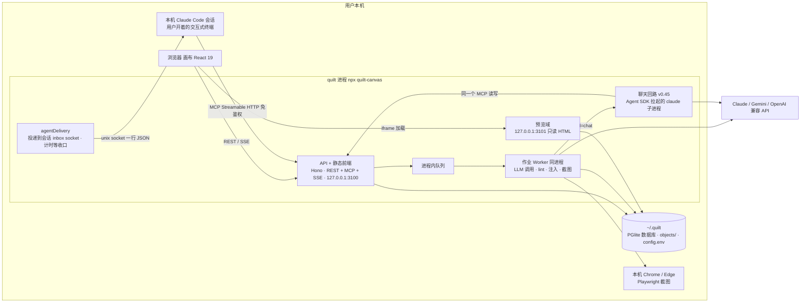
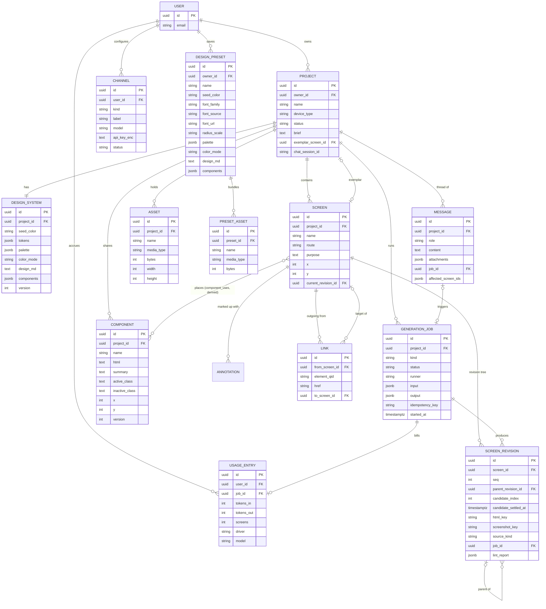
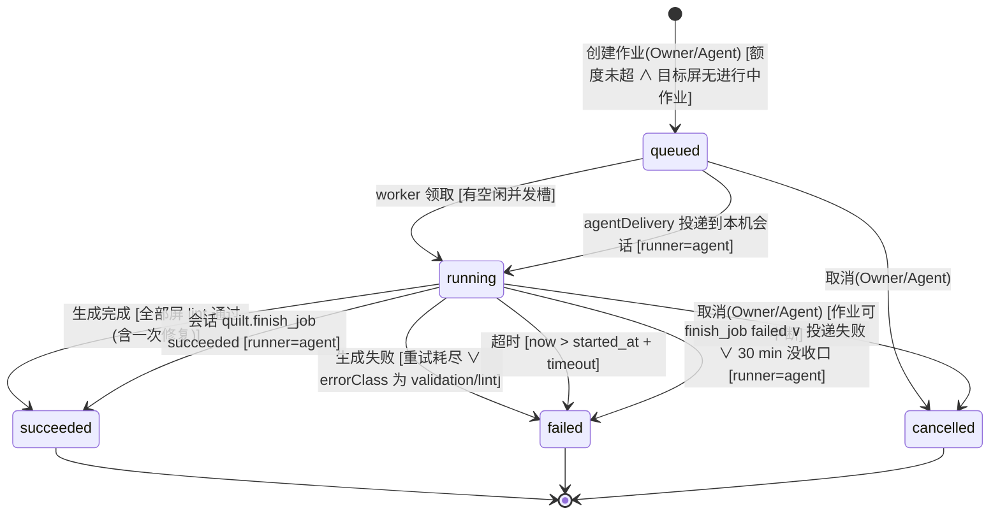
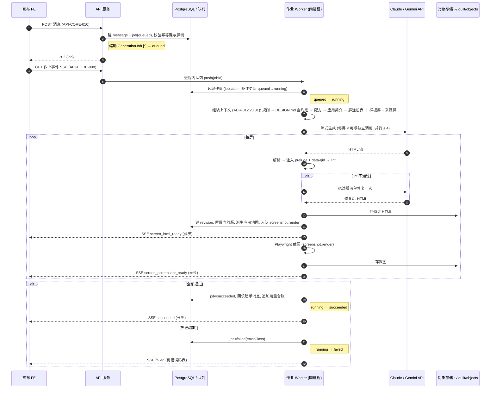
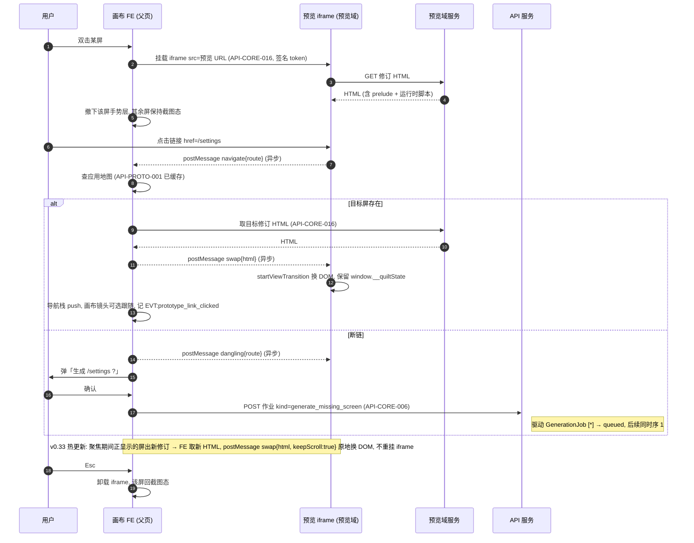
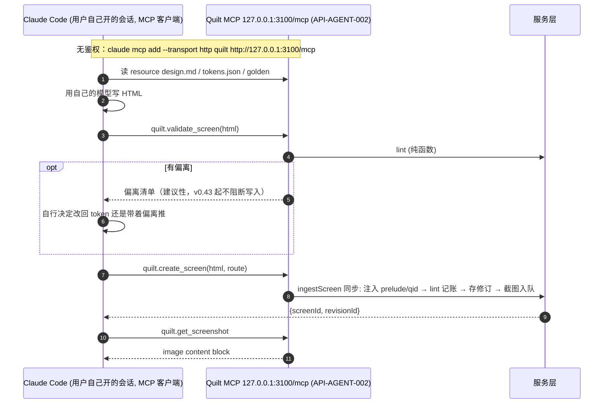
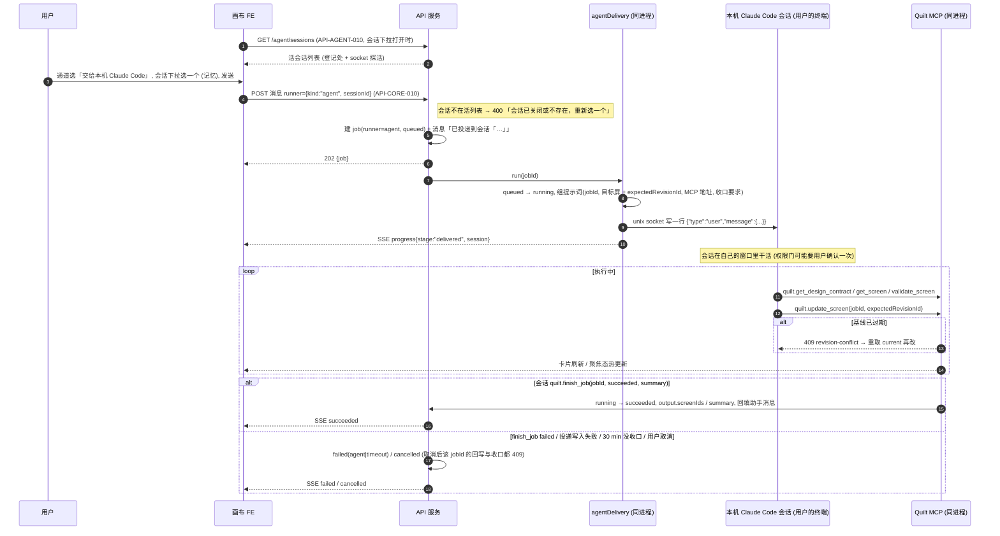
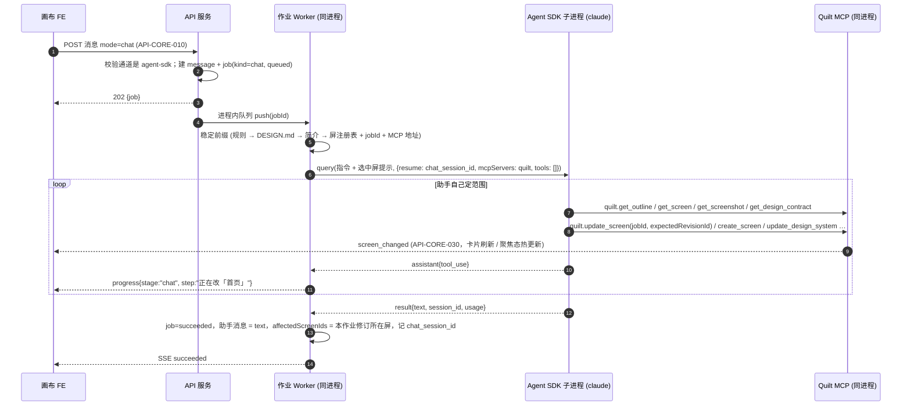
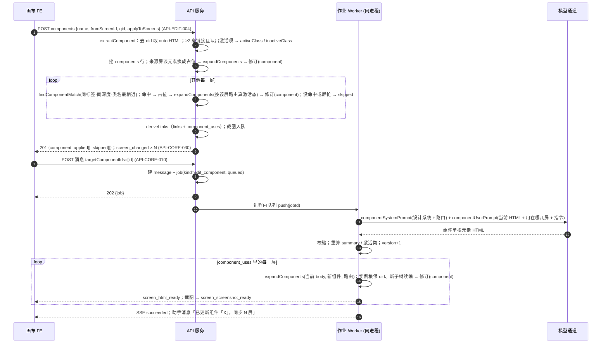

# Quilt 设计文档

> Quilt：AI 原生的无限画布设计工具——用自然语言生成一个 APP 的多屏 HTML 设计稿，摆在无限画布上浏览、交互、迭代、串成可点击的原型；并通过 MCP 让本地编码 agent（Claude Code / Codex）双向接入。**v0.32 起为本地单用户版**：`npx quilt-canvas` 一条命令在用户自己的机器上跑起来，无账号、无鉴权、数据全在 `~/.quilt`；SaaS（多账号、OAuth、配额）整体推迟，涉及的 REQ 标「推迟」而非删除。本文档是前端、后端、MCP server 共用的单一事实源。功能域与里程碑对应：`CORE`=M1、`PROTO`=M2、`EDIT`=M3、`AGENT`=M4/M5、本地版=M10。

## 1. 元信息 / 变更记录

| 字段 | 值 |
| --- | --- |
| 状态 | 已批准（2026-09-09 Owner 逐项签字 ⚠ ADR-001/003/004/005/009/010/011 与 §7 数据模型、§8 契约；见变更记录 v0.2） |
| 项目画像 | 生产产品（全部核心节生效） |
| Owner | @bug |
| 评审人 | @bug（产品 / 架构） |
| 最后更新 | 2026-09-23（v0.65） |
| 关联 | 契约 `api/openapi.yaml`（实现期建立） · 仓库 `github.com/Bearisbug/Quilt` · 安装 `npx quilt-canvas`（包 `apps/cli`） · 调研结论见会话记录 2026-09-07/08/09 |

变更记录：

更早的版本（v0.4–v0.54）在 `docs/CHANGELOG.md`；本表只留 v0.1–v0.3 与最近 5 版，再往前的随每次出版移过去。

| 日期 | 版本 | 改动 | 作者 |
| --- | --- | --- | --- |
| 2026-09-23 | v0.65 | **审查缺陷回写**（多 agent 审查 + 对抗核实，另含 quilt-mcp Skill 调研报出的 3 条）。**取消语义**：① 取消模型作业会中止在跑的 LLM 调用（worker 按作业登记 AbortController，`cancelJob` 调它），中止之后回来的产出不落库；此前只改状态，剩下的调用照常计费，改屏候选还会在取消后把 current 拨回被取消的那批。改屏候选只在 current 仍是这批的基线时接管。② 带已结束作业的 `jobId` 写屏一律 `409 /errors/job-finished`。③ 取消、超时清扫、重启恢复都把该作业发出的批注放回「未处理」。④ 多版生成里一版失败：不再领新任务、等在跑的收尾再判失败；已出的候选照常让 current 指过去，一版都没出的新屏删掉，不让空屏占着路由。**写入口**：⑤ `ingestScreen` 查单屏 256 KB 上限（§15，此前只有模型那条路查）；`append_upload` 加必填 `offset`（对不上 `409 /errors/upload-offset` 并回当前 `chars`，重试不会把同一段拼两次）、累计也查上限；上传位被 `create_screen` / `update_screen` 用掉即删。⑥ 写入时 **qid 对齐而不是全部重编**（core `reconcileQids`）：合法且唯一的旧号保留，新元素从最大号之后续编——连续几次 `patch_screen` 的锚点还对得上，挂在元素上的批注不再漂到别的元素。⑦ 写进来的共享组件实例里若改了副本（除槽位外有内容且与展开结果不同），写入照常，但返回 `componentsOverwritten: [组件名]`（§28「屏 HTML 从 agent 视角不再自包含」那条的预案，就此落地）。⑧ 改路由撞唯一约束回 `409 route-taken`（此前 `update_screen` 回 500）。**变体**：⑨ 删默认屏按整个家族查在跑作业、样板屏指针逐张清、删完清对象存储里这些屏的修订与截图（删屏此前从不删对象）；⑩ 默认屏改路由（`PATCH` / `update_screen` / `link_screens`）变体跟着改；`link_screens` 对变体 `422`；⑪ 用本机 agent 通道发懒生成 / 造变体 / 叠层屏 `400`（会话拿到的只是文字指令，这三种它没有对应写法）。**agent 面**：⑫ 本机会话投递提示词与聊天提示词不再要求「validate 到零偏离」，改为偏离是参考、局部改用 `patch_screen`、大屏分块；样板屏回落不再按 lint 通过筛（改取最早的那张整屏）；lint 文案改为说明代价；⑬ 叠层规则进 `get_design_contract.rules`，`routes` 带 `presentation`，聊天屏注册表标 `[overlay]`；⑭ `quilt.get_project` 改为紧凑投影（屏只留 id / 路由 / 当前修订 / 呈现 / 变体 / 偏离 / 待选 / 断链数 / 位置，组件、设计系统版本、在跑作业、未处理批注数），工具结果一律紧凑 JSON；⑮ `create_component` 说明写清导航组件的判定条件（每项 `<a href="/route">`、当前项有独有 class）。⑯ **token 色支持透明度修饰符**：prelude 给每个色 token 加 `--color-x-rgb` 三元组，Tailwind 颜色写成 `rgb(var(--color-x-rgb) / <alpha-value>)`，`bg-primary/40` 从「静默丢弃」变为生效；导出同构；老修订回刷后生效。**画布与播放**：⑰ 聚焦 iframe 此刻显示哪一屏由 `CanvasView` 显式记录（跳转、切变体、叠层、后退都更新）并上报，检查器、批注、子树重生成写到这一屏（此前切到变体后仍写默认屏，同号 qid 静默改错元素）；变体胶囊按正显示的屏取家族。⑱ 叠层导航：叠层里指回底下那一屏的链接是关闭；后退穿过叠层时按导航栈重摆（整屏换进、叠层逐层压回）；运行时在换整屏尚未落地时收到的压层请求先排队、换完再压（整份重写的路径经 __quiltState 交给新文档），否则叠层挂在即将被换掉的旧 body 上一起消失；叠层正显示时热更新只换这一层。⑲ 预览运行时在换 DOM / 压层后按原顺序重建屏里的 `<script>`（此前只有首次加载会跑，图表屏跳转后空白）。⑳ 导出原型自己维护路由栈，叠层层数与底屏在前进后退中保持正确。**键盘**：面板输入框里 Esc 先失焦不退出聚焦；空格在按钮等控件上是激活而非平移；风格指南卡 Enter / 空格可选；跳屏面板加可见「关闭」键（A11Y-005）。**文档**：§24 改写为现状；`patch_screen` / `append_upload` 的入参校验错误是 MCP 协议层参数错误（-32602），不是 `/errors/validation`。`TC-AGENT-011` 增第 7c、8a 步，`TC-PROTO-012` 增第 5～6b 步，`TC-CORE-040` / `041` 增断言 | @bug |
| 2026-09-23 | v0.64 | **MCP 写屏改小步**（`API-AGENT-002` 补充，54 个工具）：本机 Claude Code 用 Quilt 写屏时频繁报「API Error: Connection lost mid-response」。断的是模型自己的输出流，单条响应越长越容易断；而写屏只有「一次调用带整屏 HTML」一条路——Omnivia 会话实测 `create_screen` 单次入参最大 23,985 字符、超过 15 K 的 9 次，`update_screen` 为改几行也整屏重发（最大 21,243）。另一头 `get_screen` 每次返回 16.9 K 字符的 prelude（其中 14 K 是 Quilt 自己的预览运行时），agent 回写时还常原样抄回来。改动：① 新增 `quilt.patch_screen { screenId, expectedRevisionId, edits:[{ find, replace, all? }], jobId? }`：在当前 body 上按原文锚点依次替换，只传改动；锚点找不到或匹配多处（未给 `all`）`422 /errors/validation` 并点名第几条，整批不落库；成功走 `ingestScreen` 同一条写入路径（去旧 qid → 展开组件 → 注入 → lint 记账 → 新修订 → 截图）。② 新增 `quilt.append_upload { uploadId, chunk }`：往 `create_upload_url` 给的 HTML 上传位追加一段（单段 ≤ 16,000 字符，工具说明建议 ≤ 8 KB），传完把 `uploadId` 交给 `create_screen` / `update_screen`——大屏拆成多次小调用，不必再让 agent 自己写文件再 curl。③ `get_screen` / `get_revision` / 资源 `screen-html` 只返回 body（带 data-qid，正好是写入口收的东西），prelude 由服务端每次写入时重拼，agent 用不上。④ `create_screen` / `update_screen` 的说明写明单次 `html` 以 8 KB 为界、超了走分块或改用 `patch_screen`，server instructions 同步。`TC-AGENT-011` 增第 13 步、第 1 步工具数改 54 | @bug |
| 2026-09-23 | v0.63 | **叠层屏**（新增 `REQ-PROTO-005`）：弹层、底部抽屉、动作面板此前要么焊死在某屏里，要么当整屏生成——播放时跳过去底下的屏就没了。屏加一个呈现方式 `presentation = push \| overlay`（默认 push）：overlay 屏在播放时**压在当前屏上**（运行时新消息 `quilt:overlay`：暗 45% 的遮罩 + 该屏 body 的根元素，点遮罩或 Alt+← 关掉；导航栈照常压栈，`goBack` 遇到顶层是叠层就只关它），跳到 push 屏时先清掉全部叠层；导出原型同构（`template[data-presentation]`，hash 路由到叠层路由时加一层，`history.back()` 即关）。生成侧：规划器可给每屏 `presentation`（sheet / dialog / picker 类），懒生成与 MCP 带 `presentation`；叠层屏的提示词只写弹层本身、根元素透明、不画遮罩。呈现是**元数据**，改它不重烤修订：预览域下发与截图时按屏的 `presentation` 临时注入 `html,body{background:transparent}`（截图 `omitBackground`，PNG 带 alpha），画布卡片把透明截图铺在暗底上并标「叠层」。入口：工具栏「设为叠层 / 设为整屏」（恰好选中一屏时）、`API-CORE-012` 的 `presentation`、MCP `create_screen` / `update_screen` / `generate_screens`。`TC-PROTO-012` 新增 | @bug |
| 2026-09-23 | v0.62 | **状态变体**（新增 `REQ-CORE-025`）：一条路由只有一份 HTML，空态 / 错误态 / 未登录态没处放——另起路由污染应用地图，用候选又会被采用结清。变体 = **同路由下的具名兄弟屏**：`screens.variant_of` 指向默认屏、`variant_name` 是状态名，路由唯一约束改为只对默认屏生效（partial unique）；变体只有一层（变体不能再出变体），删默认屏级联删变体。应用地图与导航只认默认屏（`deriveLinks` 的路由表、播放时 `quilt:navigate` 的目标都排除变体），变体自己发出的链接照常入图；屏注册表与 ALLOWED ROUTES 也不列变体（路由已由默认屏占着）；导出原型只带默认屏。造变体 = 钉死路由的 `generate`：`input.variantOf + variantName`（`count` 恒 1，`versions` 照用），跳过规划器，默认屏作参考屏，提示词写明「同一屏的 X 状态：布局、导航、视觉不变，只改状态所指的那部分」，落位在默认屏最右一个变体的右侧、同一行。变体是普通屏：改 / 子树 / 直改 / 批注 / 候选 / 回溯都一样，只是 `route` 不可改（422）、`variantName` 可改。画布：变体卡标「变体」、默认屏卡标「N 个变体」；**播放时可切状态**——聚焦的屏所在家族 ≥ 2 时卡上方出现状态胶囊「默认 ｜ 空态 ｜ …」，点即在同一 iframe 里换成该变体的当前修订（`quilt:swap keepScroll`，不动镜头、不进导航栈）。入口：工具栏「出变体」（恰好选中一个默认屏）→ 起名 + 一句话 → 作业；MCP `generate_screens` 同名字段。`TC-CORE-041` 新增 | @bug |
| 2026-09-23 | v0.61 | **找屏与总览**（新增 `REQ-CORE-024`，纯前端）：40 屏以上全靠平移找卡片。三样东西：① **跳屏 `⌘K`**——命令面板按名字 / 路由 / 用途模糊匹配屏与共享组件，↑↓ 选、Enter 跳（镜头把那张卡摆到可用区中央、缩放不超过 1:1，并选中它）；② **屏列表面板**（`panel=screens`，`⌥S`）——按画布阅读顺序（先上后左）列全部屏，筛选片「断链 / 待选候选 / 有偏离 / 正在改」带计数，点行同样跳过去；变体紧跟在默认屏之后缩进一级；③ **小地图**——顶栏下方左侧 176×112 的缩略图，按位置画出屏、组件、风格指南卡与当前视口框，点哪儿镜头就平移到哪儿，视口框可拖；工具栏可开关（本机记忆 `quilt:minimap`，默认开）。三样都是零 token 的纯前端，数据全来自项目详情。`TC-CORE-040` 新增 | @bug |
| 2026-09-23 | v0.60 | **工程底座：仓库结构、单测层、MCP 拆域与工具合并、两处修复**（接口语义只有 `API-AGENT-002` 工具表两行合并）。① **前端按功能域分目录**（§6「仓库布局」）：`apps/web/src` 从一个 21 文件的 `components/` 拆成 `ui / canvas / composer / panels / project / settings`，跨目录一律 `@/` 绝对引用（vite alias + tsconfig paths）；645 行的 `SidePanels.tsx` 按面板拆成五个文件。② **`Canvas.tsx` 拆分**：947 行 / 37 个 `useState` 拆到 669 行 / 24 个——排列条（`ArrangeBar.tsx` + 纯函数 `arrange.ts`）、位置草稿与撤销栈（`positions.ts`）、作业文案（`jobs.ts`）、三个弹层（`dialogs.tsx`）、通道 / 会话 / 模式偏好（`useRunnerPrefs`）、输入框与对话记录显隐（`useComposerChrome`）各自成文件，e2e 脚本零改动。③ **MCP 按域拆文件**：`mcp/server.ts`（330 行、92 行超 200 字符、最长 1186 字符）拆成 `mcp/ctx.ts` + `mcp/tools/{projects,screens,revisions,jobs,design,components,assets,annotations}.ts` + `resources.ts`，每个工具的说明、入参、处理各自成行；工具说明逐字不变。④ **合并两对重合工具**（54 → 52）：`adopt_candidate` 吸收 `adopt_candidates`（`{ jobId, index, screenId? }`，逐屏成败、`skipped` 带错误码），`create_upload_url` 吸收 `create_attachment_upload_url`（按 `mediaType` 分流）。其余工具不裁——单个会话开出来就是为了 Quilt 的全功能接入，§28 那条改为已拍板。⑤ **单测层**：`tests/unit` 用 `node:test` 覆盖 `packages/core` 的注入 / 组件展开 / 大纲 / lint / token / 约定 / 用量预估与前端的排列算位、作业文案共 29 条，`pnpm test` 0.5 s 跑完；`TEST.md` §5 加「单测轮」。起因：v0.58 一天回写的 10 条缺陷里至少 6 条在这些纯函数上，此前只能起 Postgres + 浏览器 + stub 模型才发现。⑥ **`projectOutline` 去 N+1**：此前逐屏查两次库再读一次文件且串行（100 屏 = 200 条 SQL + 100 次文件读），聊天助手每轮先看大纲都要付这个价；改为一条 `inArray` 取齐修订、并行读文件。⑦ **删除确认与断链补屏两个弹层接上 `useModal`**（`canvas/dialogs.tsx`）：此前只有 `aria-modal` 与 `autoFocus`，没有焦点陷阱与背景 `inert`，读屏被告知背景已隐藏、Tab 却还能走进画布；§28 M7 那条收口。⑧ 变更记录只留 v0.1–v0.3 与最近 5 版，更早的移入 `docs/CHANGELOG.md`（`TEST.md` 同） | @bug |
| 2026-09-09 | v0.1 | 初稿：M1–M5 全范围数据模型、接口契约、状态机、流程、页面、ADR | @bug |
| 2026-09-09 | v0.2 | Owner 逐项签字批准；新增 `REQ-CORE-010` 设计系统可视化（M1 只读风格指南卡片 + 面板）；⚠ ADR 由 Proposed 转 Accepted；M0 spike 时间盒定 3 天；拍板 Google 登录推迟、金标准屏用内置模板库 | @bug |
| 2026-09-09 | v0.3 | M0 spike 结论回写（§26 出口达成；ADR-002/003/005 补实证与后果；§28 新增 4 条发现）；spike 代码在 `spike-m0/`（gitignore），不进生产 | @bug |
| 2026-09-22 | v0.59 | **改可见文案时无障碍名跟着改**（`REQ-EDIT-001` / `API-EDIT-005` 补充，v0.57 的遗留项收口）：直改此前只改选中的那一处，把一条 tab 从「附近」改成「同城」之后，同一条上的 `aria-label="附近"` 还是旧的——读屏念出来的与看到的不是一回事。`applyElementOps` 的 `text` op 之后联动一次：**只在两者原本逐字符相等时才改**，不相等说明作者刻意让它们不同（图标按钮 `aria-label="关闭对话框"` 配可见的「×」是最常见的一种），一个字都不动。找的范围是被改元素本身加上最近一层 `label` / `a` / `button` / `[role]` 祖先及其子树——`<label><input aria-label="附近"><span>附近</span></label>` 这种结构里名字挂在兄弟节点上，只看自己会漏；范围到那一层就停，不会漫到邻条去改别人的。`title` 同规则处理。屏与组件共用这一条路径，两边一起受益。**HTML 注释不动**（如 `<!-- Tab 3: 附近 -->`）：它不可见、读屏也不念，改它只是替作者重写注释，不属于这条规则要守的东西。`TC-EDIT-012` 第 11 步增断言 | @bug |
| 2026-09-22 | v0.58 | **今天这批功能的缺陷回写（10 条，多 agent 审查 + 对抗验证后逐条实测修掉）**：① **选择元素态的穿透规则把运行时自己的选中框也变成可命中**（`runtime.ts`，v0.57 引入）——选中框为了与检查器对号也带 `data-qid`，被 `[data-qid]{pointer-events:auto !important}` 强制成可命中后，它罩住的一切都点不动；选中的是根元素时整屏失效。**屏与组件都受影响**，这是最严重的一条。改为 `[data-qid]:not([data-quilt-ui])`。② **「记为共享组件」这条建组件路径绕过了 qid 注入**（`createComponent` 的提取分支用的是 `extractComponent` 的产物，它把 qid 整套剥掉了）——这样建出来的组件选不中任何元素，要等下次重启被回填补上才突然能用。改为提取后 `injectQids`（不走 `classifyComponentHtml`：它重算 navClasses 时没有 route 上下文，会丢掉按屏算出的激活态）。③ **组件直改成功后 iframe 会因 `?v=` 变化重载，选择元素态静默失效**——父页那个同步模式的 effect 依赖没变不会重跑，新文档的 `quilt:ready` 又被守卫挡掉。改为接住组件 iframe 的 ready 并补发当前模式。④ **删掉带 `aria-current` 的那条链接会把 `activeClass` / `inactiveClass` 抹成 null**，展开时整段激活态逻辑被跳过、所有屏的导航一起变成清一色未激活。那对类描述的是「选中长什么样」而不是「哪一条选中」，重算为空时保留上一版。⑤ **画布视图落盘只防抖不 flush**，触控板惯性滚动后立刻刷新会丢掉**整段**平移；补 `pagehide` 与卸载时 flush。⑥ **切到从未打开过的项目时用上一个项目的屏算适配并把错镜头存进新项目的键**（切项目是客户端导航，`detail` 还是旧的）——改为 `detail.project.id !== projectId` 时不渲染画布。⑦ **改窗口大小后工具条不重量**，停在缩窄前算出的 nowrap 上，屏数 / 版数 / 发送被外壳裁到视口外点不到；用画布的可用区探针做 ResizeObserver 重量（探针缺席时退回 window resize）。⑧ **390 px 下左组既不缩也不折行**，参考图按钮整颗被裁、点下去命中的是画布；`data-bar="wrap"` 时两组都允许内部折行。⑨ **`overflow:hidden` 把按钮提示气泡切掉一半**（含取消键的 `Esc` 提示）；改 `overflow: clip` + `overflow-clip-margin: 2rem`——要裁的是过渡中途横向溢出的那一大截，不是探出十几 px 的气泡。⑩ **组件直改能在 `edit_component` 作业跑着时落库**，把作业顶成失败（收尾时 `where version = N` 匹配不到行），花掉的 token 全白费；新增 `/errors/component-busy`（服务端按在跑作业判，客户端保存 / 删除按钮同时受 `busy` 约束）。`TC-EDIT-012` 与 `TC-CORE-007` / `TC-CORE-023` 的相关步骤增断言 | @bug |
| 2026-09-22 | v0.57 | **组件里也能选元素直改**（`REQ-EDIT-006` 扩写，新增 `API-EDIT-005`）：此前选择元素只对屏开放——组件 HTML 里一个 `data-qid` 都没有（qid 是展开进屏时逐屏发的），组件自己没有可寻址的元素。改动：① 组件 HTML 落库前重编 qid（`classifyComponentHtml`，三条写入路径共用这一个口子），这套编号是组件自己的、与屏里那套互不相干——`expandComponents` 展开时照旧整套剥掉按屏重发，屏侧零变化；存量组件由启动回填补上（`backfillComponentQids`，只补缺的、不升版本、不回刷屏）。② 新增 `API-EDIT-005` `POST /components/{id}/elements/{qid}`：与屏的 `API-EDIT-001` 同一套 op（text / classes / style / link / remove，**不含 detach**——「脱离共享」说的是把某一屏里的实例摘出来，对组件本体不成立），乐观并发用组件版本号（组件没有修订），改完走 `updateComponent` 那条路升版 + 确定性回刷所有用它的屏。③ 画布：组件卡在交互态按 `⌘E` 就地转选择元素态（运行时同一套，`quilt:mode` 单独发给组件那个 iframe），选中后开检查器（标题「检查器 · <组件名>」）；组件态下没有「用 AI 重生成这块」与「记为共享组件」——整块重写是输入框的「改组件」，面板里给指路；正被 `edit_component` 作业改的组件挡住直改。④ **选择元素态临时解除 `pointer-events:none`**（`[data-qid]{pointer-events:auto !important}`，退出即撤）：设计里常把文字或装饰层设成不可命中、整块交给外层 `<label>`，不解除的话里面的文字元素永远选不中——这条对屏同样生效。⑤ 离开时必须**显式把组件运行时打回 `interact`**：屏退出聚焦会卸载 iframe、什么都不留，而组件卡的 iframe 是常驻的——不发这一条，选中框与「tag · qid」标签就留在卡片上、命中规则也还解除着；⌘E / ⌘/ 同样要从组件 iframe 转发给父页键位表，否则焦点一落进组件里 `⌘E` 就是死键、模式退不掉（两条都是实测打出来的，见 `RUN-109`）。`TC-EDIT-012` 增第 11 步 | @bug |
| 2026-09-22 | v0.56 | **组件交互态的角标换成呼吸绿点**（`REQ-EDIT-006` 补充）：v0.53 给的是「交互中 · <组件名>」文字角标，组件名一长就占掉卡片右上一整条，而组件名本来就写在卡片下方的标签里、重复一遍没有新信息。改为卡片右上一个 8 px 绿点（`--color-success` + 22% 同色光晕），复用骨架那条 `sk-pulse` 关键帧做呼吸（1.2 s 一循环，避开 0.2 Hz 那档前庭不适区；`prefers-reduced-motion` 下只留常亮的点）。不是纯靠颜色表态：点带 `role="status"` 与 `aria-label="交互中"`（读屏与 hover 都读得到），卡片本身还有强调色外框。屏的角标不动——它写的是路由与 `⌘E` 提示，是有信息量的 | @bug |
| 2026-09-22 | v0.55 | **组件预览里的链接一律惰性**（`REQ-EDIT-006` 补充）：v0.53 让组件卡可交互后，组件里按契约写 `href="#"` 的条目一点就弹「去处还没设计」，连点几下弹一叠——但组件根本没有路由，跳转这件事对它不成立，提示本身就是噪音。`componentPreviewDocument` 在 prelude 之后注入 `window.__quiltComponent = true`，运行时据此把组件文档里的链接点击与表单提交做成**惰性**：拦掉默认行为、不发 `quilt:navigate` / `quilt:dead`，父页自然也不再有提示。组件卡的交互态只用来试组件**自己的状态**（tab 切换、开关、折叠），见「组件交互契约」。`Esc` 仍转发：焦点落在组件 iframe 里时父页 window 收不到键盘，组件只接这一条消息。`TC-EDIT-012` 第 9 步增断言 | @bug |

## 2. 背景 / 目标 / 非目标

- 背景：Google Stitch 证明了「一句话 → 多屏 UI 设计稿」的需求真实存在，但它的屏幕彼此孤立（链接全是 `href="#"`）、画布只是缩略图墙、agent 只能单向拉取、生成的 HTML 硬编码色值导致多屏漂移。设计师和独立开发者需要一个能把整个 APP **串起来**、能**直接点着走**、能被自己的编码 agent **双向驱动**的画布。
- 目标：① 从需求描述生成整套风格一致的多屏设计稿并摆在无限画布上；② 屏幕可直接交互、可沿路由穿行成完整原型；③ 多轮对话迭代与元素级编辑，且任何一版可回溯；④ 设计系统可改可回刷；⑤ MCP 让本地 agent 既能读写画布，又能被画布派活；⑥（v0.32）一条命令装好、在本机跑起来，不装 Docker、不注册账号。
- 非目标：① 多人实时协作（单用户项目，不做 CRDT）；② 生成生产级 React 工程代码（导出仅为可交互 HTML 原型，代码实现交给接入的 agent）；③ React Native / 原生端渲染；④ 计费与支付（本地版只记用量台账，无上限）；⑤ 跨用户的分支合并（v0.31 起修订链允许分支与候选，但只在单用户项目内，不做合并 / 冲突解决）；⑥ 平板设备形态（只做手机与桌面）；⑦ 国内市场合规与中转（面向海外）；⑧（v0.32 推迟）多账号 SaaS——登录、OAuth、配额、远程派活通道整体推迟，数据模型不为它让路也不为它删字段。

规模画像：

| 维度 | 估算 | 依据 / 假设 |
| --- | --- | --- |
| 用户量 | 上线 6 个月内注册 < 1000，DAU < 100，峰值并发 < 50 | 显式假设（用户拍板「海外小规模起步」）；注册超 3000 或并发超 150 需重估 |
| 请求量 | 生成类写请求峰值 < 1 QPS（每次生成 = 1 个作业）；画布读请求 < 20 QPS；预览域 HTML 读 < 30 QPS | 按并发 50 × 每人每分钟 ≤ 1 次生成、每次生成 3–6 屏估；超 5 倍需重估 |
| 数据量 | 12 个月：项目 < 5000、屏幕 < 10 万、修订 < 50 万（HTML ≈ 10 KB/版 → 5 GB）、截图 < 50 万（≈ 100 KB/张 → 50 GB） | 按 1000 用户 × 5 项目 × 20 屏 × 5 版估；对象存储超 200 GB 需重估保留策略。本地版单机：几十个项目、几千版、`~/.quilt` 几百 MB |
| 分布与形态 | v0.32：每个用户自己机器上一个进程（`npx quilt-canvas`），无服务端；SaaS 阶段再单区域部署 | 用户拍板本地优先 |
| LLM 调用 | 每屏生成 ≈ 8–15K token 输入 / 4–8K 输出；峰值并发 LLM 调用 ≤ 20 | 按上下文预算 5–10K + 屏幕输出估；超 20 并发需申请额度 |

## 3. 成功指标 / 验收阈值

| 指标 | 定义 | 当前 | 目标 | 由哪些事件算 |
| --- | --- | --- | --- | --- |
| 生成成功率 | 完成的生成作业 / 发起的生成作业（排除用户取消） | — | ≥ 95% | `EVT:generation_requested` / `EVT:generation_completed` |
| 首批屏可用时间 P50 | 从发起到首批 5 屏全部截图就绪的耗时中位数 | — | ≤ 90 s | `EVT:generation_completed`（`duration_ms`） |
| 一致性一次通过率 | 生成的屏幕首次 lint 即通过的比例 | — | ≥ 90% | `EVT:generation_completed`（`lint_pass_first_try`） |
| 迭代深度 P50 | 每个有 ≥ 3 屏的项目的对话消息数中位数 | — | ≥ 5 | `EVT:message_sent` |
| 原型播放使用率（M2） | 发生过链接跳转的项目 / 有 ≥ 3 屏的项目 | — | ≥ 50% | `EVT:prototype_link_clicked` / `EVT:project_created` |
| 派活完成率（M4 / M10） | `runner=agent` 作业 succeeded / 创建的 `runner=agent` 作业 | — | ≥ 80% | `EVT:agent_job_created` / `EVT:agent_job_completed` |

（作业系统失败率、预览加载错误率是接口可用性 SLI，放 §21，不入本表。「对标 Stitch」是人工评审门，放 §19 与 §26 出口条件，不是埋点指标。）

## 4. 术语表 / 统一语言

| 术语 | 定义 | 代码/字段标识 | 对应实体 |
| --- | --- | --- | --- |
| 账号 | v0.32 本地版 = 一行默认用户 `local@quilt.local`，所有项目归它；SaaS 阶段 = 登录用户 | `user` | `ENT-User` |
| 项目 | 一个 APP 的设计工作区：一张画布 + 一份设计系统 + 一条对话 | `project` | `ENT-Project` |
| 设备形态 | 项目级屏幕尺寸口径：手机 390×844 或桌面 1280×800 | `deviceType` | `ENT-Project`（字段） |
| 设计系统 | 项目的视觉契约：结构化 token + DESIGN.md 散文 + 组件片段库 | `design_system` | `ENT-DesignSystem` |
| 设计契约 | 设计系统的机器可判定投影（token、组件白名单、禁用清单），供 lint 与 agent 使用 | `designContract` | `ENT-DesignSystem`（派生视图） |
| 屏幕 | 画布上的一张卡片，代表 APP 的一个页面；有位置、路由、当前修订 | `screen` | `ENT-Screen` |
| 修订 | 屏幕的一个不可变版本：HTML + 截图 + 来源；带父修订指针，修订链成树（v0.31） | `revision` | `ENT-ScreenRevision` |
| 候选 | 同一作业为同一屏产出的 N 条兄弟修订（同 `jobId`、`candidateIndex` 0..N−1），采用前 current 默认第 1 版；采用 = 把 current 指向所选修订并结清该批 | `candidate` | `ENT-ScreenRevision`（字段） |
| 锚点 | 双击画布空白处放下的「新屏落点」，随下一次「造」消费；它是输入框的一种目标标签 | `anchor` | 前端状态（作业输入 `anchor{x,y}`） |
| 应用简介 | 项目级的 3–5 句话：这是什么 APP、给谁用、调性；首轮规划器扩写，面板可编辑，每次生成都带 | `brief` | `ENT-Project`（字段） |
| 样板屏 | 用户钦定的风格锚点屏，生成 / 修改时作为参考屏带入上下文；默认首轮第 1 屏 | `exemplarScreenId` | `ENT-Project`（字段） |
| 约定 | DESIGN.md 的 `## 约定` 节：跨屏生效的绝对规则清单（≤ 20 条），只经提炼 + 预览确认写入 | `conventions` | `ENT-DesignSystem`（`design_md` 内） |
| 前置样式 | 服务端拼进每版 HTML `<head>` 的 token CSS 变量与运行时脚本，模型不生成 | `prelude` | `ENT-ScreenRevision`（拼装规则见 §18 ADR-005） |
| 元素 ID | 服务端注入到每个元素上的稳定标识 `data-qid` | `qid` | `ENT-ScreenRevision`（HTML 内） |
| 作业 | 一次异步的生成/编辑/回刷/导出任务，含流式进度 | `job` | `ENT-GenerationJob` |
| 对话 | 项目内的多轮消息流；每条助手消息关联一个作业与受影响屏幕 | `thread` / `message` | `ENT-Message` |
| 聊天 | 输入框的第三种动词（v0.45）：一句话交给住在 Quilt 进程里的助手（Agent SDK 回路 + Quilt MCP），范围由它定、可以只回答不改；一个项目一条会话，逐轮 `resume` | `mode=chat` / `kind=chat` / `chatSessionId` | `ENT-GenerationJob`（`kind`）、`ENT-Project`（字段） |
| 共享组件 | 项目级的一段 HTML（导航栏、顶栏、侧栏、页脚…），画布上与屏并列的一等对象（v0.46）；屏引用它、不复制代码，改它一次所有用它的屏零 LLM 同步 | `component` | `ENT-Component` |
| 实例 | 屏里放共享组件的位置：写入前是占位根元素 `<tag data-component="名字">`，展开后是组件正式 HTML、根元素仍带 `data-component` 标记；实例里的元素锁定直改，只能「改组件」或「脱离共享」 | `data-component` | `ENT-ScreenRevision`（HTML 内） |
| 槽位 | 组件正式 HTML 里标 `data-slot="name"` 的元素：随屏变的内容（如顶栏标题）由实例按名填入 | `data-slot` | `ENT-Component`（`html` 内） |
| 脱离共享 | 摘掉某屏某实例根的 `data-component`：这一屏的这份从此归屏自己管、不再跟着组件变；唯一允许落在实例上的直改（`API-EDIT-001` 的 `detach` 操作） | `detach` | `ENT-ScreenRevision`（`source_kind=manual`） |
| 链接 | 从某屏某元素指向某路由的跳转关系；目标屏可能不存在（断链） | `link` | `ENT-Link` |
| 应用地图 | 项目内全部链接与屏幕路由构成的图；从 HTML 派生，不手工维护 | `appMap` | `ENT-Link`（派生视图） |
| 聚焦 | 画布上某屏由截图态切换为活 iframe 态 | `focus` | 前端状态 |
| 原型播放 | 在聚焦的屏内点链接沿应用地图跳转 | `play` | 前端状态 |
| 派活 | 把一个作业交给本机 agent 去做（v0.32：就是 `runner=agent` 的作业本身，没有单独的任务单据） | `runner=agent` | `ENT-GenerationJob` |
| 用量台账 | 每次作业消耗的 token 与屏数的只增记录 | `usage_ledger` | `ENT-UsageEntry` |
| 硬上限 | （v0.32 删除）本地版不设上限，台账只记不拦 | — | — |
| 本机 agent | `runner=agent` 作业的执行者：本机正在运行的一个 Claude Code 交互式会话（v0.34：作业经它的 inbox socket 投递进去，由它经 MCP 回写并收口；v0.32 的无头 `claude -p` 子进程与更早的伴侣进程都已删除） | `agentDelivery` | `ENT-GenerationJob`（`runner` 字段、`input.runner.sessionId`） |
| QUILT_HOME | 本地版的全部数据目录，默认 `~/.quilt`：`db/`（PGlite）、`objects/`、`config.env`、`agent/`（子进程工作目录）、`quilt.log` | `QUILT_HOME` | — |

## 5. 功能清单与需求 ID

| ID | 功能 | 对应目标 | 优先级 / 里程碑 |
| --- | --- | --- | --- |
| REQ-CORE-001 | 邮箱 magic link 登录/注册，会话 30 天（**v0.32 推迟**：本地版无账号，所有请求解析为默认用户 `local@quilt.local`；SaaS 阶段加回） | 地基 | 推迟 |
| REQ-CORE-002 | 创建项目：只填项目名与设备形态，自动生成初始设计系统（种子色取默认值算色板，生成后可在设计系统面板改；v0.40 起可选一个设计预设开局，见 `REQ-CORE-021`）；重命名项目（v0.40）：切换器行内重命名键 → 名字就地变输入框 → 回车 / 失焦保存、`Esc` 放弃（`API-CORE-013`；项目名不要求唯一）；删除项目（v0.34）：项目切换器行内垃圾桶 → 确认 → 级联删除，有进行中作业时拒 | 目标 ① | P0 / M1 · v0.34 改写 |
| REQ-CORE-003 | **造**（v0.31 统一为一种 `generate` 作业）：输入框无目标标签 + 发送即造；屏数档位 `1 / 2 / 3 / 4 / 自动`（非空项目默认 1，空项目默认自动 = 规划器定 4–6 屏主流程），> 1 或自动时规划器规划一组并互相连线，规划器拿到屏注册表（route + purpose）避免撞路由；版数 1–4 = 每张新屏 N 版候选（`REQ-CORE-015`）；流式落到画布；**目标为空时**造完自动选中新屏（用户已手动设过目标 = 明确意图，后台这一批落地不接管，否则正在写的指令被改投到刚造出来的屏上） | 目标 ① | P0 / M1 · M9 改写 |
| REQ-CORE-004 | 无限画布：截图平铺、平移缩放、拖动摆放、位置持久化；**多选批量移动**（v0.47）：按住已选中的任一卡片拖动，选中的屏与共享组件整组等量位移，松手逐张落库，`⌘Z` 整组还原 | 目标 ① | P0 / M1 · v0.47 补充 |
| REQ-CORE-005 | 聚焦交互：双击某屏切换为活 iframe（独立预览域），可点按滚动输入，Esc 退出 | 目标 ② | P0 / M1 |
| REQ-CORE-006 | **改**：输入框有目标标签 + 发送即改（`edit_screens`，默认整屏重生成），版数 > 1 时每个目标各得 N 版候选；目标标签只被「点屏（替换 / 加选）/ 标签 × / 目标区「清空」」改变，点空白只清画布高亮不清标签，输入框内 `Esc` 有草稿清草稿、无草稿失焦、都不清标签；目标区始终显示动词行「造 1 屏 × 3 版 · 此处」/「改 3 屏」/「改全部 12 屏 × 2 版 = 24 次调用」；`⌘A` + 发送 = 普通改全部；消息记录受影响屏 | 目标 ③ | P0 / M1 · M9 改写 |
| REQ-CORE-007 | 屏幕修订树：每次生成/编辑产生新修订并记父修订；可回溯到任意一版（回溯 = 以旧版内容建新修订）；修订面板按分支折叠、候选组内标「未选用」并可随时采用 | 目标 ③ | P0 / M1 · M9 改写 |
| REQ-CORE-008 | 用量台账：每个作业结束记一条（token 进出、屏数、驱动 / 模型），设置弹层「本月用量」按月汇总、按驱动分列；发送前动词行的预计调用数与作业超时共用一个预估函数 `estimateJob`（屏数 × 版数 ×（1 + 修复轮）+ 规划 1 次）。**v0.32 起无硬上限、不拦截**——本地版花的是用户自己的 Key / 订阅，台账只为可见 | 非目标 ④ 的最小替代 | P0 / M1 · M10 改写 |
| REQ-CORE-015 | **选（候选）**：候选 = 同一作业产出的兄弟修订（`jobId` + `candidateIndex`），current 默认第 1 版、不选也不阻塞连线 / 导出 / agent 读屏；卡片挂「N 版 · 展开」角标、后面叠错位底板；点角标**在画布上就地展开**（v0.34）：第 1 版留在卡片原位，其余版横向排成一行铺到右边，每格与卡片同尺寸、随画布缩放，里面是该版的**活 iframe**（可滚动 / 悬停 / 填表）；动作收进每格上方右缘对齐的浮层胶囊（屏幕尺寸的图标按钮）：「第 k 版 / 当前」标签、「就用这一版」、「采用这一组（N 屏）」，第 1 格带「收起」，`Esc` 收起（焦点在候选 iframe 里时也算）；采用即结清该批并自动收起。整组采用按服务端逐屏的成败分三种反馈：全采用、部分跳过、全跳过；**一屏都没采用时不刷新也不收起**，展开层留给用户重试或逐屏采用 | 目标 ③ | P0 / M9 · v0.34 改写 |
| REQ-CORE-016 | **持久记忆**：应用简介（首轮规划器把用户那句话扩写成 3–5 句落到 `projects.brief`，设计系统面板可编辑，每次调用都带）；样板屏（`projects.exemplarScreenId`，工具栏「设为样板」，默认首轮第 1 屏，永远取其 current 作参考屏）；屏注册表（`screens.purpose` 由规划器落库，进每次调用的稳定前缀） | 目标 ①④ | P0 / M9 |
| REQ-CORE-009 | 项目持久化与恢复：刷新/重登后画布、对话、修订完整恢复 | 地基 | P0 / M1 |
| REQ-CORE-010 | 设计系统可视化：画布上一张只读「风格指南卡片」（色板/字阶/间距/圆角/组件样例，由 token 渲染、永远同步）+ 侧面板查看 DESIGN.md；编辑与回刷见 `REQ-EDIT-003` | 目标 ④ | P1 / M1 |
| REQ-PROTO-001 | 原型播放：聚焦屏内点链接（`<a href>`）、提交表单（`<form action>`）或点带 `data-href` 的按钮 → iframe 内换 DOM 跳目标屏，状态保持、转场、导航栈后退；没有对应屏的导航写 `href="#"`，点击只给提示、不跳转；聚焦屏内的触控板捏合作用于画布缩放、不触发浏览器整页缩放 | 目标 ② | P0 / M2 |
| REQ-PROTO-002 | 应用地图从 HTML 派生（`<a href>` / `<form action>` / `[data-href]` 三种导航源）；画布上屏与屏之间画出跳转连线（可开关），断链标红；「接上跳转」一键让 AI 把未连上路由的导航动作连好（`edit_screens` 作业 + 固定指令，指令给出全部允许路由、由模型自行判断每个动作的去向；对选中的屏生效，未选中时作用于全部屏）（无对外写 API，见状态机 `GenerationJob` running→succeeded 动作列与 `API-PROTO-001` 读） | 目标 ② | P0 / M2 |
| REQ-PROTO-003 | 懒生成：点到不存在的路由 → 一键生成该屏（v0.31 起为 `generate` 作业的一种输入：`route` 与 `name` 钉死、跳过规划器、来源屏作为参考） | 目标 ② | P1 / M2 · M9 改写 |
| REQ-PROTO-004 | 导出单文件可交互原型（全部屏 + hash 路由） | 目标 ② | P1 / M2 |
| REQ-PROTO-005 | **叠层屏**（v0.63）：屏的呈现方式 `presentation = push \| overlay`（默认 push）。播放时跳到 overlay 屏不换 DOM，而是压在当前屏上（暗遮罩 + 该屏根元素），点遮罩或后退关掉；跳到 push 屏先清掉全部叠层；导出原型同构。生成侧规划器 / 懒生成 / MCP 都能指定；叠层屏的提示词只写弹层本身、根透明、不画遮罩。呈现是元数据：改它不重烤修订，预览域与截图按它临时注入透明背景（截图带 alpha），画布卡片铺在暗底上并标「叠层」。入口：工具栏「设为叠层 / 设为整屏」、`API-CORE-012 presentation`、MCP | 目标 ② | P1 / v0.63 |
| REQ-EDIT-001 | 元素级选中与本地直改：改文案/样式/跳转目标零 token，落为新修订 | 目标 ③ | P0 / M3 |
| REQ-EDIT-002 | 元素子树 AI 重生成：只发选中子树，整段替换。**通道单独选**（v0.34）：检查器「用 AI 重生成这块」下方有与输入框同一套的通道 + 会话选择器，`regenerate_subtree` 输入带 `runner?`；记忆独立于输入框（局部改动常只要更快的模型），第一次沿用输入框当前通道；选本机 agent 时作业投递到会话，提示词限定只重写该 `qid` 子树、其余元素原样推回 | 目标 ③ | P0 / M3 · v0.34 改写 |
| REQ-EDIT-003 | 设计系统面板：改色板/字体/圆角 → 一键回刷所有屏；v0.31 起设计系统是唯一的持久记忆且**只显式改**——两条路径（面板的指令输入、改屏回执上的「记为约定」）走同一个作业 `propose_design_system`：小模型读「指令 + 当前设计系统 + 一张改后的屏」→ 输出绝对规则（约定条目）与 / 或 token 变更 → 弹预览让用户确认 → 写入 DESIGN.md `## 约定` 节与 tokens；只改 token → 确定性回刷（零 LLM），改了约定 → 问「按新约定重生成所有屏？」；`⌘A` + 发送不碰设计系统。**字体来源**（v0.44）：字体 = 族名 + 来源（`google` 任意 Google Fonts 族 / `system` 本机字体、不发外链 / `url` 自定义 `@font-face` 样式表链接），改字体与改种子色同路走回刷 | 目标 ④ | P0 / M3 · M9 改写 · v0.44 扩写 |
| REQ-EDIT-004 | 元素批注：在聚焦屏内给任意元素挂一条自然语言改动说明，批注以编号气泡常驻在画布上（跟随平移缩放），可逐条立刻发送，也可攒够一起发送；发送按屏合并成一条带元素定位的整屏指令 | 目标 ③ | P0 / M6 |
| REQ-EDIT-005 | **品牌色板**（v0.35）：设计系统可挂一份显式色板逐键覆盖种子派生值，亮 / 暗各一套，`colorMode` 选当前生效的那套（切换 = 换一套 token 再按原路回刷）；用途是把外部品牌规范的精确色值原样搬进来——种子派生只能算出邻近色（`#284CCA` 派生出 `#3052d0`），品牌规范要的是原值；token 色键新增 `success / onSuccess / warning / onWarning`，无覆盖时由种子按固定色相派生，保证任何项目都有语义色可用；面板逐键标「派生 / 品牌」，可整份清空回到纯派生。**未覆盖键的派生值随模式走**：`colorMode=dark` 时底座取 Material 暗色方案、语义色明度切到 80/20（与 `error`/`onError` 同规则），否则暗色项目会得到一套亮色派生值（`text-on-surface-variant` 压在 `bg-surface-variant` 上只有 1.39:1）。暗色色板被撤掉时 `colorMode` 回落 `light`，`dark:{}` 等同于没有暗色色板 | 目标 ④ | P1 / v0.35 |
| REQ-EDIT-006 | **共享组件**（v0.46）：项目级的一段 HTML 作为画布上的一等对象——有名字、活渲染、可拖、可点选 / 框选、可当输入框目标。屏**引用**它：屏 HTML 里只放占位根元素 `<nav data-component="TabBar"></nav>`，每次写入屏时（生成 / 改屏 / 子树重生成 / agent 经 MCP 写入 / 组件改动后的回刷）在注入阶段确定性展开成正式 HTML，改组件一次所有用它的屏零 LLM 同步（新修订 `source_kind=component`）。三条来路：检查器选中元素「记为共享组件」（同时把其他屏里对应的元素换成它——同标签、同深度、类名最相近）、工具栏「新建组件」建空组件再在输入框描述、agent 经 MCP `create_component`。改法三种：只框选 1 个组件发「改」→ `edit_component` 作业（1 次模型调用 + 确定性回刷）；`PATCH` 直改 HTML / 名字（乐观锁 `version`）；屏 + 组件一起框选 / 造屏时框选组件 → 完整 HTML 进上下文。上下文分级：每个组件永远进稳定前缀一张卡（名字 + 确定性一行摘要 + 占位写法，约 30 token），完整 HTML 只在框选了它或目标屏本来就用它时附上。参数克制：导航型组件的激活项按屏路由自动算（href 等于当前屏路由的链接加 `activeClass` / 去 `inactiveClass`、置 `aria-current="page"`）；随屏变的文字用 `data-slot` 槽位。实例里的元素锁定直改与批注（`409 /errors/component-locked`），出口是「改组件」或「脱离共享」；删组件不动屏（已展开的 HTML 留在屏里、只是不再跟着变）。不支持组件套组件；组件里不能有 `<script>` / `<style>` | 目标 ①③④ | P1 / M11 |
| REQ-CORE-012 | 参考图输入：输入框可贴 / 拖 / 选图片，随消息作为参考进模型（照着这个感觉做，不是复刻成屏）；至多 4 张、单张 ≤ 5 MB | 目标 ①④ | P1 / M6 |
| REQ-CORE-014 | 画布空白处放锚点：双击空白 / 工具栏「新建屏幕」`⌥G` 在该点放一个锚点并聚焦输入框，目标区显示「新屏 · 此处」（可移除）；下一次「造」把屏（一组屏按流程顺序排成一行，包围盒与既有屏相交则整行下移）摆在锚点，无锚点接在最右一屏右侧；规划器声明「既有屏 X 进入新组」时对 X 跑一次现成的「接上跳转」固定指令（指令里把新组路由标为「本次新增」），产生一条可回溯修订，回执列出实际改动的链接；新屏不强制与既有屏连线（`links` 可为空） | 目标 ①④ | P1 / M8 · M9 改写 |
| REQ-CORE-013 | 生成通道可配置：设置页管理 API 类通道（Anthropic / Gemini / OpenAI 兼容端点：显示名、Endpoint、Key、模型），本机通道（Claude Code / Codex CLI）的可用性 = 命令在 PATH 上，不可用时就地给出安装步骤；每条可一键验证；只有验证通过的才进输入框下拉；密钥加密落库（v0.32：加密主密钥由首次启动写进 `~/.quilt/config.env`，用户不必手配） | 目标 ①③⑤ | P1 / M7 · M10 改写 |
| REQ-CORE-011 | 生成通道可选：输入框内选择本次由谁来做——自己在设置页配的云端通道（Claude / Gemini / OpenAI 兼容端点）或本机 agent（交给本机正在运行的某个 Claude Code 会话——选了它再在旁边的会话下拉里选投给谁，见 `REQ-AGENT-003`；Codex 推迟）；可选清单与默认值在设置页配置，凭据只在服务端 | 目标 ①③⑤ | P1 / M6 · M10 · v0.34 改写 |
| REQ-CORE-017 | **一键安装与本地运行**（v0.32）：`npx quilt-canvas` 首次运行即初始化 `~/.quilt`（PGlite 数据库、对象存储、`config.env` 密钥）、跑迁移、起服务（API + 静态前端同端口，预览域另一端口，只绑 `127.0.0.1`）、自动打开浏览器；第二次启动秒开；截图优先用本机已装的 Chrome / Edge，都没有时提示 `npx playwright install chromium`；`DATABASE_URL` 留空即用内置 PGlite，设了就连外部 Postgres（开发 / 将来 SaaS 用）；不需要 Docker、不需要手写 `.env` | 目标 ⑥ | P0 / M10 |
| REQ-CORE-018 | **多选排列**（v0.34）：选中 ≥ 2 屏、未聚焦、未在就地展开候选时，画布顶部出现排列条（在可用区内居中、右端避让侧面板）：左对齐 / 水平居中 / 右对齐 / 上对齐 / 垂直居中 / 下对齐（按选中集合的外接框算），横向等距 / 纵向等距（≥ 3 屏；保住首尾两屏，中间按间隙均分）；点即生效、只动位置变了的屏，落库走 `API-CORE-012` 的位置 PATCH，**等全部 PATCH 有结果再决定**：任一失败就点名哪几屏没排上并重取（成功的那几屏不回滚，它们已经落库） ；**可撤销**（v0.41）：拖动与对齐 / 等距都压进画布的位置撤销栈，`⌘Z` 逐步还原、至多 20 步；**排成一行 / 排成一列**（v0.52，≥ 2 屏）：按固定 80 px 间距把选中的屏排成同一行（同 y）或同一列（同 x），顺序取当前位置（行按 x、列按 y 升序，相同再按另一轴），起点取外接框左上角；落库与撤销同上，撤销标签「排列」 | 目标 ③ | P1 / v0.34 · v0.52 补充 |
| REQ-CORE-019 | **项目素材库**（v0.35）：项目级素材（logo / 插图 / 模板）上传即有稳定 URL——`SVG / PNG / JPEG / WebP`（类型按文件正文认定，不信客户端给的 `Content-Type`：浏览器按扩展名给，改名的 webp 会以 `image/png` 下发、屏里永远渲染不出来），单个 ≤ 5 MB、每项目 ≤ 50 个；设计系统面板里管理（上传 / 删除 / 复制引用地址），URL 走预览域 `/a/{projectId}/{assetId}`，随项目删除一并清理；素材清单（名字 + URL + 像素尺寸）进每次生成的 prompt，模型用 `` 引用真实素材，不再拿纯色块占位 | 目标 ④ | P1 / v0.35 |
| REQ-CORE-020 | **并行作业**（v0.36）：一个项目可同时有多个作业在跑，输入框不因「有作业在跑」被锁死——textarea 任何时候可输入，通道 / 会话下拉、屏数 / 版数档位、参考图入口都不禁用；只有**这一轮要发的东西与在跑作业真冲突**时才挡住发送（发送键 `aria-disabled` + 就地写出理由，草稿与参考图不动），两种冲突：① 没有目标（= 造）且已有 `generate` 在跑 → 「上一批屏还在造，等它落地再造下一批」（懒生成补屏、锚点造屏、工具栏「新建屏幕」都是 `generate`，同受这一条挡）；② 有目标（= 改）且任一目标屏落在某个在跑作业的**覆盖屏集**里 → 「「<屏名>」正在改，等这一轮完事」。其余组合一律放行：造屏 + 改另一屏、改 A + 改 B、在不同屏上各自重生成子树。覆盖屏集按 `kind` 从 `input` 反推——`edit_screens` = `screenIds` 全部、`regenerate_subtree` / `ingest_screen` = `screenId`、`apply_design_system` = `screenIds`（`'all'` = 项目全部屏）、`generate` = `fromScreenId`（懒生成补屏 / 断链补屏的入口屏，作业会给它落一条反向连线修订；没有则为空——造屏占的是项目级名额，不占屏。规划器自己声明的 `entryFrom` 同样会被补链改到，但那要等作业跑起来才知道是哪一屏，前端与后端都拦不住，见 §16 真值表的 `entryFrom` 缺口行）、`propose_design_system` / `export_prototype` = 空；判定读 `activeJobs` 全量**含 `runner=agent`**（它同样持屏锁），在跑作业行只显示非 agent 的（agent 作业在本机 agent 面板）。在跑作业逐个成行摆在输入框上方、各自可取消，`Esc` 取消最新一个（§13）。前端拦截只为免掉一次白等，后端 `409 /errors/screen-busy` 仍是最终判据（§16） | 目标 ①③ | P0 / v0.36 |
| REQ-CORE-021 | **设计预设**（v0.40）：把一个项目的设计系统存成账号级预设,供别的项目复用——同一品牌的 App 与 Web 两个项目共用一套视觉。预设内容 = 种子色 / 字体 / 圆角 / 品牌色板 / 色板模式 / DESIGN.md / 组件配方 + **素材副本**（logo 等，按值复制，`≤ 50` 个）；存的是输入而非算好的 tokens，套用时按当时的引擎重算。入口两处：新建项目弹窗的「设计预设」下拉（默认「不用预设」）、设计系统面板的预设区（存为预设 / 套用 / 删除；套用后问一次「回刷所有屏？」）。预设与项目解耦：存完之后改哪边都不影响另一边 | 目标 ④ | P1 / v0.40 |
| REQ-CORE-022 | **屏可以用外部开源库**（v0.43）：屏内允许 `<script>` 与任意 `https:` CDN（Chart.js、ECharts、自写组件库等），预览域与导出产物的 CSP 相应放开；token 与组件配方仍然是默认词汇表，但不再是唯一可写的东西。代价写进逐屏偏离报告：外部库在离线或 CDN 失效时退化，硬编码颜色不随主题变 | 目标 ④ | P1 / v0.43 |
| REQ-CORE-023 | **聊天模式**（v0.45）：输入框工具条左端一个段控「造 / 改 ｜ 聊天」；选「聊天」后发送建 `kind=chat` 作业（`API-CORE-010 mode="chat"`），由 worker 用 Claude Agent SDK 起一个 agent 回路：挂 Quilt 自己的 MCP（`quilt.get_outline` / `get_screen` / `get_screenshot` / `get_design_contract` / `update_screen` / `create_screen` / `update_design_system` / `update_project` …），内置文件与 shell 工具关闭，助手自己决定只回答还是改哪几张屏、改不改设计系统；它最后一段文字就是助手回执，它经 MCP 回写的修订带本轮 `jobId`（`affectedScreenIds` 由此算出，卡片与聚焦屏照常热更新）。**一个项目一条会话**：`projects.chat_session_id` 记 SDK 会话 id、每轮 `resume`（会话文件由 SDK 存在 `~/.claude/projects/` 下，`cwd` 固定为 `$dataDir/chat`）；会话丢失或 `resume` 失败时静默新开一条。项目级同一时刻只跑一个 `chat` 作业（部分唯一索引，同 `generate`），再发一句 `409 /errors/screen-busy`，前端预判写「上一句还在回答，等它说完」。聊天时画布选中的屏作为**上下文提示**随消息带上（`input.screenIds`，不是目标锁，助手可以改别的屏）；屏数 / 版数档位不显示；参考图照带。**只对 `agent-sdk` 通道可用**（Agent SDK 只认 Claude）：聊天模式下通道下拉只列它们，一条都没有时段控旁写明去设置页加「本机 Claude 订阅」并挡住发送；服务端建作业时校验通道类型，不符 `400`。进度：助手每调一次工具发 `progress{stage:"chat", step}`（「正在看项目大纲」「正在读「首页」」「正在改「首页」」…），在跑作业行与折叠横条都显示；超时按 `estimateJob(chat)` = 8 次调用伸缩（11 分钟）；取消 = 中止 SDK 子进程，已回写的修订保留 | 目标 ①③④ | P1 / v0.45 |
| REQ-CORE-024 | **找屏与总览**（v0.61）：`⌘K` 跳屏（按名字 / 路由 / 用途模糊匹配屏与共享组件，Enter 把镜头摆到那张卡、选中它）；屏列表面板（`⌥S`，画布阅读顺序，筛选片「断链 / 待选候选 / 有偏离 / 正在改」带计数，变体缩进跟在默认屏后）；小地图（顶栏下方左侧，画屏 / 组件 / 风格指南卡与视口框，点即平移、框可拖，工具栏可开关、本机记忆）。零 token 纯前端 | 目标 ① | P1 / v0.61 |
| REQ-CORE-025 | **状态变体**（v0.62）：同路由下的具名兄弟屏（`variantOf` + `variantName`，只有一层，删默认屏级联删变体）。应用地图、导航目标、屏注册表、导出只认默认屏；变体发出的链接照常入图。造变体 = 钉死路由的 `generate`（`variantOf + variantName`，跳过规划器、默认屏作参考屏、落在默认屏那一行最右），之后是普通屏（改 / 直改 / 批注 / 候选 / 回溯都一样），只是 `route` 不可改、`variantName` 可改。画布：变体卡标「变体」、默认屏标「N 个变体」；聚焦时家族 ≥ 2 在卡内顶部中央出状态胶囊，点即同 iframe 换成该变体（不动镜头、不进导航栈）。入口：工具栏「出变体」、MCP `generate_screens` | 目标 ①② | P1 / v0.62 |
| REQ-AGENT-001 | MCP server（Streamable HTTP，`http://127.0.0.1:3100/mcp`）+ 高层工具（生成/编辑/列表/取屏/截图）。**v0.32：本地版免鉴权**——服务只绑回环地址，能连上的就是本机用户；OAuth 2.1 接入推迟到 SaaS | 目标 ⑤ | P0 / M4 · M10 改写 |
| REQ-AGENT-002 | MCP 底层原语与资源：设计契约、校验、创建/更新屏、连接屏、应用地图、上传 URL、resources。**v0.51 与画布同面**：画布能做的每一件事都有对应工具——删屏 / 组件 / 项目，读旧修订与回溯、采用候选，摆放屏与组件，素材、预设、导出，作业列表 / 取消 / 事件，批注处理，元素直改，全部作业类型与造 / 改屏的全部选项（通道、参考图、锚点、懒生成、组件上下文）；只有通道的增删改（含密钥）留在设置页 | 目标 ⑤ | P0 / M4 · v0.51 补充 |
| REQ-AGENT-003 | **本机 agent 执行作业**（v0.34 改写）：通道选「交给本机 Claude Code」并在会话下拉里选定一个本机正在运行的 Claude Code 交互式会话后，发送建的是 `runner=agent` 的 `generate` / `edit_screens` 作业（`input.runner = { kind:"agent", tool:"claude-code", sessionId }`），由 Quilt 进程的 `agentDelivery` 立即把提示词（项目、指令、目标屏与各自的 `expectedRevisionId`、作业 id、MCP 地址与接入命令、收口要求）**投递到该会话的 inbox socket**，作业随即 `running`（`output.delivery = { sessionId, name, deliveredAt }`）；会话在自己的终端窗口里做，经本机 MCP 回写（带 `jobId` 的 `quilt.update_screen` 必须传 `expectedRevisionId`，不一致 409），做完调 `quilt.finish_job { jobId, status, summary }` 收口 → `succeeded`（`output.screenIds` = 该作业名下修订所在屏）或 `failed errorClass=agent`；投递失败（会话已关、socket 拒绝）→ `failed errorClass=agent`；30 分钟没收口 → `failed errorClass=timeout`；取消作业 = 标 `cancelled`，之后该 jobId 的回写与收口都被拒（会话那边的活由用户自己叫停）；作业运行期间持屏锁（与云端作业同一条索引）；agent 通道固定 1 版。**会话列表**（`API-AGENT-010`）：读 Claude Code 登记处 `~/.claude/sessions/*.json`，只取 `kind=interactive`、`peerProtocol=1`、socket 250 ms 探活通过的，按最近活跃排序、列全机；有名字（`nameSource=user`）显示名字，派生名显示会话 UUID，另带目录名与 idle / busy。**选择跨会话记忆**，同通道选择一样不必每条重选；记住的会话已关闭时不自动换人，下拉回到「选择会话」、发送被挡并说明。agent 面板 = `runner=agent` 的作业列表（投递到谁、状态、收口摘要），靠**轮询** `API-CORE-029` 推进、不订阅作业事件流（各开一条会撞满浏览器同源 6 条的连接额度，见 §16 连接预算）。无头 `claude -p` / `codex exec` 拉起路径删除，Codex 推迟；派活队列、租约、长轮询领取仍不存在 | 目标 ⑤ | P0 / M4 · M10 · v0.34 改写 |
| REQ-AGENT-004 | Deeplink 派活：零安装，把任务预填进本机 Claude Code / Codex（**v0.32 推迟**：本机直接拉起后无此需要） | 目标 ⑤ | 推迟 |
| REQ-AGENT-005 | 本地伴侣进程 `quilt connect`（**v0.32 删除实现并推迟**：它解决的是「云端连不到本机」，本地版不存在这个问题；SaaS 阶段若需要再按 `ADR-009` 重做） | 目标 ⑤ | 推迟 |

## 6. 总体架构



边界与数据流：画布只与 API 服务和预览域通信；所有生成走同进程的 Worker（队列在进程内，作业表是事实源，重启后 `queued` 作业自动补入队）；预览域与主站是不同 origin，AI 生成的脚本拿不到主站 storage（本地版无 cookie）；MCP 与 REST 共用同一服务层（MCP 工具是 REST 的投影，见 §8 `API-AGENT-002`）；本机 agent 是用户开着的 Claude Code 会话，作业由 `agentDelivery` 投递进去，它通过同一个 MCP 回写并收口；聊天（`kind=chat`，v0.45）由 worker 拉起 Agent SDK 子进程，它像本机会话一样经同一个 MCP 读写，区别只是住在 Quilt 进程里、由 Quilt 起停、会话 id 记在项目上。`DATABASE_URL` 设了则连外部 Postgres（开发用 docker、将来 SaaS 用托管库），`STORAGE_DRIVER=s3` 则对象存储走 S3——这两处是保留给 SaaS 的插口，本地版默认都不用。外部依赖与 §17 一一对应。

仓库布局（v0.60）：

| 路径 | 放什么 | 规则 |
| --- | --- | --- |
| `packages/core/src` | 三端共用的纯逻辑：schema、契约提示词、lint、注入、组件展开、大纲、token、导出、预览运行时 | 不依赖 Node 或浏览器专有 API；纯函数由 `tests/unit/core` 直接覆盖 |
| `apps/api/src` | `http/routes`（REST）、`mcp`（`ctx.ts` 共用件 + `tools/<域>.ts` + `resources.ts`）、`services`（REST 与 MCP 共用的服务层）、`worker`（作业管线、聊天、投递）、`db`、`lib` | MCP 工具只调 services；每个工具的说明、入参、处理各自成行，不写成一行 |
| `apps/web/src` | `pages`（路由页）、`canvas`（画布视图、排列、位置、弹层、作业文案、找屏面板、小地图）、`composer`（输入框、对话记录、通道 / 显隐偏好）、`panels`（右侧面板与设计系统分区）、`project`（顶栏、切换器、新建）、`settings`（设置、通道管理）、`ui`（无业务的基元：按钮、弹层基建、下拉、图标）、`lib`（API 客户端、toast） | 跨目录一律 `@/` 绝对引用；`ui` 不 import 业务目录；一个文件超过约 600 行就按域再拆 |
| `tests/unit` | `node:test` 单测，按来源分 `core` / `web`；`pnpm test` | 只测纯函数，不起库、不起浏览器；HTML 断言用 `lib.ts` 的 `norm` 抹平属性顺序 |
| `tests/e2e` | Playwright / MCP 脚本，执行 `docs/TEST.md` 的用例 | 只对 `quilt_test` 跑（`assertTestApi`） |
| `docs` | `DESIGN.md`（事实源）、`TEST.md`（用例与台账）、`CHANGELOG.md`（两份文档的历史变更）、`test-runs/`（证据） | 两份文档的变更记录只留最近 5 版 |

## 7. 数据模型 / 领域实体



实体 ID：`ENT-User`（v0.32 起本地版恒为一行默认用户，`email=local@quilt.local`，启动时不存在则创建；保留这一层是为了 `owner_id` / `created_by` 在 SaaS 阶段直接可用）、`ENT-Project`、`ENT-DesignSystem`、`ENT-Screen`、`ENT-ScreenRevision`、`ENT-Annotation`（M6，元素批注：挂在某屏某个 `qid` 上的一条自然语言改动说明）、`ENT-Message`、`ENT-GenerationJob`、`ENT-Link`、`ENT-UsageEntry`、`ENT-Channel`（M7，用户自配的生成通道：类型、厂商、端点、加密后的密钥、模型、验证状态）、`ENT-Asset`（v0.35，项目素材：logo / 插图 / 模板等二进制资源，正文在对象存储，行里只记名字、类型、字节数与像素尺寸）、`ENT-DesignPreset` 与 `ENT-PresetAsset`（v0.40，账号级的设计预设及其素材副本：预设存的是设计系统的**输入**，套用时按当时的 token 引擎重算）、`ENT-Component`（v0.46，共享组件：项目级一段正式 HTML、名字项目内唯一、导航型的激活 / 未激活两套类、画布位置与乐观锁版本；哪些屏放着它由派生表 `component_uses(project_id, screen_id, name)` 记录——与 `links` 一样在 `deriveLinks` 时按每屏当前修订全量重算，不手工维护）。v0.32 删除的实体：`ENT-AgentTask`、`ENT-OAuthGrant`、`ENT-OAuthClient`、`ENT-OAuthCode`、`ENT-DeviceToken`、magic link 与会话（都是鉴权与远程派活的机制，不是领域模型；SaaS 阶段按当时的方案重建，不保留空表）。字段权威定义见 §9。修订链为树（v0.31）：`SCREEN_REVISION.seq` 在同一屏内单调递增（创建时对屏行 `select … for update` 再取号，并行落候选不撞唯一键），`parent_revision_id` 记录它由哪一版派生（生成时的 current，首版为空），`SCREEN.current_revision_id` 指向当前版；同一作业为同一屏产出的多版是**候选**：同 `job_id`、`candidate_index` 0..N−1，`candidate_settled_at` 为空表示尚待采用；回溯 = 以旧版内容创建新修订（不改历史，见 `API-CORE-015`），采用候选 = 只改 current 指针、不建新修订（`API-CORE-025`）。`PROJECT.exemplar_screen_id` 是样板屏（不建外键，屏删除时由服务层清空并回落）。HTML 与截图正文存对象存储，表内只存 key。**变体**（v0.62 `REQ-CORE-025`）：`SCREEN.variant_of` 指向同项目的默认屏（外键、级联删除）、`variant_name` 是状态名；有 `variant_of` 的屏与默认屏共用 `route`，`screens_project_route_uq` 因此改为只对 `variant_of IS NULL` 的行生效；变体只有一层（服务端拒绝给变体再出变体）。**呈现方式**（v0.63 `REQ-PROTO-005`）：`SCREEN.presentation` 取 `push` / `overlay`，是元数据，不进修订。

## 8. 接口契约 (API-first)

契约权威文件：`api/openapi.yaml`（OpenAPI 3.1，实现期建立并冻结；本节为摘要）。全部 REST 端点前缀 `/v1`。**鉴权（v0.32）**：本地版无鉴权——服务只绑 `127.0.0.1`，中间件把每个请求解析为默认用户；`/v1/objects/*`、`/v1/uploads/*`、`/v1/attachments/*` 仍按签名校验（URL 会被贴进预览页与对象链接）。SaaS 阶段的会话 cookie 与 MCP Bearer 推迟。统一错误信封见 §14。除注明外，写端点接受 `Idempotency-Key` 头，24 小时内同键同参返回首次结果。

### CORE（M1）

- **`API-CORE-001` / `API-CORE-002`** magic link 登录 — **v0.32 推迟**（编号保留；本地版无这两个端点）
- **`API-CORE-028` getConfig** — 实现 `REQ-CORE-017`（M10）
  - `GET /config`；响应 `200 { previewOrigin, version, local: true, home }`；前端启动时取一次，`previewOrigin` 用于 iframe 的 postMessage origin 校验（打包后由运行时决定，不再在构建时写死）；`no-store`
- **`API-CORE-029` listJobs** — 实现 `REQ-AGENT-003`（M10）
  - `GET /projects/{projectId}/jobs?runner=agent|model&limit=`；响应 `200 { items: JobDto[] }`（按创建时间倒序，默认 50 条；`JobDto.output.agentLog` 为本机 agent 进程输出的尾部 ≤ 4 KB）；agent 面板据此列出本机 agent 的作业；`no-store`
  - v0.38：面板**靠轮询这一条推进**（有 `queued` / `running` 作业时每 1.5 s 一次，全部终态即停；`document.hidden` 跳过该拍、回到前台立刻补一拍；重取失败就停下并锁存错误横幅，叠在已加载的列表上方给「重试」，不自动重触发）。1.5 s 是按投递窗口定的：作业先转 `running`，中间隔着最长 250 ms 的会话 socket 探活才落 `output.delivery`，这段窗口内卡片显示「正在投递…」
- **`API-CORE-003` createProject** — 实现 `REQ-CORE-002`
  - `POST /projects`，请求 `{ name, deviceType, seedColor? }`（`$ref ENT-Project`）；响应 `201 { project, designSystem }`——服务端按种子色用 Material HCT 算法生成 token，写入默认 DESIGN.md 与组件片段库
  - 错误：`400 /errors/validation`
- **`API-CORE-004` getProject** — 实现 `REQ-CORE-009`、`REQ-CORE-004`、`REQ-CORE-010`（风格指南卡片与面板由响应中的 `designSystem` 在前端渲染，无独立端点）
  - `GET /projects/{projectId}`；响应 `200 { project, designSystem, screens[] (含 currentRevision 摘要与截图 URL), links[], activeJobs[], annotations[], assets[], components[] }`（`assets` 见 `REQ-CORE-019`，v0.35：风格指南卡片与设计系统面板共用这一份，不再各取各的；`components` 见 `API-EDIT-004`，v0.46：每项 `{ id, name, summary, html, slots[], nav, x, y, version, previewUrl, usedBy: screenId[] }`，`usedBy` 取自派生表 `component_uses`）
  - 缓存：`Cache-Control: private, no-store`（画布是编辑面，写后即读）；FE 超时 10 s，自动重试 1 次
- **`API-CORE-005` listProjects**：`GET /projects?cursor=`，游标分页，`no-store`
- **`API-CORE-006` createJob** — 实现 `REQ-CORE-003`、`REQ-CORE-014`、`REQ-PROTO-003`、`REQ-PROTO-004`、`REQ-EDIT-002`、`REQ-EDIT-003`
  - `POST /projects/{projectId}/jobs`，请求 `{ kind, input }`，`kind` 枚举见 §9；`input` 按 kind：
    - `generate{ prompt, count?: 1|2|3|4|"auto" = 1, versions?: 1–4 = 1, anchor?: {x,y}, route?, fromScreenId?, runner?, imageKeys?, variantOf?, variantName?, presentation? }`（v0.31 三合一；v0.62 `variantOf + variantName` 二者同给 = 造变体：钉死默认屏的路由、`count` 按 1 算、跳过规划器、默认屏作参考屏，`variantOf` 不是本项目的默认屏 → `422 /errors/validation`；v0.63 `presentation` 只在懒生成 / 造变体时生效，整组规划由规划器逐屏给）：`count` 为屏数档位——`1` 走单屏规划（`planOneScreen`，路由不得与现有撞车、`links` 只指向现有路由且以空为常态），`2–4` 与 `auto` 走整组规划（`auto` = 空项目 4–6 屏主流程 / 非空项目 2–6 屏子流程；规划器同时给出 `entryFrom`：既有哪一屏进入新组）；`route` 钉死时是懒生成（跳过规划器，`fromScreenId` 作来源屏参考）；`versions` = 每张新屏的候选版数；`anchor` 为画布世界坐标（一组屏按流程顺序自锚点向右排成一行，与既有屏相交则整行下移），缺省接在最右一屏右侧。空项目首轮且 `brief` 为空时规划器顺手扩写应用简介落库；样板屏为空时以本次第 1 屏钦定。按 `count × versions` 屏计费
    - `edit_screens{ prompt, screenIds[1..20], versions?: 1–4 = 1, runner?, imageKeys?, componentIds?[0..10] }`（`componentIds` 与 `generate` 同名字段，v0.46 `REQ-EDIT-006`：画布上一起框选的共享组件，它们的完整 HTML 进这一轮的上下文；目标屏本来就放着的组件不必列、服务端自己会附上）；`regenerate_subtree{ screenId, qid, prompt, expectedRevisionId, runner? }`（`runner` 同 `edit_screens`，v0.34；`kind:"agent"` 时该作业也投递到会话）；`apply_design_system{ screenIds[] | all }`；`propose_design_system{ instruction, screenId?, runner? }`（`REQ-EDIT-003`：输出 `output.proposal = { summary, conventions[], tokens?{ seedColor?, fontFamily?, radiusScale? }, regenerate }`，不改任何东西，由 `API-EDIT-002` 确认写入）；`export_prototype{}`
    - `chat{ prompt, screenIds?[0..20], runner?, imageKeys? }`（v0.45 `REQ-CORE-023`）：`screenIds` 是「用户此刻选中的屏」这一条上下文提示，不是目标锁；`runner` 必须解析为 `agent-sdk` 通道（缺省取第一条已验证的 `agent-sdk` 通道），否则 `400 /errors/validation`（`path: runner`）；项目级同时只有一个 `chat` 在跑，撞上 `409 /errors/screen-busy`；成功时 `output.reply` = 助手最后一段文字、`output.screenIds` = 本作业名下修订所在屏
    - `edit_component{ componentId, prompt, runner?, imageKeys? }`（v0.46 `REQ-EDIT-006`）：改一个共享组件——worker 用 `componentSystemPrompt`（只产出组件自己的单根元素；保留 `data-slot`；导航型标恰好一条 `aria-current="page"`）+ `componentUserPrompt`（当前 HTML + 用在哪几屏）调**一次**模型，校验（单根、无 `<script>` / `<style>`、不套组件）→ 重算 `activeClass` / `inactiveClass` 与 `summary` → 组件 `version+1` → 对所有放着它的屏做确定性回刷（`progress{ stage:"component_synced", screens: N }`，逐屏 `screen_html_ready` + 截图；有在跑作业的屏跳过并点名）；`estimateJob` = 1 次调用（超时 3 + 1 分钟）；成功时 `output.screenIds` = 回刷到的屏、`output.componentId`；一次一个组件；模型产出不合法 → `failed errorClass=validation`，组件不变
  - 响应 `202 { job }`（状态 `queued`）；作业事件经 `API-CORE-008` 流式推送
  - 错误：`409 /errors/screen-busy`、`409 /errors/revision-conflict`、`400 /errors/validation`、`429 /errors/rate-limited`（每分钟 10 次）
  - 幂等：`Idempotency-Key` 必填（MCP 侧同）
  - `runner=agent` 的作业（`REQ-AGENT-003` v0.34）：不入队列，由 `agentDelivery` 立即投递到 `input.runner.sessionId` 指定的本机 Claude Code 会话；缺 `sessionId`、或该会话不在 `API-AGENT-010` 的活会话里（已关闭、socket 探活失败）时建作业前就返回 `400 /errors/validation`（`path: runner.sessionId`，消息「会话已关闭或不存在，重新选一个」）
- **`API-CORE-007` getJob**：`GET /jobs/{jobId}`；响应 `200 { job }`；`no-store`
- **`API-CORE-008` jobEvents** — 实现 `REQ-CORE-003`
  - `GET /jobs/{jobId}/events`（SSE），事件类型 `screen_planned | screen_html_ready | screen_screenshot_ready | progress | succeeded | failed | cancelled`，每个事件带 `seq` 供断线用 `Last-Event-ID` 续传；FE 断线自动重连（幂等）
  - v0.37 起**画布不再逐作业订阅这条流**（每个作业一条长连接会撞满浏览器同源 6 条的上限，多标签页共用同一份额度），改为从 `API-CORE-030` 的 `job_changed` 拿同样的信息；v0.38 起本机 agent 面板也不订阅它（改为轮询 `API-CORE-029`，同一个额度问题：5 个 agent 作业同时跑就占满）。本接口保留给外部消费者与 MCP 侧，语义不变
- **`API-CORE-009` cancelJob**：`POST /jobs/{jobId}/cancel`；响应 `200 { job }`；已终态返回 `409 /errors/job-finished`
- **`API-CORE-010` createMessage** — 实现 `REQ-CORE-003`、`REQ-CORE-006`
  - `POST /projects/{projectId}/messages`，请求 `{ content, mode?: "chat", targetScreenIds?[], targetComponentIds?[0..10], count?, versions?, anchor?, runner?, attachmentIds?[] }`（`mode="chat"` 见下，v0.45；`targetComponentIds` 见下，v0.46）（`attachmentIds` 见 `REQ-CORE-012`：`API-CORE-019` 传完图拿到的 id，至多 4 个，作为参考图随这一轮进模型；通道的视觉能力见 `/v1/runners` 的 `vision`，选了不支持的通道时返回 `400 /errors/validation` 并点名（当前全部通道都支持，护栏为将来驱动保留），不静默丢图。`runner` 见 `REQ-CORE-011`：`{ kind:"model", driver, model }` 指定云端驱动与模型、`{ kind:"channel", channelId }` 账号自建通道，或 `{ kind:"agent", tool:"claude-code", sessionId }` 把这一轮投递到本机某个 Claude Code 会话（v0.34）；缺省取用户在设置页的默认值）。**动词由目标决定（v0.31）**：`targetScreenIds` 非空 → `kind=edit_screens`（`versions` 透传）；为空 → `kind=generate`（`count` / `versions` / `anchor` 透传；`count` 缺省时空项目取 `auto`、非空项目取 1）。`runner.kind=agent` 时同样建作业（`runner=agent`），由 `agentDelivery` 立即投递到该会话（v0.34），助手消息占位写「已投递到本机 Claude Code 会话「<名字或 UUID>」…」。**`mode="chat"`（v0.45 `REQ-CORE-023`）**：不看目标——建 `kind=chat` 作业，`targetScreenIds` 转成 `input.screenIds`（上下文提示），`count` / `versions` / `anchor` 忽略；`runner` 必须解析为 `agent-sdk` 通道，缺省取第一条已验证的，一条都没有 `400 /errors/validation`（`path: runner`，消息点名去设置页加「本机 Claude 订阅」）；助手消息在作业成功时回填为助手的最后一段文字。**`targetComponentIds`（v0.46 `REQ-EDIT-006`）**：画布上框选的共享组件——只有组件、既没有 `targetScreenIds` 也没有 `anchor` 时是**改组件**：必须恰好 1 个（≥ 2 个 `400 /errors/validation`，`path: targetComponentIds`，消息「一次只能改一个组件」），且 `runner` 不能是本机会话（`kind=agent` → `400`，`path: runner`：改组件是一次调用 + 确定性回刷，没有投递收口这条路），建 `kind=edit_component`；与 `targetScreenIds` 同在 → 透传为 `edit_screens.input.componentIds`；有 `anchor`（造）→ `generate.input.componentIds`（造出来的屏用这些组件）；不属于本项目的组件 id → `400`；`mode="chat"` 忽略它。服务端创建用户消息 + 作业 + 关联的助手消息占位；响应 `202 { userMessage, assistantMessage, job }`
  - 错误：同 `API-CORE-006`
- **`API-CORE-019` createAttachmentUpload** — 实现 `REQ-CORE-012`
  - `POST /projects/{projectId}/attachments`，请求 `{ mediaType, bytes }`；校验类型在 `image/png|jpeg|webp` 内、`bytes ≤ 5 MB`，返回 `201 { attachmentId, putUrl, expiresAt }`（签名 PUT，10 分钟，复用 `API-AGENT-009` 同一套对象签名）
  - `PUT /attachments/{attachmentId}?exp=&sig=`：直传图片正文；服务端按签名校验、按 `Content-Type` 复核类型与大小，返回 `204`
  - 未被任何消息引用的附件是孤儿，由对象存储生命周期清理；本契约不保证立即回收
  - 错误：`422 /errors/validation`（类型或大小不合规）、`403 /errors/preview-token-invalid`（签名过期或不符）
- **`API-CORE-025` adoptCandidate** — 实现 `REQ-CORE-015`（M9；编号沿用 v0.29 空出的位）
  - `POST /screens/{screenId}/revisions/{revisionId}/adopt`：该修订必须是候选（`candidateIndex` 非空）且 current 仍属同一批（否则 `409 /errors/revision-conflict`——用户已在某一版上继续改，采用会顶掉他的改动）；把 current 指向它、结清该批（同批全部 `candidateSettledAt = now`）、重派生应用地图；不建新修订、不计额度；响应 `200 { screen }`
  - `POST /jobs/{jobId}/candidates/adopt`，请求 `{ index }`：对该作业产出候选的每一屏做同样的事，**按屏独立成败**——某屏没有该 index、current 已不属同批（用户在某一版上继续改过）、或该屏有进行中作业，都只是跳过并在响应里列出；响应 `200 { adopted: screenId[], skipped: screenId[] }`（整体不会因为部分失败变成 4xx，所以调用方必须按 `adopted` / `skipped` 说话，不能把 200 当全部成功；FE 的三种反馈见 §13。`skipped` 只有 screenId、不带原因，前端只能把「改过」与「正在生成」并列陈述）
  - 错误：`404 /errors/not-found`、`409 /errors/revision-conflict`、`409 /errors/screen-busy`
- **`API-CORE-026` listCandidates** — 实现 `REQ-CORE-015`
  - `GET /jobs/{jobId}/candidates` → `200 { jobId, versions, screens:[{ screenId, name, route, currentRevisionId, settled, revisions:[{ id, index, seq, screenshotUrl, htmlUrl, previewUrl }] }] }`；`previewUrl` 是该版在预览域的签名地址（项目级 token），就地展开层据此挂活 iframe；`no-store`
- **`API-CORE-027` updateProject** — 实现 `REQ-CORE-016`
  - `PATCH /projects/{projectId}`，请求 `{ name?, brief?, exemplarScreenId? }`（`brief` ≤ 2 KB；`exemplarScreenId` 必须是本项目的屏，传 `null` 回落默认）；响应 `200 { project }`
  - 错误：`400 /errors/validation`、`404 /errors/not-found`
- **`API-CORE-020` listChannels / createChannel** — 实现 `REQ-CORE-013`
  - `GET /channels` → `200 { items: ChannelDto[] }`，只含用户自己配的通道（本机 agent 见 `API-CORE-023`）
  - `POST /channels`，请求 `{ kind: "anthropic"|"gemini"|"openai", vendor?, label, endpoint?, model, apiKey }`；`kind=openai` 时 `endpoint` 必填（OpenAI 兼容基址，如 `https://api.deepseek.com/v1`），原生两家可缺省用官方端点；响应 `201 ChannelDto`（`status=unverified`）
  - `ChannelDto = { id, kind, vendor, label, endpoint, model, apiKeyHint, status: "unverified"|"verified"|"failed", lastProbeAt, lastError, createdAt }`。**任何响应不含 `apiKey` 明文**，`apiKeyHint` 只有末 4 位
  - 错误：`400 /errors/validation`（字段不合规；服务端未配置 `QUILT_SECRETS_KEY` 时也在这里报，点名该变量）
- **`API-CORE-021` updateChannel / deleteChannel**
  - `PATCH /channels/{id}`，请求 `{ label?, endpoint?, model?, apiKey? }`；`apiKey` 缺省或空串 = 不改；改了 `endpoint` / `model` / `apiKey` 任一项即把 `status` 重置为 `unverified`；响应 `200 ChannelDto`
  - `DELETE /channels/{id}` → `204`；已在排队 / 运行中的作业若引用该通道，运行时以 `errorClass=validation` 失败并说明「通道已删除」
- **`API-CORE-022` probeRunner** — 实现 `REQ-CORE-013` 的「验证」
  - `POST /runners/{runnerId}/probe`，`runnerId` 为 `API-CORE-023` 目录里的 id（`channel:<uuid>` / `model:<driver>:<model>` / `agent:<tool>`）；对模型类通道实际发一次最小请求（系统提示「只回复 OK」，`maxTokens` 8，15 s 超时）；对 `agent:*` 在 PATH 上找命令并取 `--version`（v0.32）
  - 响应 `200 { ok, latencyMs?, detail?, error? }`；`channel:*` 的结果落库更新 `status` / `lastProbeAt` / `lastError`，其余不持久化
- **`API-CORE-023` listRunners（原 `/v1/runners` 扩展）**
  - `GET /runners` → `{ items: RunnerOptionDto[], default }`，统一目录（v0.34 起没有「系统预置」——开源自用，云端通道都由用户自己在设置页配）：**用户自己配的通道**（`source=channel`，可用 = `status=verified`；`default` 取第一条可用的）+ **本机 agent**（`source=builtin`：`claude-code` 可用 = `PATH` 上找得到 `claude`，`hint` 为 `--version` 输出，不可用时 `unavailableReason` 与 `setupHint` 给出安装步骤）。没带通道的 LLM 作业（MCP 建的、辅助作业）建作业时填上 `default` 那条通道，一条都没有才回落到 `.env` 的 `LLM_DRIVER`
  - `RunnerOptionDto` 增 `source`、`vendor`、`status`、`setupHint?`、`channelId?`；`runner` 增第三种形态 `{ kind:"channel", channelId }`，作业输入原样记录，worker 运行时解密凭据、按（驱动、端点、凭据）装配驱动
  - 输入框下拉只渲染 `available=true` 的项并在尾部给「管理通道…」入口；设置页渲染全部项
- **`API-CORE-024` hideRunner / unhideRunner** — **v0.34 删除**，编号保留不复用。v0.27 为多账号共用一份 `.env` 预置而做的「按账号隐藏、可恢复」，本地单用户版没有「其他账号」这个前提：要增删预置通道直接改 `QUILT_RUNNERS` 重启；`users.hidden_runners` 列随迁移 `0009` 删除
  - v0.32：`agent:claude-code` / `agent:codex` 的 `available` = 对应命令在 PATH 上（`claude` / `codex`），`API-CORE-022` 对它们的探测 = 找命令并取版本；不可用时 `setupHint` 给安装命令（Claude Code：`npm i -g @anthropic-ai/claude-code` 后运行 `claude` 登录；Codex：`npm i -g @openai/codex` 后运行 `codex` 登录）
- **`API-CORE-011` listMessages**：`GET /projects/{projectId}/messages?cursor=`；`no-store`
- **`API-CORE-012` updateScreen** — 实现 `REQ-CORE-004`
  - `PATCH /screens/{screenId}`，请求 `{ x?, y?, name?, route?, variantName?, presentation? }`；响应 `200 { screen }`；`route` 变更会重新派生应用地图；`presentation`（v0.63）改的是元数据，不建修订、不重截图——画布卡片与预览域下一次取到时按新值呈现
  - 错误：`409 /errors/route-taken`；`422 /errors/validation`：变体改 `route`（路由属于默认屏）、默认屏给 `variantName`（v0.62）
- **`API-CORE-013` listRevisions** — 实现 `REQ-CORE-007`：`GET /screens/{screenId}/revisions`，倒序，`no-store`；每条含 `parentRevisionId`、`candidateIndex`、`candidateSettledAt`（v0.31），面板据此把同批候选折成一组、标出未选用
- **`API-CORE-014` getRevision**：`GET /screens/{screenId}/revisions/{revisionId}`；响应含 `htmlUrl`（对象存储签名 URL，5 分钟）、`screenshotUrl`、`lintReport`；修订不可变，`Cache-Control: private, max-age=300`
- **`API-CORE-015` restoreRevision** — 实现 `REQ-CORE-007`
  - `POST /screens/{screenId}/revisions/{revisionId}/restore`，请求 `{ expectedRevisionId }`；以该版内容创建新修订（`source_kind=restore`）并置为当前；响应 `201 { revision }`
  - 错误：`409 /errors/revision-conflict`、`409 /errors/screen-busy`
- **`API-CORE-016` getPreviewDocument** — 实现 `REQ-CORE-005`、`REQ-PROTO-001`、`REQ-PROTO-005`（v0.63：`presentation=overlay` 的屏下发时在 `</head>` 前注入 `<style data-quilt-overlay>html,body{background:transparent}</style>`，运行时协议增 `quilt:overlay { html, route }`（压一层：45% 暗遮罩 + 该 body 的根元素，遮罩点击回 `quilt:overlay-dismiss`）、`quilt:overlay-close`（关最上一层）；`quilt:swap` 先清掉全部叠层）
  - 预览域：`GET https://{preview-host}/p/{projectId}/{screenId}?rev={revisionId}&t={signedToken}`；返回该修订 HTML（已含前置样式与运行时脚本；v0.34 起下发时把存的运行时换成当前版本，见 `ADR-003`）；`t` 为 HMAC 签名（含 projectId、过期 10 分钟；v0.34 起过期时间对齐到 30 分钟窗口，同窗口内 URL 稳定——截图 / 修订 HTML 的对象签名同理，否则画布每次刷新都让全部卡片重新请求截图），由 `API-CORE-004` 随屏幕下发
  - 缓存：`Cache-Control: no-cache`（v0.49 起）。修订不可变，但这份**响应**不是——运行时每次下发都换成当前版本，标成 `immutable` 的 10 分钟里浏览器连条件请求都不发，运行时修复到不了已经开着的会话；而 iframe 是聚焦那一刻才建的，刷新页面（含硬刷新）也绕不过这层缓存。本地形态下重取一份 30 KB HTML 没有成本
  - 无 cookie、无登录；错误 `403 /errors/preview-token-invalid`
  - 共享组件预览（v0.46 `REQ-EDIT-006`）：`GET https://{preview-host}/c/{projectId}/{componentId}?v={version}&t={signedToken}`；返回只含这一个组件的文档（同一份 prelude + 组件正式 HTML 作为 body 里唯一的根，根元素带 `data-component`），加载完成后向父页 `postMessage { type:"quilt:component-size", componentId, w, h }` 报根元素尺寸——画布卡片按它定大小，不写死；`t` 同上；`Cache-Control` 同上（`v` 随版本变，改完即换 URL）；由 `API-CORE-004` 的 `components[].previewUrl` 下发
- **`API-CORE-017` getUsage** — 实现 `REQ-CORE-008`：`GET /me/usage`；响应 `{ month, screens, tokensIn, tokensOut, byDriver:[{ driver, model, screens, tokensIn, tokensOut }], inflight:{ calls, screens } }`——`inflight` 由 queued / running 作业的 payload 按 `estimateJob` 派生（`runner=agent` 的作业计 0），不落库；v0.32 起无 `quota`、不拦截；`no-store`
- **`API-CORE-018` deleteScreen** — 实现 `REQ-CORE-004`：`DELETE /screens/{screenId}`；`204`；进行中作业占用时 `409 /errors/screen-busy`；删除后重新派生应用地图

- **`API-CORE-030` projectEvents** — 实现 `REQ-CORE-005` / `REQ-AGENT-003`（v0.34）：`GET /projects/{projectId}/events`，SSE。事件 `screen_changed { screenId, revisionId, jobId?, screenshot? }`（MCP 回写落修订、截图就绪）与 `job_changed { jobId, type, seq, data? }`（任何作业事件的项目级投影，含别处建的作业与投递到本机会话的作业；`data` 是 `API-CORE-008` 同名事件负载的**裁剪版**，只留画布要用的字段——`progress{stage,attempt,step}`（`step` 是 `kind=chat` 作业每调一次工具的一句话进度，v0.45）、`screen_planned{name}`、`screen_html_ready{screenId,revisionId,lintPassed}`、`screen_screenshot_ready{screenId}`、终态 `{errorClass,message,screenIds}`；`succeeded` 原始负载带全量屏 DTO，直接透传会超出 `pg_notify` 的 8000 字节上限，所以只送屏 id，要完整产出的场景（如设计系统提案）由画布另取 `API-CORE-007`。整条通知超 7 KB 时丢掉 `data` 只留 `{jobId,type,seq}`，画布回落到整体重取）；`ping` 每 15 s。不落表、不续传——事件只是「有变化」的提示，画布收到就整体重取 `API-CORE-004`（防抖 250 ms，聚焦中的屏走热更新），断线由 EventSource 自己重连、重连后再刷一次即可。实现：`pg_notify('quilt_project_events')`，与作业事件同一套 LISTEN 基建
- **`API-CORE-031` deleteProject** — 实现 `REQ-CORE-002`（v0.34）：`DELETE /projects/{projectId}`；行级联删掉屏 / 修订 / 作业 / 消息 / 连线 / 批注 / 设计系统，对象存储按前缀 `projects/{id}/` 清掉修订 HTML、截图与导出；有 `queued` / `running` 作业时 `409 /errors/project-busy`（worker 还在往里写）；响应 `204`

### PROTO（M2）

- **`API-CORE-032` assets** — 实现 `REQ-CORE-019`（v0.35）
  - `POST /projects/{projectId}/assets`：`multipart/form-data`（字段 `file`，可选 `name`）；类型限 `image/svg+xml | image/png | image/jpeg | image/webp`，单个 ≤ 5 MB，每项目 ≤ 50 个；服务端读出像素尺寸（SVG 取 `viewBox` / `width`·`height`，位图读文件头）→ `201 { asset }`，`asset = { id, name, mediaType, bytes, width, height, url, createdAt }`
  - v0.38 三条守卫：① **`mediaType` 由正文魔数认定**（RIFF/WEBP、PNG 签名、JPEG SOI、前 4 KB 出现 `<svg>`），认不出即拒——客户端给的 `Content-Type` 来自浏览器按扩展名的猜测，`.png` 改名的 webp 会被原样记下并以 `image/png` 下发（预览域带 `nosniff`，那张图永远渲染不出来）；② 尺寸经 `Number.isFinite && > 0` 与 `MAX_DIM = 100000` 夹取后再落库，读不出记 0（`int4` 直插 NaN 或天文数字会 500，夹取值保留「这文件不对」的可见信号）；③ 「数 + 插」在同一事务里做且先 `select … for update` 锁项目行，否则并发直传能绕过 50 个上限
  - `GET /projects/{projectId}/assets` → `200 { items:[asset] }`（按创建时间升序）；`no-store`
  - `DELETE /assets/{assetId}` → `204`；同时删对象。已经被某版屏引用的素材照删不误——修订是不可变快照，删掉只会让那张图裂开，这是用户的选择，不为它建引用计数
  - `url` 是预览域的稳定地址 `/a/{projectId}/{assetId}`，不带签名、不过期（`ADR-017`）：它要被烤进修订 HTML 里长期可用，签名 URL 做不到
  - 错误：`422 /errors/validation`（类型 / 大小 / 数量超限）、`404 /errors/not-found`
- **`API-CORE-033` designPresets** — 实现 `REQ-CORE-021`（v0.40）
  - `POST /design-presets`，请求 `{ projectId, name, includeAssets?=true }`：把该项目设计系统的**输入**快照成预设（`seedColor / fontFamily / fontSource / fontUrl / radiusScale / palette / colorMode / designMd / components`），`includeAssets` 时把项目素材按值复制一份到预设名下（`presets/{presetId}/assets/…`，上限同项目的 50 个）→ `201 { preset }`，`preset = { id, name, seedColor, fontFamily, fontSource, fontUrl, radiusScale, palette, colorMode, designMd, assetCount, createdAt }`
  - `GET /design-presets` → `200 { items:[preset] }`（按创建时间倒序）；`no-store`
  - `DELETE /design-presets/{presetId}` → `204`；同时删预设素材的对象。已经套用过它的项目不受影响——套用是按值复制，两边此后各改各的
  - `POST /projects/{projectId}/design-preset`，请求 `{ presetId, expectedVersion }`：把预设写进该项目的设计系统（tokens 按当时的引擎重算）并把预设素材复制成项目素材（重名不合并，直接新增；超 50 个时只复制到上限并在响应里点名）→ `200 { designSystem, assetsCopied }`（`version+1`）；FE 随后问一次「回刷所有屏？」，走 `API-CORE-006 kind=apply_design_system`
  - `POST /projects` 增可选 `presetId`：建项目时直接按预设初始化设计系统与素材，省掉「建完再套」这一步
  - 错误：`404 /errors/not-found`（预设不存在或不属于当前账号）、`409 /errors/version-conflict`、`422 /errors/validation`（名字为空 / 超长）
- **`API-PROTO-001` getAppMap** — 实现 `REQ-PROTO-002`：`GET /projects/{projectId}/app-map`；响应 `{ nodes:[{screenId, route}], edges:[{fromScreenId, qid, href, toScreenId|null}] }`（`toScreenId=null` 即断链）；`no-store`
- **`API-PROTO-002` downloadExport** — 实现 `REQ-PROTO-004`（v0.62 起只导出默认屏；v0.63 `template[data-presentation=overlay]` 由导出运行时压层呈现）：`GET /jobs/{jobId}/export`；作业 `kind=export_prototype` 成功后可下载单文件 HTML；`302` 到签名 URL；未完成 `409 /errors/job-not-finished`

### EDIT（M3）

- **`API-EDIT-001` applyElementEdit** — 实现 `REQ-EDIT-001`
  - `POST /screens/{screenId}/elements/{qid}`，请求 `{ ops:[{type:"text"|"classes"|"style"|"link"|"remove"|"detach", value?}], expectedRevisionId }`；服务端对当前修订 HTML 做确定性 DOM 变换、跑 lint、生成新修订（`source_kind=manual`）并异步重截图，随后重派生应用地图；响应 `201 { revision }`；不消耗 LLM 额度
  - `link` 操作：`value` 为应用路由（`/…`）或 `null`（不跳转）；目标是 `<a>` 时写 `href`，`null` 落为 `href="#"`（保留链接样式，点击给「未设计」提示）；其他元素写/删 `data-href`（`<form>` 为 `action`）；运行时按 `REQ-PROTO-001` 劫持；非 `/` 开头且非 `#` 的值按 lint `internal-links-only` 拒绝
  - 共享组件锁（v0.46 `REQ-EDIT-006`）：`qid` 在某个组件实例里（自身或祖先带 `data-component`，且该名字存在于项目）时 `409 /errors/component-locked`，体带 `component: <名字>`——这一屏的这份是组件正式 HTML 的展开，改了下次写入也会被盖回去；唯一放行的是 `detach` 操作（`ops` 只含它）：摘掉实例根的 `data-component`，落一版 `manual` 修订，此后这一屏的这份归屏自己管、不再跟着组件变。组件被删后实例名字不再存在，直改照常放行
  - 错误：`404 /errors/element-not-found`、`409 /errors/revision-conflict`、`409 /errors/component-locked`（v0.43 起不再因 lint 被拒：违规只进 `lintReport`，照样落修订）
- **`API-EDIT-002` updateDesignSystem** — 实现 `REQ-EDIT-003`
  - `PUT /projects/{projectId}/design-system`，请求 `{ seedColor?, fontFamily?, fontSource?, fontUrl?, radiusScale?, palette?, colorMode?, designMd?, conventions?: string[], expectedVersion }`；字体三件（v0.44）：`fontFamily` 是族名（`^-?[\p{L}\p{N}][\p{L}\p{N} _-]{0,79}$`），`fontSource` = `google|system|url`，`fontUrl` 只在 `url` 来源下生效（https、≤ 500 字符、不含引号与尖括号），合并后来源为 `url` 却没有链接 → `400 /errors/validation`（`path=fontUrl`）；`system` 来源的 prelude 不发任何外链、用本机字体栈；`palette`（v0.35 `REQ-EDIT-005`）= `{ light:{ <tokenKey>:"#RRGGBB" }, dark?:{…} } | null`，键取自 26 个 token 色键、逐键覆盖种子派生值，`null` 清空回到纯派生；`colorMode` = `light|dark`，选当前生效的那套；未覆盖键的派生值按它取 Material 对应方案（`REQ-EDIT-005`）。三条口径（v0.38）：**400 只在请求显式带 `colorMode:"dark"` 且合并后没有暗色色板时报**（清空色板这类请求没碰 `colorMode`，不该被存量模式连带拒掉）；这次请求把暗色色板撤掉时 `colorMode` 自动回落 `light`；`dark:{}`（零个覆盖键）归一为「没有暗色色板」——面板在暗色下把 dark 的键逐个删完就会提交这个形状，拒了用户存不下去、卡在面板里。`conventions` 整体替换 DESIGN.md 的 `## 约定` 节（≤ 20 条、每条一行；没有该节则追加），是「记为约定」预览确认后的唯一写入口；响应 `200 { designSystem }`（`version+1`）；回刷屏幕由 FE 随后调 `API-CORE-006 kind=apply_design_system`（只改 token）或 `kind=edit_screens screenIds=全部 + 固定指令「按更新后的约定重做」`（改了约定）
  - 错误：`409 /errors/version-conflict`、`400 /errors/validation`

- **`API-EDIT-003` annotations** — 实现 `REQ-EDIT-004`
  - `GET /screens/{screenId}/annotations` → `200 { items:[{ id, qid, note, status:"open"|"sent"|"resolved", anchorText, createdAt, sentJobId? }] }`（按创建时间升序，编号即序号）
  - `POST /screens/{screenId}/annotations`，请求 `{ qid, note, anchorText, rect:{x,y,w,h} }`（`anchorText` 为批注时元素的可见文案片段，qid 失效后仍能告诉用户当初批的是哪儿；`rect` 为屏文档坐标，父页据此在画布层画气泡，见 ADR-003）→ `201 { annotation }`；不消耗额度
  - `PATCH /annotations/{id}`，请求 `{ note?, status? }` → `200 { annotation }`；`DELETE /annotations/{id}` → `204`
  - `POST /projects/{projectId}/annotations/send`，请求 `{ annotationIds[] }` → `202 { jobs[] }`：服务端按 `screen_id` 分组，**每屏合成一条 `edit_screens` 作业**（指令 = 固定前缀 + 逐条「元素 `qid`（原文案「…」）：<note>」），把这些批注置为 `sent` 并记 `sentJobId`；作业成功后置 `resolved`，失败回落 `open`。每屏计一次费，与手写整屏指令同价
  - 错误：`404 /errors/not-found`、`409 /errors/screen-busy`、`409 /errors/component-locked`（v0.46：`qid` 在共享组件实例里——批注会随整屏指令交给模型，而模型改的副本下次写入就被盖回去，所以在挂批注这一刻拒掉、面板提示去改组件）、`422 /errors/validation`（`note` 空或超长、`annotationIds` 为空或跨项目）
  - qid 失效（元素在此期间被删除或重生成）不阻塞发送：该条批注照常进指令，由模型按 `anchorText` 自行定位；若模型判断已不存在则忽略
- **`API-EDIT-004` components** — 实现 `REQ-EDIT-006`（v0.46）
  - `POST /projects/{projectId}/components`，两种请求体：**提取** `{ name, fromScreenId, qid, applyToScreens?: true }`——取该元素去 `qid` 的 outerHTML 做正式 HTML（元素在别的组件里、或自己包着组件 → `400 /errors/validation`）；导航型判定：≥ 2 条 `/` 开头的链接且能认出激活项（带 `aria-current="page"` 或 `href` 等于本屏路由）时，激活项独有的类 = `activeClass`、其余链接共有而它没有的 = `inactiveClass`，正式 HTML 里给激活项标 `aria-current`（两者都空 = 非导航型，`nav=false`）；来源屏当场换成实例并展开 → 新修订 `component`；`applyToScreens` 时对其他每一屏找「对应元素」：同标签、同深度（离 body 根的层数）、不在组件里——唯一候选直接取，多个按类名 Jaccard 相似度取最高且 ≥ 0.3；找到就换成占位再展开 → 该屏新修订；找不到、或该屏有在跑作业 → 跳过并点名。**直建** `{ name, html }`（MCP / 工具栏「新建组件」的空组件）：`html` 须单根、无 `<script>` / `<style>`、不套组件、≤ 64 KB。`name`：`^[\p{L}\p{N}][\p{L}\p{N} _-]{0,39}$`，项目内唯一；每项目 ≤ 30 个。新组件的画布位置由服务端给：与风格指南卡同一列（`x = −500`），`y = 760 + 已有组件数 × 400`。响应 `201 { component, applied: screenId[], skipped: [{ screenId, name, reason }] }`
  - `PATCH /components/{componentId}`，请求 `{ name?, html?, x?, y?, expectedVersion? }`：改 `html` / `name` 必带 `expectedVersion`（`409 /errors/version-conflict`），改完对所有放着它的屏做确定性回刷（改名时旧名实例当新名处理；有在跑作业的屏跳过并点名），`version+1`；只挪 `x` / `y` 不回刷、不升版。响应 `200 { component, applied, skipped }`
  - `DELETE /components/{componentId}` → `204`；**屏不动**：已展开的 HTML 留在每一屏里、只是不再跟着变（展开时不认识的名字原样保留，等于全部脱离）；`component_uses` 在下一次派生时自然消失
  - 错误：`400 /errors/validation`、`404 /errors/not-found` / `/errors/element-not-found`、`409 /errors/component-name-taken`、`409 /errors/version-conflict`、`409 /errors/screen-busy`（来源屏被在跑作业占着）；不消耗 LLM 额度（提取、直改、回刷都是确定性的）

### AGENT（M4 / M5 · v0.32 本地化）

- **`API-EDIT-005` applyComponentElementEdit** — 实现 `REQ-EDIT-006`（v0.57）：`POST /components/{componentId}/elements/{qid}`，请求 `{ ops, expectedVersion }`。op 与 `API-EDIT-001` 同一套（`text` / `classes` / `style` / `link` / `remove`），**不含 `detach`**——脱离共享是把某一屏里的实例摘出来，对组件本体不成立。乐观并发用组件版本号（组件没有修订）：版本对不上 `409 /errors/version-conflict`，qid 不在组件里 `404 /errors/element-not-found`，改完不再是单根或带 script `422`。成功后与 `PATCH /components/{id}` 同构：组件升版 + 确定性回刷所有用它的屏，响应 `{ component, applied, skipped }`
- **`API-AGENT-001` oauth** — **v0.32 推迟**（编号保留）。本地版 MCP 免鉴权：服务只绑 `127.0.0.1`，`/mcp` 不校验任何凭据；SaaS 阶段按 OAuth 2.1 + PKCE 重建
- **`API-AGENT-002` mcp** — 实现 `REQ-AGENT-001`、`REQ-AGENT-002`
  - `POST /mcp`（MCP Streamable HTTP，协议版本 `2025-06-18` 主 + `2026-07-28` 分支）；无鉴权（v0.32）。接入方式：`claude mcp add --transport http quilt http://127.0.0.1:3100/mcp`（设置弹层「生成通道」一节可复制）。工具、资源、提示词均为服务层投影，与 REST 同源：

| MCP 工具 | 层 | 投影到 | 说明 |
| --- | --- | --- | --- |
| `quilt.list_projects` / `quilt.get_project` | 高层 | `API-CORE-005` / `API-CORE-004` | |
| `quilt.generate_screens` | 高层 | `API-CORE-006 kind=generate`（`count` 缺省 `auto`；v0.62 `variantOf + variantName` 造变体；v0.63 `presentation`） | 走 Quilt 服务端模型与用户额度；返回作业句柄，agent 轮询 `quilt.get_job`；工具名保留为公开契约。v0.51 补齐与 REST 同义的全部选项：`anchor`、懒生成 `route + name + fromScreenId`、`runner`（id 经 `quilt.list_runners` 取，`channel` 须属当前账号、`agent` 须是活会话，同 REST 校验）、`attachmentIds`（先经 `resolveForMessage` 换成 `imageKeys`，取不到 `400 /errors/validation`；通道不支持视觉同样 `400`）、`componentIds` |
| `quilt.update_design_system` | 高层 | `API-EDIT-002`（+ 可选 `API-CORE-006 kind=apply_design_system`） | v0.42。改种子色 / 字体（族名 + 来源 + 链接，v0.44）/ 圆角 / 品牌色板 / 色板模式 / DESIGN.md，带 `expectedVersion` 乐观锁；`applyToScreens=true` 时顺带发一次回刷作业并返回 `jobId`。**这是 agent 让画布对齐真机视觉的唯一途径**——此前只能读契约。v0.51 增 `conventions`（整体替换「## 约定」节，`quilt.propose_design_system` 产出的 `output.proposal.conventions` 由 agent 确认后从这里写回） |
| `quilt.update_project` | 高层 | `API-CORE-027` | v0.42。改项目名与应用简介（`brief` 进每次生成的 prompt，建完项目才发现写错时此前无从修改）。v0.51 增 `exemplarScreenId`（须是本项目的屏，`null` 回落默认） |
| `quilt.edit_screens` | 高层 | `API-CORE-006 kind=edit_screens` | v0.51 补齐 `runner` / `attachmentIds` / `componentIds`，校验同 `generate_screens` |
| `quilt.list_revisions` | 高层 | `API-CORE-013` | 含候选标记（`candidateIndex`），agent 不会在第 1 版上继续改而把其余候选变成孤儿 |
| `quilt.get_job` | 高层 | `API-CORE-007` | |
| `quilt.get_project` | 高层 | `API-CORE-004` 的 agent 投影 | v0.65 起为紧凑投影：`project`（id / name / deviceType / brief / exemplarScreenId）、`designSystem`（version / seedColor / colorMode）、`screens[]`（id / name / route / currentRevisionId / presentation / variantOf? / variantName? / deviations / pendingCandidates? / danglingLinks? / x / y）、`components[]`（id / name / version / nav / usedBy / x / y）、`activeJobs[]`（id / kind / status / runner）、`openAnnotations`；不带签名 URL、链接、素材与 DESIGN.md（分别见 `get_app_map`、`get_design_contract`） |
| `quilt.get_screen` | 高层 | `API-CORE-014` | 返回当前修订的 body（带 data-qid，不含 prelude——v0.64 起；prelude 每次写入由服务端重拼，agent 回写只需 body） |
| `quilt.patch_screen` | 底层 | 服务层 `ingestScreen`（同 `update_screen`） | v0.64。`{ screenId, expectedRevisionId, edits:[{ find, replace, all? }] (1–50), jobId? }`：在当前 body 上按原文锚点依次替换，只传改动——整屏重发会让单条模型响应长到流式中断。入参不合 schema（条数、长度）是 MCP 协议层参数错误（-32602）；`find` 按字面匹配（含 data-qid 属性原文），找不到或匹配多处且未给 `all` 时 `422 /errors/validation`，`errors[].path = edits.<i>.find` 并带匹配数，整批不落库；`409 /errors/revision-conflict` / `screen-busy` 同 `update_screen`；返回同 `update_screen`（`screenId` / `revisionId` / `lintReport`） |
| `quilt.get_screenshot` | 高层 | `API-CORE-014` | 直接返回 image content block，不返回 URL |
| `quilt.get_outline` | 高层 | 服务层（`outlineBody`，纯函数，无 REST 对应） | v0.45。`{ projectId, screenIds? }` → 每屏 `{ screenId, name, route, purpose, currentRevisionId, outline }`：当前修订 body 的结构摘要——根与其直接子元素、地标（header / nav / main / section / form…）、标题、链接、按钮、表单控件、图片，每行带 `qid` 与首句文字，列表只展开前 2 项，每屏 ≤ 40 行。聊天助手先看它再决定读哪张整屏（`ADR-018`）；本机会话同样可用。v0.46：共享组件实例根那行标 `[shared component: <名字>]`，读大纲的人一眼知道这一块不归屏管 |
| `quilt.get_design_contract` | 底层 | `API-CORE-004`（设计系统投影） | JSON：token、颜色类清单、组件配方、默认约定（v0.43 起是建议而非闸门，唯一硬性项是单根结构）、布局栅格；v0.46 增 `sharedComponents:[{ id, name, summary, tag, slots, placement, html, version, usedBy }]` 与一条规则——屏里用占位根元素放组件、不要手写它的副本（副本下次写入会被盖回） |
| `quilt.create_component` / `quilt.update_component` | 底层 | `API-EDIT-004`（直建 / `PATCH`） | v0.46。`create { projectId, name, html }`；`update { componentId, html?, name?, expectedVersion }`（`expectedVersion` 取自契约的 `sharedComponents[].version`，过期 `409 /errors/version-conflict`）；两者都同步执行、返回 `{ component, applied, skipped }`——`applied` 是这次确定性回刷到的屏。**这是 agent 改导航这类跨屏元素的正路**：逐屏 `update_screen` 改副本会被展开盖回 |
| `quilt.validate_screen` | 底层 | 服务层 lint（无 REST 对应，纯函数） | 返回偏离清单，建议性、不阻断写入；不落库、不计额度 |
| `quilt.create_screen` | 底层 | 服务层 `ingestScreen`（同步：去旧 qid → 注入 → lint 记账 → 修订 → 入 `screenshot.render` 队列；不经作业） | agent 自带 HTML 推进画布；偏离随修订记录、不拒绝写入（v0.43）；路由占用 `409 /errors/route-taken`；可带 `jobId`（`agentRunner` 写进提示词的作业 id），修订即算该工单产出 |
| `quilt.update_screen` | 底层 | 同上（带 `screenId`、`expectedRevisionId`） | 带 `jobId` 时 `expectedRevisionId` **必填**（取自任务载荷 `screens[].revisionId`），不一致 `409 /errors/revision-conflict`，agent 应 `get_screen` 重取后重做（v0.31：防止租约过期期间用户已改过的屏被旧基线顶掉）。v0.51：`name` / `route` 可选，缺省沿用该屏当前值——只换 HTML 不必重传它们 |
| `quilt.create_project` | 高层 | `API-CORE-003` | v0.51 增 `presetId`（按设计预设开局，同 REST） |
| `quilt.append_upload` | 底层 | 对象存储 `uploads/{uploadId}.html` | v0.64。`{ uploadId, offset, chunk }`（`chunk` 1–16,000 字符；`offset` = 已上传字符数，v0.65 起必填，对不上 `409 /errors/upload-offset` 并回 `chars`，累计超过单屏上限 `422`；上传位被写入口用掉即删）：往 `create_upload_url`（`text/html`）给的上传位追加一段，返回 `{ uploadId, chars }`（累计字符数）；传完把 `uploadId` 交给 `create_screen` / `update_screen`。给 agent 拆分大屏用——每段一次调用，单条响应保持在 8 KB 上下。`uploadId` 须是 16–64 位 base64url——入参不合 schema 时是 MCP 协议层的参数错误（JSON-RPC -32602），不走 `/errors/*` |
| `quilt.create_upload_url` | 底层 | `API-AGENT-003` / `API-CORE-019` | HTML 超 64 KB 时改走上传；v0.60 起也是参考图的直传口：`mediaType` 缺省 `text/html` → `{ uploadId, putUrl }`，`image/png \| jpeg \| webp`（`bytes` 必填，缺则 `400 /errors/validation`）→ `{ attachmentId, putUrl, expiresAt }`。原 `create_attachment_upload_url` 并入 |
| `quilt.link_screens` | 底层 | `API-CORE-012`（改 `route`）+ 应用地图派生 | 把 `href` 解析为目标屏 |
| `quilt.get_app_map` | 底层 | `API-PROTO-001` | |
| `quilt.finish_job` | 底层 | 服务层 `finishAgentJob`（v0.34） | 投递到本机会话的作业由会话自己收口：`{ jobId, status?: "succeeded"|"failed" = succeeded, summary? }`；`output.screenIds` = 该作业名下修订所在屏，`summary` 进 `output.summary` 与助手回执；作业不是 `running` 的 `runner=agent` 作业时 `409 /errors/job-finished` |
| `quilt.delete_screen` / `quilt.delete_component` / `quilt.delete_project` | 底层 | `API-CORE-018` / `API-EDIT-004 DELETE` / `API-CORE-031` | v0.51。删屏有在跑作业 `409 /errors/screen-busy`，删后重派生应用地图、样板屏指针跟着清；删组件屏不动（已展开的 HTML 留在屏里、不再跟着变）；删项目级联且不可逆、有在跑作业 `409 /errors/project-busy`——MCP 侧没有二次确认，工具说明里写明 |
| `quilt.get_revision` / `quilt.restore_revision` / `quilt.adopt_candidate` / `quilt.list_candidates` | 底层 | `API-CORE-014` / `API-CORE-015` / `API-CORE-025`（单屏 / 整组）/ `API-CORE-026` | v0.51。`get_revision { screenId, revisionId }` 直接返回该版 HTML 文本与元数据（不是签名 URL——agent 拿到就能重推）；`restore_revision` 带 `expectedRevisionId`；`adopt_candidate { jobId, index, screenId? }`（v0.60 单屏与整批合并）：按作业 + 版号寻址，`screenId` 缺省 = 该作业出过候选的每一屏；逐屏成败，返回 `{ adopted: id[], skipped: [{ screenId, error }] }`，`error` 是 `/errors/not-found`（没有那一版）/ `revision-conflict` / `screen-busy`；`screenId` 不在该作业候选里 `404 /errors/not-found` |
| `quilt.move_screens` | 底层 | `API-CORE-012`（`x` / `y`）+ `API-EDIT-004 PATCH`（组件只挪位置，不升版不回刷） | v0.51。`{ screens?: [{ id, x, y }], components?: [{ id, x, y }] }` 逐张写、逐张成败，返回 `{ moved: { screens, components }, failed: [{ id, error }] }`；与画布多选批量移动（`REQ-CORE-004` v0.47）落的是同一条路径 |
| `quilt.edit_element` | 底层 | `API-EDIT-001` | v0.51。零 token 直改：`{ screenId, qid, ops, expectedRevisionId }`，`ops` 同 REST（`text` / `classes` / `style` / `link` / `remove` / `detach`），`409 /errors/component-locked` 同样适用 |
| `quilt.regenerate_subtree` / `quilt.edit_component` / `quilt.propose_design_system` / `quilt.export_prototype` | 高层 | `API-CORE-006` 对应四种 kind | v0.51。都返回作业句柄。`propose_design_system` 的产出在 `output.proposal`，画布侧的「预览确认」在这里就是 agent 自己的判断，确认后经 `quilt.update_design_system` 的 `conventions` / token 字段写回；`edit_component` 不接 `runner.kind=agent`（同 REST）；`export_prototype` 无输入、无模型调用 |
| `quilt.get_export` | 底层 | `API-PROTO-002` | v0.51。`{ jobId }` → `{ url, bytes }`，`url` 是 5 分钟签名对象地址（curl 即可下载）；作业未完成 `409 /errors/job-not-finished` |
| `quilt.list_runners` | 高层 | `API-CORE-023` | v0.51。给 `runner` 字段取 id（响应与 REST 同 DTO，不含密钥）；参考图直传见 `quilt.create_upload_url` |
| `quilt.list_jobs` / `quilt.cancel_job` / `quilt.get_job_events` | 高层 | `API-CORE-029` / `API-CORE-009` / `API-CORE-008` | v0.51。`get_job_events { jobId, after? }` 是拉取式：返回 `seq > after` 的事件列表，不是 SSE |
| `quilt.list_assets` / `quilt.create_asset` / `quilt.delete_asset` | 底层 | `API-CORE-032` | v0.51。`create_asset { projectId, path, name? }` 读**服务端本机**的文件（MCP 与 Quilt 同机是本地版前提，`ADR-016`）——不走 multipart 也不收 base64，几百 KB 的 logo 经模型回显 base64 是浪费；`name` 缺省取文件名；类型仍按魔数认定、大小与数量上限同 REST，文件不存在 `404 /errors/not-found` |
| `quilt.list_design_presets` / `quilt.create_design_preset` / `quilt.apply_design_preset` / `quilt.delete_design_preset` | 高层 | `API-CORE-033` | v0.51。`apply_design_preset { projectId, presetId, expectedVersion, applyToScreens? }`，`applyToScreens=true` 时顺带发回刷作业并返回 `job`（同 `update_design_system`） |
| `quilt.list_annotations` / `quilt.update_annotation` / `quilt.delete_annotation` / `quilt.send_annotations` | 底层 | `API-EDIT-003` | v0.51。`list` 给 `screenId` 列该屏全部状态的批注、只给 `projectId` 列项目内未处理的（`open` + `sent`）；**不提供建批注**——气泡 `rect` 要在画布里量，agent 给不出 |
| `quilt.list_messages` | 高层 | `API-CORE-011` | v0.51。游标分页，同 REST DTO |

  - v0.32 删除的工具：`quilt.await_task` / `complete_task` / `fail_task` / `heartbeat_task`（派活队列不存在了）；v0.34 起本机 agent 是被投递的会话，收口只剩 `quilt.finish_job` 一个工具
  - resources：`quilt://projects/{id}/design.md`、`.../tokens.json`、`.../app-map.json`、`.../golden`（样板屏）、`.../screens/{screenId}/html`、`.../screens/{screenId}/screenshot`（blob）、`.../attachments/{id}`；变更走 `notifications/resources/list_changed`（2025-06-18）或 `subscriptions/listen`（2026-07-28）
  - prompts：`quilt.new-screen`、`quilt.sync-from-canvas`、`quilt.audit-drift`
- **`API-AGENT-003` createUploadUrl** — 实现 `REQ-AGENT-002`：`POST /projects/{projectId}/uploads`；响应 `{ uploadId, putUrl }`（签名 PUT，10 分钟，≤ 2 MB）
- **`API-AGENT-004`～`API-AGENT-009`**（派活任务的创建 / 领取 / 回执 / 取消、deeplink、伴侣 socket）— **v0.32 删除**，编号保留不复用。
- **`API-AGENT-010` listAgentSessions** — 实现 `REQ-AGENT-003`（v0.34）：`GET /agent/sessions`；响应 `{ items: [{ sessionId, name, named, cwd, status: "idle"|"busy"|"unknown", updatedAt }] }`，按 `updatedAt` 倒序。来源是 Claude Code 登记处 `$QUILT_CLAUDE_SESSIONS_DIR`（默认 `~/.claude/sessions`）下的 `*.json`：只取 `kind=interactive` ∧ `peerProtocol=1` ∧ `messagingSocketPath` 250 ms 内可连接的；`named = nameSource === "user"`（派生名不算名字，前端显示 UUID）；登记处不存在或不可读时返回空数组不报错。结果缓存 2 s（下拉打开与建作业校验共用）
  - 本机 agent 的生命周期就是作业的生命周期（`API-CORE-006/007/009`）：
  - 投递：`agentDelivery` 把提示词（项目、指令、目标屏与 `expectedRevisionId`、作业 id、MCP 地址与接入命令、收口要求）作为一行 `{"type":"user","message":{"role":"user","content":<提示词>}}\n` 写进该会话的 `messagingSocketPath`（Claude Code 会话间消息的 inbox 通道，写成功即视为已投递——收件方的权限门可能要用户在终端确认一次）；作业 `running`，`output.delivery = { sessionId, name, deliveredAt }`，事件 `progress{stage:"delivered", session}`
  - 进度：没有进程输出可转发；屏一被回写就走聚焦态热更新 / 卡片刷新，面板只显示状态
  - 结束：会话调 `quilt.finish_job` → `succeeded` / `failed errorClass=agent`（`message` = summary）；投递写入失败 → `failed errorClass=agent`（`message` 含 socket 错误）；超过 `agentJobTimeoutMs`（30 分钟）没收口 → `failed errorClass=timeout`；`API-CORE-009` 取消 → `cancelled`，之后带该 jobId 的 `update_screen` / `finish_job` 分别 `409 screen-busy` / `409 job-finished`。进程重启时 `running` 的 agent 作业按 `startedAt` 重新计时，不标失败（会话还在外面干活）
  - 回写守卫不变：agent 通过 `quilt.update_screen(jobId, expectedRevisionId)` 回写，旧基线 `409 /errors/revision-conflict`

演进与弃用：契约随 `api/openapi.yaml` SemVer 版本化，当前 `0.1.0`（草稿，M1 冻结为 `1.0.0`）；弃用期 ≥ 90 天；兼容承诺对象：Web 前端、MCP 客户端（Claude Code / Codex / Cursor）；MCP 工具名与参数视同公开契约；v0.32 deprecated：`quilt.await_task` / `complete_task` / `fail_task` / `heartbeat_task`（已移除）。

缓存与超时：读端点除修订（不可变、可缓存）外一律 `no-store`（编辑面写后即读，依 §2 规模画像读 QPS < 20 无缓存收益）；预览域 HTML 自 v0.49 起 `no-cache`——它每次下发都换成当前运行时，不是不可变响应（`API-CORE-016`），也因此不再走 CDN。FE 请求超时：普通 10 s，SSE 长连接无超时（心跳 15 s），作业创建 15 s；仅幂等 GET 自动重试 1 次，写操作靠 `Idempotency-Key` 支持用户手动重试。

## 9. 数据字典

| 字段 | API 名 | DB 名 | 类型 | 必填 | 枚举/约束 | 单位/精度 | PII |
| --- | --- | --- | --- | --- | --- | --- | --- |
| 邮箱 | `email` | `email` | string(email) | 是 | 唯一，小写归一；v0.32 本地版恒为 `local@quilt.local` | — | **是** |
| 设备形态 | `deviceType` | `device_type` | enum | 是 | `mobile`(390×844) / `desktop`(1280×800)；创建后不可改；未知值 FE 按 mobile 渲染 | px | 否 |
| 项目状态 | `status` | `status` | enum | 是 | `active` / `archived`（极简运营态：Owner 单向归档/恢复，无多步流程，不建状态机） | — | 否 |
| 种子色 | `seedColor` | `seed_color` | string | 是 | `#RRGGBB` | — | 否 |
| token | `tokens` | `tokens` | jsonb | 是 | 结构：`colors{primary,onPrimary,surface,onSurface,…}` / `typography{fontFamily, fontSource: google\|system\|url, fontUrl?, scale}`（`fontSource` 缺省按 `google` 读，v0.44）/ `spacing{scale}` / `radius{sm,md,lg}`；按 Google DESIGN.md 规范 front matter | — | 否 |
| 品牌色板 | `palette` | `palette` | jsonb | 否 | `{light:{<tokenKey>:#RRGGBB}, dark?:{…}}`；键取自 26 个 token 色键，逐键覆盖种子派生值；`null` = 纯派生（v0.35 `REQ-EDIT-005`） | — | 否 |
| 色板模式 | `colorMode` | `color_mode` | enum | 是 | `light` / `dark`；`palette` 的哪一套生效，默认 `light`（v0.35） | — | 否 |
| DESIGN.md | `designMd` | `design_md` | text | 是 | ≤ 20 KB；按 google-labs-code/design.md spec 8 章节 | — | 否 |
| 组件片段库 | `components` | `components` | jsonb | 是 | `[{name, html, slots[]}]`，名称即白名单 | — | 否 |
| 设计系统版本 | `version` | `version` | int | 是 | 乐观锁；每次 `API-EDIT-002` +1 | — | 否 |
| 素材名 | `name` | `name` | string | 是 | ≤ 80 字符，项目内不要求唯一；默认取上传文件名（v0.35 `ENT-Asset`） | — | 否 |
| 预设名 | `name` | `name` | string | 是 | ≤ 80 字符，账号内不要求唯一（v0.40 `ENT-DesignPreset`） | — | 否 |
| 预设素材数 | `assetCount` | —（由 `preset_assets` 计数） | int | 是 | 0–50；`includeAssets=false` 存的预设为 0 | — | 否 |
| 素材类型 | `mediaType` | `media_type` | string | 是 | `image/svg+xml` / `image/png` / `image/jpeg` / `image/webp` | — | 否 |
| 素材大小 | `bytes` | `bytes` | int | 是 | ≤ 5 MB | byte | 否 |
| 素材尺寸 | `width` / `height` | `width` / `height` | int | 是 | 像素；SVG 取 `viewBox`，读不出记 0（只用于面板显示与 prompt 提示） | px | 否 |
| 应用简介 | `brief` | `brief` | text | 是 | ≤ 2 KB；空串 = 未扩写；首轮规划器写入、面板可改 | `''` | 否 |
| 样板屏 | `exemplarScreenId` | `exemplar_screen_id` | uuid | 否 | 本项目的屏；空 = 回落到最早一张 lint 通过的屏 | — | 否 |
| 聊天会话 | —（不进 DTO） | `chat_session_id` | text | 否 | Agent SDK 的会话 id（v0.45 `REQ-CORE-023`）；空 = 还没聊过；`resume` 失败时换成新开的会话 id | — | 否 |
| 组件名 | `name` | `name` | string | 是 | `^[\p{L}\p{N}][\p{L}\p{N} _-]{0,39}$`（会进 `data-component` 属性值与提示词，不收引号、尖括号），项目内唯一（v0.46 `ENT-Component`）；每项目 ≤ 30 个组件 | — | 否 |
| 组件正式 HTML | `html` | `html` | text | 是 | 恰好一个根元素、无 `<script>` / `<style>`、不套别的组件、≤ 64 KB、不含 `data-qid`；屏里的实例由它展开 | — | 否 |
| 组件摘要 | `summary` | `summary` | text | 是 | 从 `html` 确定性派生的一行：根标签 · `links: 文案→href…` · `buttons: …` · `N inputs` · `heading: …` · `slots: …`；进每次生成的稳定前缀 | — | 否 |
| 组件激活类 | `nav`（DTO 只给布尔） | `active_class` / `inactive_class` | text / text | 否 | 提取时分出的激活 / 未激活两套类（空格分隔）；二者都空 = 非导航型，展开时不算激活态 | — | 否 |
| 组件槽位 | `slots` | —（由 `html` 派生） | string[] | 是 | 正式 HTML 里 `data-slot` 的去重值 | `[]` | 否 |
| 组件位置 | `x` / `y` | `x` / `y` | int | 是 | 画布世界坐标（左上角）；新建时服务端给 `(−500, 760 + n×400)` | px | 否 |
| 组件版本 | `version` | `version` | int | 是 | 乐观锁，从 1 起；改 `html` / `name` +1，只挪位置不变 | — | 否 |
| 组件被用于 | `usedBy` | —（派生表 `component_uses(project_id, screen_id, name)`） | uuid[] | 是 | 当前修订里放着该组件的屏；与 `links` 同批在 `deriveLinks` 全量重算 | `[]` | 否 |
| 屏幕名 | `name` | `name` | string | 是 | ≤ 80 字符 | — | 否 |
| 路由 | `route` | `route` | string | 是 | 以 `/` 开头、项目内唯一、kebab-case | — | 否 |
| 屏用途 | `purpose` | `purpose` | text | 是 | 一句话，由规划器落库；进屏注册表 | `''` | 否 |
| 画布位置 | `x` / `y` | `x` / `y` | int | 是 | 画布坐标（世界坐标，左上角） | px | 否 |
| 变体所属 | `variantOf` | `variant_of` | uuid | 否 | 指向同项目的默认屏（外键、级联删除）；空 = 默认屏。有值时与默认屏同 `route`，路由唯一约束只对默认屏生效（v0.62） | — | 否 |
| 变体名 | `variantName` | `variant_name` | string | 否 | 状态名（≤ 20 字符，如「空态」「未登录」）；只在 `variant_of` 非空时有值 | — | 否 |
| 呈现方式 | `presentation` | `presentation` | enum | 是 | `push`（整屏换）/ `overlay`（压在当前屏上：弹层、底部抽屉）；元数据，不进修订（v0.63） | `push` | 否 |
| 当前修订 | `currentRevisionId` | `current_revision_id` | uuid | 否 | 生成中可为空 | — | 否 |
| 修订序号 | `seq` | `seq` | int | 是 | 同屏唯一、单调递增 | — | 否 |
| 父修订 | `parentRevisionId` | `parent_revision_id` | uuid | 否 | 派生自哪一版（创建时的 current）；首版为空 | — | 否 |
| 候选序号 | `candidateIndex` | `candidate_index` | int | 否 | 同作业同屏多版时 0..N−1；单版为空 | — | 否 |
| 候选结清 | `candidateSettledAt` | `candidate_settled_at` | date-time | 否 | 采用后同批一起写；为空 = 待采用 | UTC | 否 |
| HTML 对象键 | `htmlUrl`（响应为签名 URL） | `html_key` | string | 是 | 对象存储 key | — | 否 |
| 截图对象键 | `screenshotUrl` | `screenshot_key` | string | 否 | 截图异步生成，未就绪为空 | — | 否 |
| 修订来源 | `sourceKind` | `source_kind` | enum | 是 | `generate` / `edit` / `subtree` / `manual` / `restore` / `apply_ds` / `agent_ingest` / `component`（v0.46：共享组件的提取、同步到其他屏、改组件后的确定性回刷；记录型枚举，非生命周期，不建状态机） | — | 否 |
| lint 报告 | `lintReport` | `lint_report` | jsonb | 是 | `{passed, firstTry, violations:[{rule, qid?, message}]}` | — | 否 |
| 消息角色 | `role` | `role` | enum | 是 | `user` / `assistant` | — | 否 |
| 消息内容 | `content` | `content` | text | 是 | ≤ 8 KB；助手消息在作业完成时回填 | — | 否 |
| 受影响屏 | `affectedScreenIds` | `affected_screen_ids` | uuid[] | 是 | 作业成功时写入 | — | 否 |
| 消息附件 | `attachments` | `attachments` | jsonb | 是 | `REQ-CORE-012` 参考图，`[{id, key, mediaType, bytes}]`；至多 4 项，正文存对象存储、表内只存 key | `[]` | 否 |
| 通道类型 | `kind` | `kind` | enum | 是 | `anthropic` / `gemini` / `openai`（OpenAI 兼容端点）；本机三条通道不入表 | — | 否 |
| 通道厂商 | `vendor` | `vendor` | text | 是 | 只用于图标与端点预设：`anthropic` / `google` / `openai` / `deepseek` / `qwen` / `moonshot` / `zhipu` / `openrouter` / `ollama` / `siliconflow` / `custom` | 随 kind | 否 |
| 通道端点 | `endpoint` | `endpoint` | text | 否 | 基址，无尾斜杠；`kind=openai` 必填 | — | 否 |
| 通道模型 | `model` | `model` | text | 是 | ≤ 80 字符 | — | 否 |
| 通道密钥 | `apiKeyEnc` | `api_key_enc` | text | 否 | `enc:v1:<iv>:<tag>:<ct>`，AES-256-GCM，密钥由 `QUILT_SECRETS_KEY` 派生（`ADR-013`）；**接口永不返回** | — | 否 |
| 密钥提示 | `apiKeyHint` | `api_key_hint` | text | 否 | 明文末 4 位，供用户辨认 | — | 否 |
| 通道状态 | `status` | `status` | enum | 是 | `unverified` / `verified` / `failed`（记录型，改端点 / 模型 / 密钥即回 `unverified`） | `unverified` | 否 |
| 最近探测 | `lastProbeAt` / `lastError` | `last_probe_at` / `last_error` | timestamptz / text | 否 | 探测结果；`lastError` 截断 200 字符、不含请求体 | — | 否 |
| 作业类型 | `kind` | `kind` | enum | 是 | `generate`（v0.31 三合一：整组 / 单屏 / 懒生成）/ `edit_screens` / `regenerate_subtree` / `apply_design_system` / `propose_design_system` / `export_prototype` / `ingest_screen` / `chat`（v0.45）/ `edit_component`（v0.46）；历史行里的 `generate_screens` / `generate_screen` / `generate_missing_screen` 只读保留 | — | 否 |
| 作业执行者 | `runner` | `runner` | enum | 是 | `model`（worker 跑云端 / 自建通道）/ `agent`（投递到本机 Claude Code 会话，不入队列） | `model` | 否 |
| 作业状态 | `status` | `status` | enum | 是 | `queued` / `running` / `succeeded` / `failed` / `cancelled`（状态机见 §11） | — | 否 |
| 作业失败类别 | `output.errorClass` | `output->>'errorClass'` | enum | 失败时 | `provider` / `lint` / `timeout` / `validation` / `system` / `agent`（本机 agent 进程非 0 退出） | — | 否 |
| agent 输出 | `output.agentLog` | `output->>'agentLog'` | text | `runner=agent` 时 | 进程 stdout + stderr 尾部 ≤ 4 KB | — | 否 |
| 幂等键 | `Idempotency-Key`（头） | `idempotency_key` | string | 是 | `(project_id, key)` 唯一，24 h | — | 否 |
| 链接元素 | `qid` | `element_qid` | string | 是 | 注入的 `data-qid` 值 | — | 否 |
| 链接目标 | `href` / `toScreenId` | `href` / `to_screen_id` | string / uuid | 是 / 否 | `to_screen_id` 空 = 断链（派生态：由 route 匹配算出，不建状态机） | — | 否 |
| 用量 | `tokensIn` / `tokensOut` / `screens` / `driver` / `model` | 同名 snake | int / int / int / text / text | 是 | 只增；按作业一条；本地版无上限 | token / 屏 | 否 |
| 运行时配置 | `previewOrigin` / `version` / `local` / `home` | —（`API-CORE-028`，不落库） | string / string / bool / string | 是 | `home` = `$QUILT_HOME`（默认 `~/.quilt`） | — | 否 |

v0.32 删除的字段（随表删除）：派活任务全部字段（`kind` / `status` / `payload` / `claimed_by` / `lease_*` / `expires_at` / `attempts` / `once_token`）、OAuth 全部字段（scope / 客户端 / 授权码 / 访问与刷新 token）、伴侣设备 token、magic link、会话、`quota_*`。

建机前扫描：取值 ≥ 2 的 status/生命周期枚举有 `GenerationJob.status`（建机）、`Project.status`（免建：③ 极简运营态，`active→archived`/`archived→active` 由 Owner 单向开关，两个目标态各只由一条转移产生）、`Link` 断链态（免建：① 纯派生态，由路由匹配算出）、`ScreenRevision.source_kind`（记录型枚举，非生命周期）。

## 10. 权限与角色

v0.32 本地版只有一个主体：**本机用户**（`ROLE-Owner`，默认用户 `local@quilt.local`）。浏览器、MCP 客户端、收到投递的本机 Claude Code 会话三者都以它的身份访问，服务只绑 `127.0.0.1`，进程边界就是权限边界。下表是 SaaS 阶段的矩阵，本地版全部按 `ROLE-Owner` 一列生效；`ROLE-Agent` / `ROLE-Companion` / `ROLE-Anon` 三列随 OAuth 与伴侣一起推迟。

| 端点 | ROLE-Owner | ROLE-Agent（scope） | ROLE-Companion | ROLE-Anon |
| --- | --- | --- | --- | --- |
| `API-CORE-001` requestMagicLink | — | — | — | ✓ |
| `API-CORE-002` verifyMagicLink | — | — | — | ✓ |
| `API-CORE-003` createProject | ✓ | ✓ `projects:write` | ✗ | ✗ |
| `API-CORE-004` getProject | ✓ 本人项目 | ✓ `projects:read` | ✗ | ✗ |
| `API-CORE-005` listProjects | ✓ 仅本人 | ✓ `projects:read` 仅授权账号 | ✗ | ✗ |
| `API-CORE-006` createJob | ✓ | ✓ `projects:write` | ✗ | ✗ |
| `API-CORE-007` getJob | ✓ | ✓ `projects:read` | ✗ | ✗ |
| `API-CORE-008` jobEvents | ✓ | ✗（agent 用 `API-CORE-007` 轮询） | ✗ | ✗ |
| `API-CORE-009` cancelJob | ✓ | ✓ `projects:write` 仅自己创建的作业 | ✗ | ✗ |
| `API-CORE-010` createMessage | ✓ | ✓ `projects:write` | ✗ | ✗ |
| `API-CORE-020` listChannels / createChannel | ✓ | ✗ | ✗ | ✗ |
| `API-CORE-021` updateChannel / deleteChannel | ✓ | ✗ | ✗ | ✗ |
| `API-CORE-022` probeRunner | ✓ | ✗ | ✗ | ✗ |
| `API-CORE-023` listRunners | ✓ | ✓ `projects:read` | ✗ | ✗ |
| `API-CORE-025` adoptCandidate | ✓ | ✓ `projects:write` | ✗ | ✗ |
| `API-CORE-026` listCandidates | ✓ | ✓ `projects:read` | ✗ | ✗ |
| `API-CORE-027` updateProject | ✓ | ✓ `projects:write` | ✗ | ✗ |
| `API-CORE-011` listMessages | ✓ | ✓ `projects:read` | ✗ | ✗ |
| `API-CORE-012` updateScreen | ✓ | ✓ `projects:write` | ✗ | ✗ |
| `API-CORE-013` listRevisions | ✓ | ✓ `projects:read` | ✗ | ✗ |
| `API-CORE-014` getRevision | ✓ | ✓ `projects:read` | ✗ | ✗ |
| `API-CORE-015` restoreRevision | ✓ | ✓ `projects:write` | ✗ | ✗ |
| `API-CORE-016` getPreviewDocument | 免列：预览域端点，鉴权 = URL 内 HMAC 签名 token（含 projectId、10 分钟过期），非登录主体，不参与面向人的矩阵 | | | |
| `API-CORE-017` getUsage | ✓ | ✓ `projects:read` | ✗ | ✗ |
| `API-CORE-018` deleteScreen | ✓ | ✓ `projects:write` | ✗ | ✗ |
| `API-PROTO-001` getAppMap | ✓ | ✓ `projects:read` | ✗ | ✗ |
| `API-PROTO-002` downloadExport | ✓ | ✓ `projects:read` | ✗ | ✗ |
| `API-CORE-032` assets | ✓ | ✓ `projects:write`（读为 `projects:read`） | ✗ | ✗ |
| `API-CORE-033` designPresets | ✓ | ✓ `projects:write`（读为 `projects:read`） | ✗ | ✗ |
| `API-EDIT-001` applyElementEdit | ✓ | ✓ `projects:write` | ✗ | ✗ |
| `API-EDIT-002` updateDesignSystem | ✓ | ✓ `projects:write` | ✗ | ✗ |
| `API-AGENT-001` oauth | 推迟（v0.32 本地版无此端点） | | | |
| `API-CORE-028` getConfig / `API-CORE-029` listJobs | ✓ | — | — | — |
| `API-AGENT-002` mcp | ✗（Web 不用） | ✓ 无 scope 区分（v0.32 免鉴权，工具映射到的 REST 端点全部可用） | ✗ | ✗ |
| `API-AGENT-003` createUploadUrl | ✓ | ✓ | ✗ | ✗ |
| `API-AGENT-004`~`009`（派活任务、deeplink、伴侣 socket、设备 token） | 删除（v0.32，`ADR-016`） | | | |

行级可见性：所有项目级资源以 `project.owner_id = 默认用户` 过滤（v0.32 只有这一行用户，过滤条件保留是为了 SaaS 阶段直接换回会话用户）；MCP 调用与 Web 请求是同一主体，`API-CORE-009` 对两者一视同仁。FE 据本矩阵做显隐，BE 在服务层强制。

## 11. 状态机

### GenerationJob（`ENT-GenerationJob.status`）



`runner=agent` 的作业（v0.34）不入队列，由 `agentDelivery` 在建作业后立即投递到本机 Claude Code 会话，状态由会话经 `quilt.finish_job` 收口（下表末三行）；`job.timeout` 不扫它，超时由 `agentDelivery` 自己计时（`agentJobTimeoutMs` 30 分钟）；进程重启时 `running` 的 agent 作业按 `startedAt` 重新计时（会话还在外面干活，不标失败）。

`kind=chat` 的作业（v0.45）走 `runner=model` 的常规路径：worker 领取后拉起 Agent SDK 子进程（`runChat`），子进程经本机 MCP 回写的修订带本作业 `jobId`；`running → succeeded` 的动作多一步「把助手最后一段文字回填成助手消息、记下 SDK 会话 id」；超时按 `estimateJob(chat)` = 8 次调用伸缩（11 分钟）；取消 = 中止子进程，已落库的修订保留。

`kind=edit_component` 的作业（v0.46）同样走 `runner=model` 的常规路径，但产出不是屏而是组件：一次模型调用得到新的正式 HTML → 校验 → 组件 `version+1` → 对所有放着它的屏做确定性回刷（`sourceKind=component`，与 `apply_design_system` 同一条路，逐屏 `screen_html_ready` + 截图）；`running → succeeded` 的动作多一步「组件行更新 + 回填『已更新组件「X」，同步 N 屏』」；模型产出不合法（多根 / 带脚本 / 套组件）→ `failed errorClass=validation`，组件行不动；作业无 `target_screen_id`，回刷时有在跑作业的屏跳过并在回执点名（那屏的作业落地时写入路径照样展开，用的就是最新组件）。

迁移表（与状态图 1:1，纯终态不列）：

| 源 → 目标 | 事件 | 守卫(纯布尔) | 动作(副作用) | 谁触发 | 接口/事件 |
| --- | --- | --- | --- | --- | --- |
| [*] → queued | 创建作业 | 本月用量 < 硬上限 ∧ 目标屏无 queued/running 作业 | 落库 job、绑定幂等键、（消息驱动时）建占位助手消息、记 `EVT:generation_requested` | Owner / Agent | `API-CORE-006` / `API-CORE-010` |
| queued → running | worker 领取 | 运行中作业数 < 并发槽（默认 20） | 置 started_at、加载上下文（DESIGN.md + token + 应用地图 + 金标准屏 + 目标屏） | 系统 worker | 内部任务 `job.claim`（无对外 API） |
| queued → cancelled | 取消 | — | 释放幂等键、助手消息标「已取消」 | Owner / Agent | `API-CORE-009` |
| running → succeeded | 生成完成 | 全部产出屏 lint 通过（允许一次自动修复回合） | 写修订、置屏当前版、派生应用地图、回填助手消息与受影响屏、追加用量台账、入队 `screenshot.render`、SSE `succeeded`、记 `EVT:generation_completed` | 系统 worker | 内部（无对外 API） |
| running → failed | 生成失败 | 重试次数 ≥ 2 ∨ errorClass ∈ {validation, lint} | 写 output.errorClass、助手消息回填失败原因、SSE `failed`、记 `EVT:generation_failed`；已产出的屏保留 | 系统 worker | 内部（无对外 API） |
| running → failed | 超时 | now > started_at + timeout（generate 8 min / 其余 3 min） | 同上，errorClass=timeout；回收并发槽 | 系统定时器 | 内部任务 `job.timeout`（无对外 API） |
| running → cancelled | 取消 | 作业未进入落库阶段 | 中断 LLM 流、丢弃未落库产出、SSE `cancelled`、已消耗 token 仍记台账 | Owner / Agent | `API-CORE-009` |
| queued → running | agentDelivery 投递 | runner=agent ∧ 会话在活会话列表里 | 置 started_at、组提示词、写一行 JSON 进会话 inbox socket、`output.delivery`、SSE `progress{stage:"delivered"}`、开始 30 min 计时 | 系统（建作业后立即） | 内部（无对外 API） |
| running → succeeded | 会话 `quilt.finish_job` | status 缺省或 succeeded | `output.screenIds` = 本作业名下修订所在屏、`output.summary`、派生应用地图、回填助手消息「本机 agent 已完成…」、SSE `succeeded`（无 LLM 台账） | 本机会话（MCP） | `quilt.finish_job` |
| running → succeeded | 聊天回合结束（v0.45，`kind=chat`） | SDK 返回 `result{subtype:"success"}` | `output.reply` = 助手最后一段文字并回填助手消息、`output.screenIds` = 本作业名下修订所在屏（助手经 MCP 回写时带了 `jobId`）、`projects.chat_session_id` = 本轮会话 id、按 SDK 报的 usage 记台账、SSE `succeeded` | 系统 worker | 内部（无对外 API） |
| running → succeeded | 改组件完成（v0.46，`kind=edit_component`） | 模型产出通过校验（单根、无脚本样式、不套组件） | 组件 `html` / `summary` / 激活类更新且 `version+1`；对 `component_uses` 里该组件的每一屏建 `sourceKind=component` 修订（有在跑作业的屏跳过）、派生应用地图、SSE `progress{stage:"component_synced"}` 与逐屏 `screen_html_ready`、入队截图、回填助手消息「已更新组件「X」，同步 N 屏」、追加用量台账、记 `EVT:component_updated{via:"job"}` | 系统 worker | 内部（无对外 API） |
| running → failed | `finish_job failed` ∨ 投递写入失败 ∨ 30 min 没收口 | — | `errorClass=agent`（message = summary / socket 错误）或 `timeout`、助手消息回填原因、SSE `failed` | 本机会话 / 系统定时器 | `quilt.finish_job` / 内部 |

v0.32 删除了 `AgentTask` 状态机：派活任务、租约、长轮询领取随伴侣进程一起移除（`REQ-AGENT-003` 改写）。

跨机一致性：`GenerationJob` 的「目标屏无进行中作业」守卫由 `generation_jobs` 部分唯一索引保证（见 §16）；取消作业（`API-CORE-009`）对 `runner=agent` 的作业 = 杀掉子进程再置 `cancelled`。

## 12. 关键流程时序

### 时序 1：对话生成多屏（M1，`REQ-CORE-003` / `REQ-CORE-006`）



### 时序 2：聚焦与原型播放（M1 聚焦 / M2 播放，`REQ-CORE-005` / `REQ-PROTO-001` / `REQ-PROTO-003`）



### 时序 3：agent 自带模型推屏进画布（M4，`REQ-AGENT-001` / `REQ-AGENT-002`；v0.32 免鉴权）



### 时序 4：画布把作业交给本机 agent（M10，`REQ-AGENT-003`）



### 时序 5：聊天回合（v0.45，`REQ-CORE-023`）



只回答不改的一轮走的是同一条路，只是循环里没有写入；助手回写的屏与本机会话推屏一样经 `ingestScreen` 落修订、派生地图、入截图队列，画布不必区分「谁写的」。

### 时序 6：共享组件的提取、同步与改组件（v0.46，`REQ-EDIT-006`）



展开只在写入路径上跑（生成 / 改屏 / 子树重生成 / `ingestScreen` / 回刷），预览下发与 `get_screen` 读的是已展开的修订，所以预览域、截图、导出、大纲、lint 都不知道「组件」这回事，只有实例根上留着的 `data-component` 标记。回刷跳过有在跑作业的屏不会漏更新：那屏的作业落地时同样经过展开，拿到的就是最新组件。

时序 1 中 `screenshot.render` 与作业在同一 worker 进程内串行于该屏之后，若截图失败不影响作业成功（修订已落库，截图由 `screenshot.retry` 补扫，见 §17）。

## 13. 页面与跳转地图

```mermaid
flowchart LR
  LAUNCH((npx quilt-canvas 自动打开浏览器)) --> ROOT[/ 入口]
  ROOT -->|有项目：跳最近更新的 API-CORE-005| PAGE_CANVAS[画布 /p/:projectId]
  ROOT -->|无项目| PAGE_FIRST[首个项目 /：品牌符号 + 新建弹窗]
  PAGE_FIRST -->|新建 API-CORE-003| PAGE_CANVAS
  PAGE_CANVAS -->|顶栏项目切换器 API-CORE-005| PAGE_CANVAS
  PAGE_CANVAS -->|切换器底部 新建 API-CORE-003| PAGE_CANVAS
  PAGE_CANVAS -->|双击屏 API-CORE-016| PAGE_CANVAS_FOCUS[画布·聚焦态]
  PAGE_CANVAS_FOCUS -->|Esc| PAGE_CANVAS
  PAGE_CANVAS_FOCUS -->|点链接 API-PROTO-001| PAGE_CANVAS_FOCUS
  PAGE_CANVAS -->|双击空白 / 工具栏 新建屏幕：放锚点并聚焦输入框| PAGE_CANVAS
  PAGE_CANVAS -->|点卡片候选角标 API-CORE-026| PAGE_CANVAS_PICK[画布·候选就地展开 M9 / v0.34]
  PAGE_CANVAS_PICK -->|采用 API-CORE-025| PAGE_CANVAS
  PAGE_CANVAS -->|历史面板 API-CORE-013| PAGE_CANVAS_HISTORY[画布·修订面板]
  PAGE_CANVAS_HISTORY -->|回溯 API-CORE-015| PAGE_CANVAS
  PAGE_CANVAS -->|点风格指南卡片 API-CORE-004| PAGE_CANVAS_DS[画布·设计系统面板 M1 只读 / M3 可编辑]
  PAGE_CANVAS_DS -->|保存 API-EDIT-002| PAGE_CANVAS_DS
  PAGE_CANVAS_DS -->|回刷 API-CORE-006| PAGE_CANVAS
  PAGE_CANVAS -->|选元素 API-EDIT-001| PAGE_CANVAS_INSPECT[画布·元素检查器 M3]
  PAGE_CANVAS_INSPECT -->|关闭| PAGE_CANVAS
  PAGE_CANVAS_INSPECT -->|记为共享组件 API-EDIT-004| PAGE_CANVAS
  PAGE_CANVAS -->|工具栏 新建组件 ⌥C API-EDIT-004| PAGE_CANVAS
  PAGE_CANVAS -->|框选组件 + 发送 API-CORE-010 targetComponentIds| PAGE_CANVAS
  PAGE_CANVAS -->|导出 API-PROTO-002| PAGE_CANVAS
  PAGE_CANVAS -->|删除屏 API-CORE-018| PAGE_CANVAS
  PAGE_CANVAS -->|⌥T| PAGE_CANVAS_AGENT[画布·本机 agent 面板 M10 API-CORE-029]
  PAGE_CANVAS_AGENT -->|取消 API-CORE-009| PAGE_CANVAS_AGENT
  PAGE_CANVAS -->|顶栏 设置 ?settings=usage| PAGE_CANVAS_SETTINGS[画布·设置弹层]
  PAGE_CANVAS_SETTINGS -->|用量 API-CORE-017| PAGE_CANVAS_SETTINGS
  PAGE_CANVAS_SETTINGS -->|通道管理 API-CORE-020~024| PAGE_CANVAS_SETTINGS
```

页面与角色/接口：`PAGE-CANVAS`（含聚焦态、修订面板、设计系统面板、元素检查器、本机 agent 面板、候选就地展开、设置弹层七个子态，同一路由）、`PAGE-FIRST`（无项目时的入口：`npx quilt-canvas` 首次打开看到的第一屏，居中放 96 px 的完整品牌符号——产品里唯一放得下它的地方，见 §13.1——与不可关闭的新建弹窗）。v0.32 本地版没有登录页与授权同意页（`PAGE-LOGIN`、`PAGE-AGENT-CONSENT` 随 `REQ-CORE-001` / `REQ-AGENT-001` 推迟）；`/` 直接进最近更新的项目，旧路径 `/projects` → `/`、`/settings` → 最近项目 + `?settings=usage`。

导航（v0.28，标识 v0.30，v0.32 收窄，v0.40 补重命名）：顶栏左上第一个元素就是**项目名 ▾**（画布顶栏不挂品牌标识，见 §13.1），它即**项目切换器**——点开为按更新时间倒序的列表（当前项打勾，每项带设备形态药丸），选一项即切到 `/p/:id`；列表底部固定一条「新建项目…」打开新建弹窗，创建成功跳新项目。每行 hover / 键盘高亮时露出垃圾桶（键盘等价物：高亮行按 `Delete`）→ 先关下拉再弹确认（写明项目名、级联范围、不可恢复）→ `API-CORE-031` 删除；删的是当前项目就回 `/`（落到最近更新的其它项目，一个不剩就是 `PAGE-FIRST`）；有进行中作业的项目拒删并说明（v0.34）。浏览器标签页标题 = 「<项目名> · Quilt」，多个项目开在不同标签页时靠它分辨，离开画布复位为「Quilt」。顶栏右侧「设置」打开**设置弹层**：分栏布局——左栏是**两节**导航（本月用量 / 生成通道；Radix Tabs 垂直方向，整组在 Tab 序里只占一个停靠点，上下方向键换节并立即切换），右栏只显示当前节（自身滚动）。当前节即视图标识，进 URL `?settings=usage|runners`（刷新保持；不认识的值回 `usage`），`Esc` / 右上「关闭」关闭并去掉参数。通道下拉里的「管理通道…」打开 `runners` 节。「本月用量」只展示台账（屏数、token 进出、按驱动 / 模型分列）与「本地版不设上限」的说明；「生成通道」一节顶部给出 MCP 接入命令（`claude mcp add --transport http quilt http://127.0.0.1:3100/mcp`，可复制）。设置弹层里可再打开「添加通道」弹层，因此弹层基建的 `inert` 按层栈计数：开一层隔离其下所有层，关一层只放开新的最上层，栈空才解除背景隔离；弹层内的按键不冒泡给画布快捷键。画布页进入调 `API-CORE-004`，对话面板调 `API-CORE-010/011` 并订阅 `API-CORE-008`。

`PAGE-CANVAS` 外壳：画布铺满视口，**视口那一层只裁剪、不滚动**（`overflow: clip`，v0.38）——平移缩放全在世界层的 transform 上，视口不需要滚动能力；留成滚动容器的话浏览器自发的 scroll-into-view（点候选格里的输入框、甚至自动化的 `scrollIntoViewIfNeeded`）会把整块画布连同全部卡片横移（实测 `scrollLeft` 一路到 699），而世界层的 transform 对此一无所知，屏幕↔世界换算随之整体偏 `scrollLeft/zoom`：框选、拖卡、放锚点全错位。chrome 一律浮于其上，四处互不重叠——① **顶栏**（浮层，只承担身份与去向）：项目切换器（项目名）、设备形态、屏数与缩放比例、设置。**退出账号不在顶栏**，收在设置弹层；② **右侧竖排工具栏**（`role=toolbar`，方向键在组内移动焦点；每个工具悬停/获焦时给出作用说明与快捷键，提示渲染在滚动容器之外以免被裁切）：适配视图 `F` / 连线 `L` / **输入框 `⌘/`**（收起 / 显示底部输入框） / **选择元素 `⌘E`** / **批注 `⌥N`** ｜ 接上跳转 / 设计系统 `⌥D` / 新建屏幕 `⌥G`（在可见区中心放锚点并聚焦输入框）/ 导出原型（无快捷键）/ 派活 `⌥T` ｜ 恰好选中一屏时追加 修订 `⌥R` 与 **设为样板**（`REQ-CORE-016`，当前样板屏上显示为「样板」且不可再点），选中任意屏时追加 删除 `Del`，聚焦某屏时追加 后退 `Alt+←` / 退出交互 `Esc`。**选择元素与批注是全局模式，不挂在某一屏上**：按 `⌘E` / `⌥N` 即开启（不必先选中或双击任何屏），开启后画布光标变准星并给出「点任意一屏开始」的提示，单击哪一屏就推镜头进哪一屏；退出模式时连同聚焦一起退回静态卡片。退出某一屏（`Esc`）只是回到画布，模式仍然开着，可以接着点下一屏——这正是「攒一批批注」要的手感。**交互态与选择元素态互斥**：一张聚焦卡片同一时刻只处于其中一种（角标分别显示「交互中」「选择元素中」），退出任一都回到卡片本身的静态截图。从交互态切进选择元素态时，若已在屏内跳转过别的路由，先把 iframe 拉回这张卡片自己的那一屏并清空导航栈——否则选中的元素属于别的屏，与卡片截图对不上（`REQ-EDIT-004` 批注的锚点矩形也会因此错位）。**聚焦态热更新**（v0.33）：聚焦期间 iframe 的 `src` 钉住不动（签名 URL 每次刷新都换，不钉就会静默重载、丢掉模式），所以屏出了新修订要由父页显式送进去——iframe 里正显示的那一屏（导航栈顶，没跳转过就是卡片自己）的 `currentRevisionId` 一变（直改、改屏、重生成子树、回刷、采用候选），父页取新 HTML 经 `quilt:swap{keepScroll:true}` 换进同一文档：不重挂 iframe、不丢导航栈，模式与滚动位置由运行时保住。运行时比对新旧 `<head>` 里的设计系统三样（token 变量块、字体链接、Tailwind 配置）：一致就只换 `<body>`（`startViewTransition`），不一致（回刷改了色 / 圆角 / 字体）就整份重写文档——`document.open` 不换 window，表单状态与滚动位置照旧恢复，新运行时重发 `quilt:ready`、父页再下发一次模式；正显示的是别的屏时卡片自己的屏被改不动它，下次回到它再显示。换完 DOM 后父页让运行时按当前选中元素的 `qid` **重选**（`quilt:reselect` → 回一份新的 `quilt:select`）：检查器留在同一元素上、字段刷成新修订的值；元素已不在（被删、子树重生成换了 qid）运行时回 `quilt:deselect` 才清空。发出直改 / 子树重生成时同样不清选中，只清说明框——面板不该在用户眼皮底下退回空态。元素直改也走这条通道，不再换 key 重挂。**变化从哪来都能到**：画布订阅项目级事件流（`API-CORE-030`），本机会话经 MCP 回写、别处建的作业、截图就绪都触发同一个刷新，不必进出交互态或刷新页面。**选中框常驻**（`REQ-EDIT-001`，v0.34）：选择元素态里运行时画两层框——hover 框细虚线跟着鼠标，选中框 2px 实线界面蓝常驻在选中元素上、左上角挂「tag · qid」标签（与检查器标题一致，看一眼就知道右侧面板改的是谁），随滚动 / 缩放重算；父页的选中状态是事实源（`quilt:highlight` 同步、热更新后 `quilt:reselect` 接回、退出选择元素态清空）。**屏内修改标记**（`REQ-EDIT-002`）：直改保存后该元素打「已更新」；项目里进行中的子树重生成作业（`activeJobs` 里 `kind=regenerate_subtree`）在聚焦屏内把该元素虚线描边并挂「修改中…」角标（`quilt:mark{working}`；元素本身描边随滚动走，角标固定定位、滚动时重算），未聚焦的卡片右上标「局部修改中」（同一张卡还挂着候选角标时药丸下移一档——两者都贴右上角，叠在一起会把角标整块盖住）；作业一收口同一 qid 就换成绿描边 + 「已更新」（热更新换完 DOM 再补一次，运行时每次都重新计 4 s 自撤；失败 / 取消只撤「修改中」）；检查器里选中的元素正在被改时写明并挡住再次发起。**快捷键分档防误触**：只有「一眼看得出、再按一次即撤销」的视图操作用单键（`F`、`L`），会弹出/收起面板的一律带 `⌥`；输入框显隐用 `⌘/`——它要在焦点落在输入框里时也能按，单键与 `⌥` 组合在文本框里都会打字，只有 `⌘` 组合能穿过去；③ **左下角对话记录面板**（浮层，v0.34 起贴左下角、底部对齐、从下往上长，高度封顶 28rem 或视口减 12rem，列表内滚动、新消息在底；头部一整条可点：**上拉展开、下收折叠**，折叠后只剩「对话 · N 条」的横条（恰好一个作业在跑时横条上显示它的进度，多个时显示「N 个作业进行中」），折叠偏好跨会话记忆并可复位；窄视口下横条停在输入框上方；**它的开合不移动底部输入框**，见下）；④ **底部输入框**（`Enter` 发送、`Shift+Enter` 换行，随内容增高至 8 行后内部滚动）。**可收起**（v0.33）：`⌘/` 与工具栏「输入框」两处是同一开关；收起后底部什么都不留（要它回来就按 `⌘/` 或点工具栏），只是不显示——草稿、参考图、目标标签都留着，叫回时光标直接落回输入区；不跨会话记忆，刷新总是显示（它是主输入控件，不该被上次的收起藏起来）。**聚焦某屏（双击进交互 / 选择元素 / 批注）时自动收起**，把屏底让出来，退出聚焦回到进入前的状态；聚焦期间 `⌘/` 可临时叫出。放锚点（双击空白 / `⌥G`）总会把它叫回来。画布安全区的底部占位（`--chrome-bottom`）跟着输入框的实际高度走（`ResizeObserver` 量到的高度 + 32px，首帧默认 11.5rem）——输入框会随内容增高、窄视口下工具条会折行，写死一个数会压住别的浮层；收起时缩到 1rem，聚焦落点随之下移。**横向落点以视口居中为默认，且不随侧边浮层开合而移动**——对话面板折叠、右侧面板滑出都不把它搬走；只有当浮层真的会压住它时才让位，且只让到不重叠为止（`clamp`：浮层内边界 ≤ 视口居中 ≤ 另一侧浮层内边界）。它是主输入控件，光标与注意力都在那里，几何必须稳定；「在剩余空白里居中」看似整齐，代价是每次开合面板都把用户正在用的控件横向搬家。自上而下四段（v0.31；第一段 v0.36）：**在跑作业行**（`REQ-CORE-020`，只在有在跑作业时出现，与下面三段同属输入框这一块面板——`--chrome-bottom` 量的是整块面板的实际高度，另起一层浮层会压住画布底边与对话记录横条：一叠紧凑的行（容器 `data-testid=running-jobs`，每行 `data-testid=running-job` 且带 `data-job-id`），每行 = 这个作业在做什么（按 `kind` 与 `input` 说话，沿用动词口径：「造 3 屏」/「改「首页」」/「改 5 屏」/「重做「首页」的一块」/「回刷所有屏」/「提炼约定」/「打包原型」）+ 当前进度文案（还没有进度时写「排队中…」，不留空——项目事件流不落表、不重放，页面认领来的作业（首次加载 / 刷新页面 / MCP 或另一个标签页建的）要等下一个实时事件才有字，`generate` 的 queued→running 之间可以是十几秒，行上只剩「造 1 屏」时与卡死不可分辨）+ 单独的取消键（`data-testid=cancel-job`，`aria-label` = 「取消」+ 行文案）；按创建时间倒序，最新的在最上、它的取消键提示里标出 `Esc`；超过 3 行时其余折成一条「+N」，最新那行永不被折进去——`Esc` 取消的就是它，它必须始终可见。这一叠不挂 `aria-live`：N 个作业各自每几秒一次进度会把读屏刷爆，进度的播报归对话记录面板的 `role=log`。`runner=agent` 的作业不进这一叠，它们在本机 agent 面板里看）→ **目标区**（始终存在：左侧是目标标签——每个目标屏一枚实心药丸、可逐个移除，锚点显示为「新屏 · 此处」药丸；右侧是**动词行**「造 1 屏 · 自动摆放」/「造 3 屏 × 2 版 · 此处 = 6 次调用」/「改 3 屏」/「改全部 12 屏 × 2 版 = 24 次调用」——版数 = 1 时省略「× N 版」，任一档位 > 1 时行尾追加「= N 次调用」（取值复用 `estimateJob`）；有目标时行尾给「清空」按钮。**目标标签只被三件事改变**：点屏（替换 / 加选）、标签 ×、「清空」；点画布空白只清画布高亮，不动标签——发完一条、点空白看结果、接着追加指令，这是最高频的用法，标签一清就会误造一张新屏）→ **输入区**（15px / 28px 行高；可见的占位文案是叠在输入区上的一层：无目标时轮播几条示例、有目标时显示对应的单条提示，聚焦后隐去只留光标；输入框内 `Esc`：有草稿清草稿、无草稿失焦，都不清标签；原生 `placeholder` 保留给读屏）→ **工具条**（以分隔线隔开，空闲时略退后、聚焦或有内容时全亮：左端通道选择器与参考图入口；中间两个档位控件——**屏数**（分段 `1 / 2 / 3 / 4 / 自动`，只在无目标即「造」时显示，标签「屏数（几张不同的屏）」）与**版数**（分段 `1–4`，标签「版数（同一屏的几种画法）」），两者之间有分隔线、不做同形并排；右端 40px 反色实心圆钮永远是发送键，插槽不随作业状态切换——停止归在跑作业行的逐个取消键）。发送前校验：这一轮与在跑作业冲突时（`REQ-CORE-020` 的两种冲突）发送键 `aria-disabled` 并在它上方就地写出理由（`data-testid=send-blocked-reason`），textarea 与工具条上的控件照旧可用，发送键按下无效但可获焦、能被读出原因；此外只有一条硬阻止：预估调用数超出余额（`API-CORE-017`），不再有 12 次封顶。面板（修订 / 设计系统 / 元素检查器 / 派活任务）从右侧贴工具栏内侧滑出，不挤压画布几何。元素检查器的「用 AI 重生成这块」下方有自己的通道选择器（与输入框同一套控件，`el-runner-select`；选本机 agent 时旁边再出会话下拉 `el-session-select`，面板放不下就折行）：记忆独立于输入框（本机 `quilt:runner:subtree` / `quilt:agent-session:subtree`），第一次沿用输入框当前通道；点「重生成选中区域」或在说明文本框里按 `Shift+Enter`（这里是多行说明，`Enter` 留给换行，与输入框的 `Enter` 发送不同；按钮旁标出）建的作业带这个 `runner`。材质分三种：**顶栏没有底板**，只是一层自上而下的渐暗遮罩，画布连同点阵直接透上来、向下渐隐到透明，无边线无模糊（遮罩高于内容行，下半段不拦指针）；**对话记录面板与滑出面板**为半透明 + `backdrop-filter: blur()` 的功能性浮层；**底部输入框是实底**大圆角面板（2px 边线 + 分层投影，聚焦时加深投影、提亮边线，不套强调色描边）——它是主输入控件，需要一块与画布截图分离的稳定底色。`prefers-reduced-transparency: reduce` 下半透明浮层一律降级为实底。

画布镜头（平移缩放）按项目留存（v0.53，`INT-019`）：存在 `quilt:view:<projectId>`，刷新、跳走再回来都**首帧就在原处**——惰性初值读一次、世界层的 transform 直接写在首次渲染上（panzoom 的 effect 跑在绘制之后，等它就会先画一帧初始位置再跳，用户读作「镜头自己动了一下」）。存过镜头的项目不再做挂载适配与首批屏到达后的适配（那两次都带 300 ms 动画）；要重新装进视野用工具栏的「适配视图」（`F`），它同时是这条留存的重置入口。写入按手势防抖 300 ms，读取按当前数据校验（缩放不在 panzoom 的 [0.1, 2] 或存的是 NaN 一律当没存过），无痕模式写不了就退化为只本次会话有效。换项目时画布整块重挂，不把上一个项目的镜头带过去。

屏幕选择与目标（`REQ-CORE-006` 的上下文来源）：画布支持多选——单击替换选择，`Shift` / `⌘` 单击加选去选，在画布空白处按住拖出选框批量选中（与选框相交即选中），`⌘A` 全选，`⌘Z` 撤销上一次位置改动（拖动 / 对齐 / 等距 / 排列，至多 20 步；v0.41、v0.52），点空白处或 `Esc` 清空**画布高亮**；空白处拖拽从此是框选，平移改走滚轮 / 触控板 / `空格+拖拽`。指针随之分工：画布与卡片平时都是箭头，按住空格进入平移就绪时画布变抓手、平移中变握拳，卡片只在拖动中变握拳（选择元素 / 批注模式已开时仍是十字线）。**多选批量移动**（v0.47）：拖动集合按「按下的卡片在不在选中集合里」定——在，则选中的全部屏与共享组件整组一起走；不在，只拖它自己（平时一按就替换选择，拖的自然只有它）。为此按在已选中的卡片上**不再一按就换选择**（否则整组选择在按下那一刻就收成一张，组拖不起来）：松手没拖过才收成只选它；`Shift` / `⌘` 按下仍是加选 / 去选，加选后拖动带上整组、去选后拖动只带它。整组用同一个整数世界位移（`round(dx / zoom)`）加到各自起点上，相对位置逐像素保持；拖动中每张卡都标 `dragging`。松手后屏走 `PATCH /screens/{id}`、组件走 `PATCH /components/{id}`，本地先行与在途坐标同单张拖动，**等全部 PATCH 有结果再决定**：全成功即止；任一失败 toast `位置保存失败：<名> 没挪过去，再拖一次` 并重取，失败的坐标交还服务端、成功的不回滚（口径同排列）。位置撤销栈的每一步同时记屏与组件，`⌘Z` 整组还原（toast「已撤销移动」）。**画布选中与输入框目标是两个状态**（v0.31）：选中变化（点屏、加选、框选、`⌘A`）同步写入目标标签并清掉锚点，但清空选中（点空白、`Esc`）不动目标标签；目标标签只经标签 × 与「清空」减少。发送时目标作为 `targetScreenIds` 传给 `API-CORE-010`（契约上限 20 屏，超出时只取前 20 并在输入框提示）。**造完自动选中新屏**：`generate` 作业成功后新屏成为选中集合与目标，追加指令时直接是改——**只在目标为空时接管**（v0.38）：一批屏在造、同时手动选了另一张屏要改是 `REQ-CORE-020` 的主场景，这一落地把药丸换成新屏就等于把用户写好的指令改投到刚造出来的屏上；目标标签本就是权威状态（点空白 / `Esc` 都不动它），设过目标就是明确意图。工具栏中「修订」「设为样板」只在恰好选中一屏时出现（修订链是单屏概念），「删除」与「接上跳转」对选中的全部屏生效——前者在确认框里点明屏数，后者未选中时退化为作用于全部屏（同样受 20 屏上限约束）。**多选排列**（v0.34 `REQ-CORE-018`）：选中 ≥ 2 屏且未聚焦、未开选择元素 / 批注模式、**未在就地展开候选**时，画布顶部出现排列条（`role=toolbar`，`data-testid=arrange-bar`）：屏数、六个对齐图标按钮（`arrange-left / hcenter / right / top / vcenter / bottom`）、分隔、两个等距图标按钮（`arrange-hspace / vspace`，选中不足 3 屏时 `aria-disabled` 并在提示里写「至少选 3 屏」）；提示浮在按钮下方。**候选就地展开时整条让位**（v0.38）：每格上方的动作胶囊与它争同一条横带（实测排列条 y 64~106、胶囊 y 74~106），而排列条在上面——不让位就会把「收起」点成「右对齐」并把新位置落库，用户点一下丢了整批摆位。**横向落点在可用区内居中、右端避让右侧浮层**（左右都给值 + 自动外边距，不必知道条宽；右端留 `--chrome-right`，它含工具栏与滑出面板）：面板层级更高且不避让，写死视口居中时窄视口下右端的等距按钮会钻到面板底下点不着；左侧这条横带上没有浮层（对话记录贴底、顶栏在其上方），所以只让右边。48rem 以下面板改成叠在画布上、可用区不再为它让位，这一档面板开着时整条隐藏。**键盘按工具条模式**（`INT-002`，与右侧工具栏同一套）：8 个按钮 roving tabindex（同一时刻只有停靠项进 Tab 序），方向键在组内移动并环绕、`Home` / `End` 跳两端，点击与获焦都同步停靠点。对齐按选中集合的外接框算：左对齐 = 全部 `x` 取最小 `x`，右对齐 = 右缘对齐最大右缘，水平居中 = 中心对齐外接框中心，上 / 下 / 垂直居中同理；等距保住最左 / 最上与最右 / 最下两屏，中间按间隙均分（间隙可为负）。先改本地状态再逐屏 `PATCH /screens/{id}` 位置（只发位置变了的屏），**等全部 PATCH 有结果再决定**（先回来的旧快照会盖掉后落地的那几条写入）：全成功即止；任一失败 toast `位置保存失败：<屏名> 没排上，再点一次对齐` 并重取，失败那几屏的坐标交还服务端、成功的仍归本地（不回滚已落库的屏）。**刚写出去的坐标在服务端回声之前归本地**：项目事件流每来一条事件就整体重取，那次 GET 可能早于排列发出、晚于它落地才回来，旧快照整份写进详情就把位置顶回去且此后无人纠正；按屏记一份「在途坐标」，响应里与本地一致（或该屏已不在响应里）即出栈，其余用本地值覆盖响应——只护坐标，截图就绪、新屏这些更新照常生效。

`Esc` 的处理顺序是「由近及远」：有弹窗先关弹窗（删屏确认、缺屏提示、提案预览，**以及 `?settings=` 设置弹层**——弹层开着时画布快捷键整组让位，这是弹层该有的模态语义 `A11Y-004/005`；此前设置弹层不在这条链里，点过一个随即消失的按钮、焦点掉到 body 时按 `Esc` 会把在跑作业取消掉）；否则展开着候选就收起候选；否则处于聚焦态就退出聚焦；否则若有进行中的作业就取消**最新**那一个——按一次取消一个，取消别的用在跑作业行上的取消键（`REQ-CORE-020`）；作业取消后已消耗的用量仍按 `REQ-CORE-008` 记账。

锚点与造屏（M9 `REQ-CORE-014` / `REQ-CORE-003`）：**双击画布空白处**在该点放一个锚点（虚线幽灵框，尺寸 = 设备形态；单击空白已是清空选择、拖拽是框选，二者都不能被占用；工具栏「新建屏幕」`⌥G` 在可见区中心放同样的锚点），随即聚焦底部输入框、目标区出现「新屏 · 此处」药丸并清掉屏目标——描述、通道、屏数、版数、参考图全在输入框里填，不再有第二个输入面。锚点只被三件事消费或清除：发送（作业 `input.anchor`）、药丸 ×、点选任何一屏（选中即改，锚点让位）。作业成功后卡片以骨架出现在锚点（一组屏按流程顺序自锚点向右排成一行，包围盒与既有屏相交则整行下移；无锚点接在最右一屏右侧）。**候选不再是独立屏**：版数 > 1 时同一张屏得到 N 条兄弟修订，路由不加 `-2` 后缀（`REQ-CORE-015`）。**新屏不强制与既有屏连线**：规划时 `links` 可为空且以空为常态，出屏提示随之写明这一屏暂不需要跳转（去向未定的动作用 `href="#"`）；规划器声明了入口屏时由服务端对该屏跑一次「接上跳转」（回执列出实际接上的链接，可回溯），其余交互想清楚后再用「接上跳转」或懒生成补上。

候选就地展开（M9 `REQ-CORE-015`，v0.34 由覆盖层改为画布内展开）：有待采用候选的卡片右上挂「N 版 · 展开」角标（`data-testid=candidate-badge`），卡片后面叠两张错位底板（`.cand-ghost`，不拦指针）示意这是一叠；点角标不开弹窗，展开层（`data-testid=candidate-stack`，`role=group`）画在世界层、盖在该卡片原位：第 1 版格子正好压在卡片上，其余版**横向排成一行**铺到右边（不折行：折成多行时下一行会把上一行的动作挡住），每格与卡片同尺寸、随画布一起缩放平移，里面是该版的**活 iframe**（`previewUrl`，跑同一套预览运行时：可滚动、悬停、填表、切屏内 tab；屏内 `/route` 链接不跳转——`CanvasView` 只认聚焦 iframe 发来的消息，候选 iframe 的 `navigate / ready / 其余按键`一律忽略，**只有 `Esc` 例外**：它收起展开层（v0.38。鼠标在某一格里、焦点已经落进那个跨源 iframe 时，`Esc` 只到得了那个文档，父页的窗口监听器收不到——承诺了「按 `Esc` 收起」就必须在这条路上也成立）；截图垫在 iframe 底下，就绪前先看到静态样子）；这是「单聚焦活 iframe」的唯一例外，同时最多 4 个候选 iframe，且展开层收起即卸载；动作全部收进每格**上方右缘对齐的浮层胶囊**（格子外，不遮屏内容；按 1/zoom 反向缩放，图标按钮始终是屏幕尺寸，悬停出提示；放不下时向上折成两行）：「第 k 版」标签（current 版加「当前」，采用后加「已采用」）、✓「就用这一版」（`adopt-one-k`，`API-CORE-025` 的单屏端点 `POST /screens/{screenId}/revisions/{revisionId}/adopt`）、多屏作业时再加 ⧉「采用这一组（M 屏）」（`adopt-group-k`，`API-CORE-025` 的整组端点 `POST /jobs/{jobId}/candidates/adopt`，同批每屏 current 都指到第 k 版），第 1 格带 ×「收起」（`candidate-collapse`）；再点一次角标或按 `Esc` 也收起。**角标画在卡片外、与卡片同一世界坐标的一层槽位上**（视觉位置不变）：卡片带内联 `transform`、自成层叠上下文，角标留在卡片里时 z-index 再高也被展开层盖住，展开态「再点一次角标收起」根本点不到；只有展开那一屏的槽位抬到展开层之上，否则展开层横向铺过去会被右邻卡片的角标戳出来。展开层内按下不冒泡到画布（不会当成框选 / 选卡），拖画布和缩放照常。**整组采用按服务端逐屏的成败给反馈**（v0.38）：整组端点对每屏独立成败、整体恒 `200 { adopted, skipped }`（current 已漂出该批、该屏有在跑作业、该屏没有这一版都进 `skipped`），所以报数只能按 `adopted` 来——全采用「已为 N 屏采用第 k 版」，部分跳过「已采用 N 屏，M 屏跳过（已在某一版上改过或正在生成）」，全跳过「M 屏都跳过了……，稍后再试或逐屏采用」，后两种按错误样式呈现；**一屏都没采用时既不刷新也不收起**，展开层留在原处等重试或逐屏采用（此前无条件报成功并自动收起，用户以为采用了）。有采用时才自动收起、角标与底板消失；未采用前 current 默认第 1 版，导出 / 连线 / agent 读屏都取 current。「给我四版登录页」是最常见的用法，四版要在同一视线上并排比较——展开层格子与卡片同尺寸就是为此：不缩小、不换比例，看到的就是画布上那一张的样子。

修订面板（M9 改）：从线性列表改为**按分支折叠**——同批候选折成一组（组头「候选 · 作业 <短 id> · 3 版」，未采用的标「未选用」并给「采用」按钮，走 `API-CORE-025`；已结清的标「已采用第 k 版」），其余修订按 `seq` 倒序、每条标出「派生自第 n 版」。回溯（`API-CORE-015`）仍是建新修订。

设计系统面板（M9 改，`REQ-EDIT-003` / `REQ-CORE-016`）：顶部新增**应用简介**（多行文本，`PATCH /projects/{id}`，旁注「每次生成都会带上」）与**样板屏**（显示当前样板屏名与路由，旁注「在画布上选中一屏后用工具栏「设为样板」更换」）；色板 / 字体 / 圆角 / DESIGN.md 原样；DESIGN.md 里的 `## 约定` 节在面板中单独渲染为可删的条目列表；底部新增**「用一句话改设计系统」**指令输入（`data-testid=ds-instruction`）——发送建 `propose_design_system` 作业，成功后弹出**预览对话框**（`data-testid=ds-proposal`：摘要、将写入的约定条目（可逐条取消）、token 变更（色块前后对比））；「确认写入」调 `API-EDIT-002`（带 `conventions` 与 token 变更），随后按提案的 `regenerate` 问「按新约定重生成所有屏？」（是 → `edit_screens` 全部屏 + 固定指令；只改了 token → 直接回刷）。改屏回执上的「记为约定」按钮（对话面板里 `edit_screens` 作业的助手消息，`data-testid=remember-convention`）打开同一条路径，指令与一张改后的屏预填。

品牌色板与素材（v0.35 `REQ-EDIT-005` / `REQ-CORE-019`）：色板区在种子色下面多一行**来源**——「种子派生」或「品牌色板（N 键覆盖）」，展开是 26 个 token 色键的色块表（`data-testid=palette-grid`），每键标出当前值与来源，可就地改一个键的 hex，也可「清空品牌色板」回到纯派生；有暗色色板时多一个 `亮 / 暗` 段控（`palette-mode`），切换即换一套 token。字体一栏（v0.44）是族名输入框（`ds-font`，附候选清单）加来源三段控「Google / 本机字体 / 自定义链接」（`ds-font-source`），选自定义链接时多一行样式表地址（`ds-font-url`）；来源为链接却没填地址时就地报错、不提交。色板改动与种子色改动同路：落 `API-EDIT-002` 后问一次「回刷所有屏？」，确认走 `apply_design_system`（确定性、零 LLM）。这一问是**保存成功后弹出的对话框**（v0.38，`data-testid=ds-apply-ask`，两个按钮：「以后再说」与「回刷 N 屏」`ds-apply-confirm`；项目一张屏都没有时不问。**只有改到 token 的那几项才问**（种子 / 字体 / 圆角 / 色板 / 模式，v0.39）——`designMd` 只进生成 prompt、不进烤好的 HTML，为它回刷产出的是逐字节相同的新修订加 N 次截图。关掉后焦点还给「保存」，但保存成功后它已变成原生 `disabled`、`focus()` 会静默失败把焦点丢到 `body`（之后按 `Esc` 会被画布接走去取消作业），所以兜底落到「回刷所有屏」）——面板内插一条会把用户刚点的「保存」挤走（`RESP-010`），面板滚到底时那一问还可能不在视野里。**有未保存改动时「回刷所有屏」不可点**并写明「先保存——回刷用的是已保存的那份设计系统」，版本行同时标「· 有未保存改动」：回刷作业只带 `screenIds`，worker 读的是库里那份，改了没存就回刷等于拿旧值刷一遍。面板还有一块**设计预设**区（v0.40 `REQ-CORE-021`，`data-testid=presets-panel`）：一个「存为预设」按钮（点开小对话框取名、勾「连素材一起存」，默认勾上）+ 已存预设的列表，每项 = 名字、`N 个素材 · 存于 <日期>`、色板来源小色块、「套用」与删除；套用前确认（文案点明会覆盖当前的色板 / 字体 / 圆角 / DESIGN.md / 组件配方，素材是新增不是替换），套用后问一次「回刷所有屏？」，与保存设计系统同一条路。新建项目弹窗（见下）里也能选预设。面板底部是**素材**区（`data-testid=assets-panel`）：点选或拖拽上传（整块区域是放置目标，拖着图片进来时 `data-dropping` + 虚线外框，标题槽位就地换成「松手上传到这个项目」——不另起一行，免得把列表整块推走；非图片就地说明「有 N 个文件不是 SVG / PNG / JPEG / WebP，已跳过」，「上传」按钮仍在，拖拽只是第二条路），列表每项 = 缩略图、名字、`类型 · 尺寸 · 大小`、复制引用地址、删除（删除要确认，文案点明已引用它的屏会裂图）。缩略图与风格指南卡片上的素材瓦片**按该图的平均亮度选底色**：浅色标志衬深底、深色标志衬浅底，读不出亮度时回落到透明棋盘格（亮度要跨源读像素，由另一个带 `crossOrigin` 的离屏 Image 去取；**展示用的 `` 一律不加 `crossOrigin`**——`/a/` 的 `Access-Control-Allow-Origin` 是常量 `webOrigin`，与它不符的 origin 下加了就连图都不显示，而亮度读不出本来就有回落）——品牌包里白色版与深墨版是同一个标志的两份文件，固定一种底色必然有一半看不见。素材清单随每次生成进 prompt，模型据此写 ``。

批注态（M6 `REQ-EDIT-004`）：聚焦某屏后，工具栏的「选择元素」旁增加「批注」；进入批注态后点屏内元素即挂一条批注，元素旁出现编号气泡（气泡画在父页画布层，按批注时记下的元素矩形 × 画布缩放定位，随平移缩放跟随；卡片退出聚焦变回截图后气泡照常显示，因为截图与矩形出自同一修订）。检查器面板列出本屏全部批注，每条可改写、删除、**单独发送**，面板底部可**一起发送**（按屏合并成一条整屏指令）。发送中的批注标为「已发送」，作业成功后标为「已处理」并从画布上收起；失败回落为未处理。批注不进导出产物、不进应用地图。

生成通道（M6 `REQ-CORE-011`）：底部输入框工具条左端是通道选择器（触发器显示当前通道名，点开为向上展开的列表）——上半组「云端模型」（按设置页配置的清单，每项只有厂商图标 + 显示名；模型 id 是配置细节，在设置弹层的通道管理器里看，v0.30），下半组「本机 agent」是「交给本机 Claude Code」（v0.34：投递到本机某个正在运行的会话，见 `REQ-AGENT-003`；不计 LLM 台账、由会话经 MCP 回写并收口；发出后画布切到本机 agent 面板看状态）。**选中它时通道选择器右侧多一个会话下拉**（`session-select`）：打开即取 `API-AGENT-010`，每项 = 名字（用户起过名的）或会话 UUID（派生名的）+ 目录名 + idle / busy 小标；当前项打勾；选择跨会话记忆（本机 `quilt:agent-session`），同通道选择一样不必每条重选；记住的会话不在活列表里时触发器显示「选择会话」、发送钮不可用并说明「先选要投递的会话」，不自动换人（投错窗口比多点一下贵）；没有任何活会话时下拉里写明「没有正在运行的 Claude Code 会话——在终端开着 claude 再来」。通道是本机 agent 时**屏数 / 版数两组档位不显示**（agent 通道固定 1 版、屏数由会话自定，档位对它没意义），动词行只写去向：「改 N 屏 · 交给本机会话」/「造屏 · 交给本机会话」；腾出的位置正好放会话下拉，工具条不折行。**工具条两组各自守住内容宽，宽度按它量**（v0.50）：左组（动词段控 · 通道 · 会话 · 参考图）与右组（屏数 · 版数 · 发送）都不许缩到自身内容以下——缩的只是盒子、内容照旧溢出去压在邻组上。输入框宽度 = 工具条一行排满的宽度（下限 30rem，上限是让开左右浮层后的可用宽），随工具条内容变化走 180 ms 过渡；过渡期间工具条钉成一行、溢出由外壳裁掉，避免中途折行导致高度来回跳。可用宽度装不下终态时才允许折行，右组整组落到第二行右对齐。当前项打勾；不可用的通道不进下拉（v0.25 起，原因在设置页的管理器里就地写明），每项前带厂商图标。列表可用方向键 / `Enter` / `Esc` 操作，关闭后焦点回到触发器；**列表开着时的按键不漏给画布快捷键**（`Esc` 只关列表，不清画布选中）。当前选择随用户偏好跨会话记忆。**下拉只列验证通过（`available=true`）的通道**，尾部给「管理通道…」入口跳设置页；不可用项不在这里灰化陈列，去设置页看原因。每一项前面带厂商彩色图标。

聊天模式（v0.45 `REQ-CORE-023`）：工具条左端、通道选择器之前是**动词段控**（`data-testid=mode`，两档 `mode-design`「造 / 改」与 `mode-chat`「聊天」，`radiogroup` 语义、方向键换档；选择是个人偏好、跨会话记忆在本机 `quilt:composer-mode`，惰性初值、读写容错）。「造 / 改」就是此前的全部行为——动词仍由目标决定。切到「聊天」：目标标签留着但语义变成**上下文提示**，动词行写「聊 · 整个项目」/「聊 · 关于「首页」」/「聊 · 关于 3 屏」；屏数 / 版数两组档位不显示；占位文案换成聊天的示例（「问点什么，或直接说要改什么：例如 整体更活泼一点」「例如：导航放底部还是顶部更合适？」）；发送键标签「发送（聊）」。**通道下拉只列 `agent-sdk` 通道**（Agent SDK 只认 Claude）：一条都没有时段控右侧就地写「聊天需要「本机 Claude 订阅」通道，去设置页添加」（`data-testid=chat-no-channel`，可点跳 `?settings=runners`），发送键 `aria-disabled` 并说明；切回「造 / 改」时通道恢复上次选的那条。发送前预判：项目里已有 `chat` 作业在跑（`activeJobs` 含 `kind=chat`）→ 发送键 `aria-disabled`，理由「上一句还在回答，等它说完」（后端 `409 /errors/screen-busy` 仍是最终判据）。在跑作业行里聊天作业写「聊「<指令前 20 字>」」+ 助手的一句话进度（`progress{stage:"chat", step}`：「正在看项目大纲」「正在读「首页」」「正在改「首页」」「正在改设计系统」…；还没有进度时同样兜底「排队中…」）；对话记录面板里助手回执就是它最后一段文字（保留换行），受影响屏照常列出。聊天回合里助手回写的屏与本机会话推屏走同一条项目事件流，卡片刷新与聚焦态热更新不必区分来源。

共享组件（v0.46 `REQ-EDIT-006`）：画布上组件是一张**卡**（`data-testid=component-card`，`data-name` 为组件名）——由预览域 `/c/{projectId}/{componentId}` 活渲染（不是截图：组件最多 30 个，活 iframe 撑得起；候选就地展开已是同一做法），卡片尺寸按 iframe 上报的根元素尺寸定（`quilt:component-size`，最小 48×32、封顶设备形态），标签写「名字 · 用于 N 屏」；可拖（位置经 `PATCH /components/{id}` 持久化，`⌘Z` 同样可撤销）、可点选 / `Shift` 加选 / 框选，与屏一样进选中集合；**双击进交互态**（v0.53，与屏同一套手势：双击进、`Esc` 出、与屏的聚焦互斥；`Esc` 由运行时转发，焦点在组件 iframe 里时父页收不到键盘）——交互态摘掉手势罩把指针交给 iframe，卡片右上一个呼吸绿点表示「交互中」（v0.56；文字角标会被长组件名占满，而组件名已经在卡片标签里）。**但镜头不动**：组件卡本就按自身内容尺寸 1:1 渲染，没有屏那种「推到 1:1 居中」的理由，为看一眼组件把整块画布推走反而丢上下文。它仍不是屏——没有路由、没有屏内跳转与导航栈。**但选元素直改对它开放**（v0.57，见 `API-EDIT-005`）：交互态按 `⌘E` 就地转选择元素态，改完升版并回刷所有用它的屏；整块重写仍走输入框的「改组件」。**组件文档里的链接与表单一律惰性**（v0.55）：预览文档注入 `window.__quiltComponent`，运行时据此拦掉默认行为且不发 `quilt:navigate` / `quilt:dead`，所以组件里点任何链接都不跳、也不弹「去处还没设计」——那条提示是给屏的，组件的交互态只用来试它自己的状态。输入框目标区：组件目标是独立的标签「组件 · X」（`data-testid=component-chip`，可 ×，「清空」一起清）；动词行——只选 1 个组件时「改组件「X」 · 同步 N 屏」，屏 + 组件「改 N 屏 · 带组件 X」，造 + 组件「造 … · 用组件 X」；只选组件时没有屏数 / 版数档位；选了 ≥ 2 个组件而没有屏 → 挡住发送并就地写「一次只能改一个组件」（`REQ-CORE-020` 同一套 `aria-disabled` + 理由）；某组件已有在跑的 `edit_component` 时同样挡住并点名。工具栏第二组增「**新建组件**」（`⌥C`）：弹一个只有名字的小对话框（`useModal` 焦点陷阱），建一个空组件（`{ name, html: 占位 div }`）并把它设为目标、聚焦输入框——描述它长什么样就是第一次「改组件」；选中恰好 1 个组件且无屏时上下文组有「**删除组件**」（`Delete` 同），确认框写明「屏里已展开的那份留着，只是不再跟着改」。在跑作业行文案「改组件「X」」，进度「正在改组件…」→「已同步 N 屏，正在截图…」；修订面板来源标签 `component` = 「共享组件同步」。检查器（`REQ-EDIT-001` 面板）：选中元素在组件实例里（运行时 `quilt:select` 带 `component` 名）→ 不显示直改表单与「用 AI 重生成这块」，改为一段提示（`data-testid=el-component-lock`）「这是共享组件「X」的一部分——改它会同步到所有用它的屏」+ 两个出口：「**改组件**」（把该组件设为输入框唯一目标并聚焦输入框）与「**脱离共享**」（`detach` 操作，toast「已脱离共享，这一屏的这份归屏自己管」）；不在组件里 → 面板多一节「**记为共享组件**」：名字 + 「同时替换其他屏里对应的元素」勾选（默认勾）→ `POST components`，toast 报「已记为组件「X」，同步 N 屏，M 屏没找到对应元素」。批注面板：元素在组件里则标签写明「属于共享组件「X」，批注请改组件」并禁用输入。聊天模式下组件目标只是画布选中，不进提示。

**组件交互契约**（v0.54 `REQ-EDIT-006` 补充）：组件要能在画布上被真的用起来，而不是一张写死选中态的图。三条硬约束，写进组件专属系统提示（`componentSystemPrompt`）：

① **区分两类「选中」，不要混**。条目指向**别的屏**的导航组件（底部 tab bar、侧栏）照旧是 `<a href="/route">` + 恰好一个 `aria-current="page"`，哪个亮由「当前在哪一屏」派生，组件自己不带状态——这是 `ADR-019` 的确定性展开要求的。条目切换的是**同一屏内的内容**（频道 tab、分段控件、筛选 chip、开关、折叠）则属于组件自己的状态，必须在组件内部可切换。

② **组件内部状态一律 CSS-only**，禁止 `<script>`（硬校验一直如此：组件 HTML 会被复制进每一屏，脚本进去就是 N 份）。模式固定为**隐藏原生 radio / checkbox + `peer-*` 变体**：每个条目是一个 `<label>`（整块可点，不是只有文字可点），里面第一个孩子是 `<input type="radio" class="peer sr-only" name="<组件名>-<组名>">`，其后的兄弟用 `peer-checked:` 表达选中态（字重、颜色、indicator 的 opacity）。默认选中写在 `checked` 上，**禁止把选中态硬编码进某一项的 class**。`name` 必须带组件名前缀，否则同一屏上两个组件的单选组会互相抢。实测（RUN-104）这套在组件预览与展开进屏后都能切：Tailwind Play CDN 在运行时生成 `peer-checked:` 变体，预览运行时不拦截 `<label>`/`<input>` 上的点击（它只劫持 `<a href>` 与 `[data-href]`）。

③ **结构可扩展**：条目由**重复块**表达，禁止按 `nth-child` 给具体某一项写样式、禁止写死条目数量或用 absolute 坐标摆放；每个条目带 `data-slot="<名>"`（屏可按槽位填内容）与 `data-part="<角色>"`（`tab` / `label` / `indicator` …，供测试与后续直改定位）。增删一个条目不需要改其余条目的任何一行。

CSS-only 覆盖不了的交互（拖拽、异步、跨组件联动）不在组件里做——那是屏的职责，组件只负责它自己那一块的可见状态。

设置弹层的生成通道（M7 `REQ-CORE-013`，v0.32 收窄）：一个管理器，两类行（v0.34 起没有「系统预置」：开源自用，云端通道都是用户自己配的；此前 `.env` 里的 `QUILT_RUNNERS` 预置整层删除）——**本机通道**（本机 Claude Code 一条，固定行、不可创建删除，可用 = `claude` 在 PATH 上；不可用时每行可展开「如何配置」= 安装命令与登录步骤。「本机 Claude 订阅」由 `QUILT_RUNNERS` 声明，因此列在系统预置组，同样带「如何配置」= 执行 `claude` 完成登录）、**我的通道**（自建，可增删改）。每行：厂商图标、显示名、次行 `类型 · 模型 · 端点主机`、状态药丸（已验证 / 未验证 / 验证失败：原因 / 系统预置 / 缺凭据）、操作（验证；自建的另有编辑、删除）。「添加通道」弹出面板：类型（Anthropic / Gemini / OpenAI 兼容）→ 若为 OpenAI 兼容再选厂商预设（自动填端点）→ 显示名、Endpoint、模型名、API Key（密码框，编辑时留空 = 不改）→「保存并验证」。保存后立即探测，结果就地显示；验证失败的通道保留在列表里带原因，但不进输入框下拉。密钥永不回显，只给末 4 位。服务端未配置 `QUILT_SECRETS_KEY` 时，面板顶部直接说明并禁用保存。

关键页态：画布左上固定一张风格指南卡片（由 `designSystem.tokens` 前端渲染，不属于屏幕流、不可删除、不进应用地图；点击打开设计系统面板，M1 只读）；项目有素材时卡片底部多一行**品牌素材**（v0.35 `REQ-CORE-019`：`data-testid=guide-assets`，最多 4 个，直接画出导入的标志——素材导进来却在画布上看不见，等于没导；卡片随这一行长高 86px，适配视图按同一尺寸算外接框）；空态 = 无屏幕时画布只有这张卡片与底部输入框，不另写引导文案（v0.35：卡片与输入框占位已经说清下一步，再加一句是重复）；加载 = 骨架卡片；生成中 = 卡片占位 + 流式进度；错误 = 作业失败以助手消息呈现并可重试；聚焦态下 iframe 加载失败（`403 /errors/preview-token-invalid`）= 自动刷新项目重取签名。`PAGE-FIRST` 空态 = 引导新建。v0.32 删除「额度耗尽」页态。

本机 agent 面板（M10 `REQ-AGENT-003`，工具栏 `⌥T`）：列出本项目 `runner=agent` 的作业（`API-CORE-029`，面板打开且有在跑作业时按 1.5 s 轮询这一条，见该接口；**不订阅作业事件流**——按作业各开一条 SSE，5 个 agent 作业同时跑就把同源 6 条额度占满）——每条：投递到哪个会话（`output.delivery.name`，未投递成功时取 `input.runner.sessionId`）、指令、目标屏、状态药丸（排队中 / 运行中 / 完成 / 失败 / 已取消）、运行中按 `output.delivery` 在不在写「正在投递…」或「已投递，等会话收口」（投递成功的事实由 `deliverAgentJob` 落在 `output.delivery` 上，前端不另存一份）、结束后显示收口摘要（`output.summary`）或失败原因；运行中的可「取消」（`API-CORE-009`：只标作业，会话那边的活由用户自己在终端叫停）。面板顶部说明通道的可用性与安装步骤（与通道管理器同源）。不再有「新建任务」表单：派活的入口只有输入框的通道下拉与会话下拉。

新建项目弹窗（项目切换器底部 / `PAGE-FIRST`）只问两件事：**项目名**与**设备形态**（创建后不可改）；账号里存过设计预设时多一个**设计预设**下拉（`data-testid=np-preset`，默认「不用预设 · 默认配色」，选了就按它初始化设计系统与素材，v0.40 `REQ-CORE-021`）。种子色不在这一步问——建项目时用户脑子里还只有「要做个什么 APP」，对品牌色没有判断依据；它由服务端取默认值，等屏幕生成出来、看得见效果了，再在设计系统面板里改并一键回刷全部屏（`REQ-EDIT-003`）。`API-CORE-003` 仍接受可选的 `seedColor`，供 MCP 等调用方显式指定。

**找屏与总览**（v0.61 `REQ-CORE-024`）：`⌘K` 打开跳屏面板（弹层，`useModal`）——输入按名字 / 路由 / 用途做不区分大小写的子串匹配，名字命中排最前、路由次之、用途最后，共享组件按名字排在屏之后；每行带路由与角标（断链 N / N 版待选 / N 处偏离 / 正在改）；↑↓ 选、Enter 跳、Esc 关；跳 = `reveal(id)`：镜头把那张卡摆到可用区中央（缩放取「装得下」与 1:1 的较小者，250 ms）并单选它。屏列表面板（`panel=screens`，`⌥S`）在右侧滑出面板槽位：按阅读顺序（`y` 再 `x`）列屏，变体紧跟默认屏、缩进一级；顶部筛选片「全部 / 断链 / 待选候选 / 有偏离 / 正在改」带计数（`aria-pressed`），空筛选结果给一句说明；点行 = `reveal`。小地图固定在顶栏下方左侧（`absolute left-4 top-16`，176×112 px，`role="img"` + 文字说明），按全部卡片的外接框等比缩放画屏（实心）、组件（描边）、风格指南卡（虚线）与当前视口框（强调色描边）；点空白 = 镜头中心平移到该点（缩放不变），拖视口框 = 平移；工具栏「小地图」开关，本机记忆 `quilt:minimap`（默认开）。`CanvasView` 为此多报 `onStat({ zoom, x, y, w, h })`、多给 `reveal(id)` 与 `panTo(x, y)` 两个 API。

**状态变体**（v0.62 `REQ-CORE-025`）：变体卡与默认屏卡同一套卡片，标签处多一枚「变体」片（`data-variant`），默认屏卡多「N 个变体」；聚焦某屏时，它所在的家族（默认屏 + 全部变体）≥ 2 就在卡内顶部中央（左上是断链角标、右上是交互角标）出一排状态胶囊「默认 ｜ 空态 ｜ …」——不放卡上方：聚焦把卡顶贴到可用区上沿，卡上方那 32 px 正压在顶栏底下，当前显示的那颗 `aria-pressed`；点即 `swapVariant(id)`：取该变体当前修订 HTML，`quilt:swap keepScroll`，镜头不动、导航栈不动，角标与检查器都跟着换（元素选中清空）。播放跳转（`quilt:navigate`）只在默认屏里找目标。工具栏「出变体」（`⌥V`）在恰好选中一个默认屏且未聚焦时出现（选中的是变体时不可用并说明「选它的默认屏再出变体」）：弹层问状态名（`datalist` 给「空态 / 加载中 / 出错 / 未登录 / 已完成」）与一句话说明（可空，缺省「The <名> state」），发 `generate { variantOf, variantName, prompt, versions }`；删默认屏的确认框写明「它的 N 个变体一起删除」。

**叠层屏**（v0.63 `REQ-PROTO-005`）：卡片按 `presentation` 呈现——overlay 屏的卡片底是暗色（`bg-black/45`），透明截图铺在上面，标签处多一枚「叠层」片；聚焦时 iframe 照常（预览域已注入透明背景，暗底由卡片给）。播放：`swapTo(target)` 看目标的 `presentation`——overlay 走 `quilt:overlay`（压层，导航栈照常压路由），push 走 `quilt:swap`（运行时先清叠层）；`goBack` 看栈顶那条路由对应的屏：是叠层就发 `quilt:overlay-close` 并出栈，否则照旧换到上一条。运行时里叠层是 `[data-quilt-ui]` 的固定层（不可被选元素命中规则穿透），遮罩点击回 `quilt:overlay-dismiss` → 父页 `goBack`；叠层里的链接与表单走同一个 document 级劫持。工具栏「设为叠层 / 设为整屏」在恰好选中一屏且未聚焦时出现，`PATCH presentation`，即时生效（卡片重画、下次聚焦生效），不重烤修订。

### 13.1 品牌

品牌包 `Quilt-Brand-Design`（Q-F-v6，造型 Q-F-v3）2026-09-16 接入，在仓库之外维护（本地 `brand/`，已 gitignore）；仓库只带产品实际加载的 4 个文件 `apps/web/public/brand/`（反白与石墨灰符号 SVG、Space Grotesk 可变字体 woff2 及其 OFL 许可）。品牌包在项目侧**只读**：要改品牌色或造型，按其 `DESIGN-RULES.md` 回包内重跑 `build.py`，再把导出的符号与字体复制进 `public/brand/`，不在产品代码里改。

**边界（最重要的一条）**：品牌只出现在**工具外壳**上——顶栏、对话记录、工具栏、输入框、`PAGE-FIRST` 首屏、favicon。**用户生成的屏幕不带 Quilt 品牌**：那些屏用的是各自项目由种子色派生的 Material 3 设计系统与自选字体（`tokensFromSeed` / `defaultDesignMd`），画布卡片的白底也属于用户的设计稿。工具的品牌色一旦渗进生成的界面，用户拿到的就不是自己的 APP 而是 Quilt 的样子。

**配色**：外壳是深色，这是工具形态决定的——画布上铺的是用户设计稿的白底截图，外壳必须退后；品牌对此有明确出口（`BRAND.md` §3「Ink 深底优先反白」）。面板底取品牌 Ink `#142033`，画布底与抬起面、分隔线按同色相（hsl 217°）派生（品牌只定到 Ink 一层，界面表面层级属产品侧）。前景取品牌 QA 已验证的深底组合：正文 `#D8E2EE`、次级 `#B4C1D2`。动作色用界面蓝 `#356FD6`，其上一律白字；深底上的强调文字与 hover 用雾蓝 `#769BB9`。**主色石墨灰 `#56616E` 不作动作色**——它在深底上轮廓对比偏低，品牌要求配浅色承载面，留给需要品牌在场的浅底物料。错误 / 警告 / 成功状态色不归品牌管（`BRAND.md` §4）。生成中的骨架占位用品牌 Paper→Line 灰阶，因为那一层是 Quilt 在替尚未存在的用户界面占位。

**标识**：品牌规定完整符号从 64 CSS px 起用、横向组合显示宽度至少 240 px。工具顶栏只有 48 px 高，两者都放不下，因此分工是：**字标**（Space Grotesk 500 / `-0.03em`）用于非画布 chrome（登录页、`PAGE-FIRST`、授权页），是唯一能随 chrome 缩小的品牌元素；**画布顶栏不挂品牌标识**（v0.30）——那一行只承担用户的去向，左上第一个元素是项目切换器，品牌在这里让位给用户的作品；**完整符号**只用在放得下的地方（`PAGE-FIRST` 首屏 96 px，v0.32 起登录页不存在、favicon），深底一律用反白版，安全区按坐标框的 1/8 补在外层。组件层对尺寸下限做硬校验，低于 64 px 直接抛错而不是偷偷缩。

**字体**：西文与字标自托管 Space Grotesk 可变字体（woff2 49 KB，权重轴 300–700，OFL 许可随附）。中文走系统字体栈——品牌包的 Noto Sans SC 是 17.7 MB 全量可变字体，不适合直接上网页，`BRAND.md` §4 本就要求「项目网页使用前需要单独评估字体体积、分片和加载方式」。Space Grotesk 不含 CJK 字形，中文自然回落到栈内下一个，无需按字符分叉。

**接线**：品牌数值在 `apps/web/src/brand.css` 一处声明（`--brand-*`），`styles.css` 的 `@theme` 是它进入界面的唯一映射层；组件只用映射后的语义 token，不写 hex、也不直接引 `--brand-*`。恒定色只有两处并各自带注释说明：压在动作色上的白字、卡片底代表用户设计稿的白。

## 14. 错误处理与错误码

统一信封 RFC 9457 `application/problem+json`，`type` 为本产品稳定 URI（相对 `https://quilt.example/errors/`），扩展字段 `requestId`。

| 错误码(type) | HTTP | 语义 | FE 处理 |
| --- | --- | --- | --- |
| `/errors/validation` | 400（素材与附件校验为 422，见 `API-CORE-032` / `API-CORE-019`） | 请求参数不合法（附 `errors[]` 字段级）；v0.32 起本机 agent 命令不在 PATH 也在这里报（`errors[].path=runner`，message 含安装命令） | 表单内联提示 / toast（前端只认 `type` 与 `errors[0].message`，不看状态码） |
| `/errors/forbidden` | 403 | 签名 URL 校验失败（对象 / 上传直传） | 提示并刷新 |
| `/errors/preview-token-invalid` | 403 | 预览签名无效或过期 | 静默重取 `API-CORE-004` 后重载 iframe |
| `/errors/not-found` | 404 | 资源不存在或不属于本人 | 提示并返回上一级 |
| `/errors/element-not-found` | 404 | `qid` 在当前修订不存在 | 刷新屏幕后重选 |
| `/errors/route-taken` | 409 | 路由在项目内已占用 | 内联提示，建议候选 |
| `/errors/screen-busy` | 409 | 目标屏有进行中作业（造屏撞造屏的项目级冲突也映射到这里，见 §16） | 发送前按 `REQ-CORE-020` 的覆盖屏集预判并就地写出理由；真撞上时 toast 点名是哪一屏忙（problem 体不带屏信息，屏名由前端用本轮目标 ∩ 在跑作业覆盖屏集算，算不出退回通用文案），草稿与参考图保留 |
| `/errors/component-locked` | 409 | 直改或批注落在共享组件实例里（v0.46 `REQ-EDIT-006`；体带 `component` 名） | 检查器不发请求就先挡住（运行时 `quilt:select` 带组件名），给「改组件 / 脱离共享」；真撞上（别的标签页刚把它记成组件）toast 点名组件并刷新 |
| `/errors/component-name-taken` | 409 | 组件名在项目内已占用 | 名字框内联提示 |
| `/errors/revision-conflict` | 409 | `expectedRevisionId` 已非当前版 | 提示「已被更新」，刷新后重试 |
| `/errors/version-conflict` | 409 | 设计系统版本冲突；v0.46 起共享组件的 `expectedVersion` 过期也是它 | 同上 |
| `/errors/job-finished` | 409 | 作业已终态，不可取消 | 忽略 |
| `/errors/job-not-finished` | 409 | 导出未完成 | 等待作业 `succeeded` |
| `/errors/lint-failed` | — | **v0.43 退役**：写入不再因偏离设计契约被拒。偏离逐屏记在 `lintReport` 里，画布卡片与 MCP 返回值都能看到，文案写明代价（硬编码颜色的屏不跟主题变） | 不再产生 |
| `/errors/rate-limited` | 429 | 触发限流（附 `Retry-After`） | 退避后重试 |
| `/errors/provider-unavailable` | 503 | LLM 供应商不可用（作业级以 `failed errorClass=provider` 呈现） | 助手消息提示稍后重试 |

v0.32 删除：`/errors/unauthorized`、`/errors/token-expired`（无登录）、`/errors/task-finished`、`/errors/lease-expired`（无派活任务）、`/errors/quota-exceeded`（无硬上限）。

排障关联：API 网关生成 `X-Request-Id`（UUID）并透传到 Worker 日志、作业记录 `input.requestId`、SSE 事件、预览域访问日志；错误信封 `requestId` 字段携带；FE 错误提示右下角展示短码（前 8 位）供报障。

## 15. 非功能需求

数字口径均出自 §2 规模画像。

| 维度 | 场景 | 目标 |
| --- | --- | --- |
| 延迟 | 画布加载 `API-CORE-004` P95（30 屏项目） | < 500 ms（DB 100 ms + 序列化 + 签名） |
| 延迟 | 预览文档 `API-CORE-016` P95 | < 300 ms（CDN 命中 < 50 ms） |
| 延迟 | 首屏 HTML 就绪（作业创建 → 首个 `screen_html_ready`）P95 | < 40 s（LLM 流式 30 s + 注入/lint 2 s） |
| 延迟 | 单屏截图（`screenshot.render`）P95 | < 5 s |
| 延迟 | 元素直改 `API-EDIT-001` P95 | < 800 ms（DOM 变换 + lint + 落库；截图异步） |
| 前端性能 | 100 屏截图态画布平移缩放 | ≥ 55 fps（仅 1 个合成层 transform，视口外卡片不渲染 img） |
| 前端性能 | 聚焦切换（截图 → 活 iframe） | < 1 s 可交互 |
| 可用性 | 主站 API 月可用性 | ≥ 99.5%（受 Claude API SLA 约束，见 §17） |
| 容量 | 并发 LLM 调用 | ≤ 20（worker 并发槽）；超出排队，队列等待 P95 < 30 s（并发 50 用户下） |
| 容量 | 单项目屏数 | ≤ 200；单屏 HTML ≤ 256 KB（超出拒绝 `422`；模型生成、MCP 写入、分块上传三条路都查，v0.65） |
| 限流 | `API-CORE-006/010` | ≤ 10 次/分钟，超出 `429 /errors/rate-limited`（本地版保留：挡住 agent 失控循环） |
| 配额 | 无硬上限（v0.32） | 台账只记不拦；花的是用户自己的 Key / 订阅 |
| 安装 | `npx quilt-canvas` 首次启动到浏览器打开 | 依赖已缓存时 < 10 s；首次要下载依赖（含 PGlite WASM ≈ 12 MB），网络决定 |
| 数据增长 | 修订与截图对象存储 12 个月 | ≈ 55 GB（§2）；保留全部修订（回溯需求）；截图仅保留每屏最近 20 版 + 当前版，其余按月清理（`storage.gc`）；超 200 GB 重估 |
| 数据增长 | `generation_jobs`、`usage_entries` | < 100 万行/年；作业 `input/output` 90 天后归档到对象存储 |
| 兼容性 | 画布浏览器 | Chrome / Edge / Safari 最近 2 个大版本；Firefox 最近 2 版（同文档 View Transitions 已 Baseline） |
| 安全 | 预览域 | 与主站不同 origin（本地版 `127.0.0.1:3101` vs `localhost:3100`，无 cookie 故 origin 隔离即够）；HTML 响应带 `Content-Security-Policy: default-src 'none'; style-src 'unsafe-inline' https:; script-src 'unsafe-inline' 'unsafe-eval' https:; img-src * data: blob:; font-src https: data:; connect-src https:; frame-ancestors <画布 origin>`。v0.43 放开到任意 `https:` 源，是为了让屏能用 Chart.js 这类开源库与自写组件库（`REQ-CORE-022`）；安全边界不变——预览域是独立 origin、无 cookie、拿不到主站 storage，屏里的脚本只能影响自己那张屏 |
| 安全 | 本地服务 | API / 预览域只绑 `127.0.0.1`（`BIND_HOST` 可改）；MCP 免鉴权的前提就是这一条 |

## 16. 并发与一致性

事务边界：作业创建 = 「校验额度 + 建 job + 绑幂等键 +（消息驱动时）建两条 message」单事务；作业成功落库 = 「建 revision + 置屏 current_revision_id + 重派生该项目 links + 追加 usage_entry + job=succeeded + 回填 message」单事务（截图入队在事务提交后）；回溯 / 元素直改 = 「建 revision + 条件更新屏当前版」单事务。

并发控制：
- `generation_jobs` 部分唯一索引 `(project_id, target_screen_id) WHERE status IN ('queued','running')`，实现「目标屏无进行中作业」（`generate` 以项目为目标：`(project_id) WHERE kind='generate' AND status IN (...)`）。`runner=agent` 的作业运行期间同样持锁（v0.32：进程在就持锁，进程退出即释放）。
- **同时在跑的作业条数不由前端限制**（v0.36 `REQ-CORE-020`）：画布同时跟踪多个在跑作业，串行只由上面两把索引产生——同一项目两个 `generate`（项目级索引）、同一屏两个以 `target_screen_id` 落库的作业（屏级索引）；其余组合真并行（worker 20 个并发槽，单作业内 4 屏并行）。唯一键冲突统一映射成 `409 /errors/screen-busy`，造屏撞造屏也是这个 type 且体里不带屏信息。前端按覆盖屏集预判是为了免掉一次白等（被 409 拒掉的请求同样吃掉一格限流配额，见 §15），判据与守卫都在后端。
- 同屏并行落多版候选：`createRevision` 先对 `screens` 行 `select … for update` 再取 `seq`，否则两笔事务算出同一 `seq` 撞 `screen_revisions_screen_seq_uq`（`RUN-059` 实证）。
- 带 `jobId` 的 agent 回写（`quilt.update_screen`）必须带 `expectedRevisionId`，条件更新失败返回 `409 /errors/revision-conflict`；不带 `jobId` 的普通 MCP 写入行为不变。
- 屏幕写操作全部带 `expectedRevisionId`，条件更新 `WHERE current_revision_id = expected`，失败返回 `409 /errors/revision-conflict`。
- 设计系统 `version` 乐观锁。
- 共享组件 `version` 乐观锁（v0.46）：改 `html` / `name` 的 `PATCH` 与 `quilt.update_component` 必带 `expectedVersion`；`edit_component` 作业落库时同样按领取时的版本条件更新，用户在它跑的时候直改了同一组件就 `failed errorClass=validation`，不顶掉用户的改动。
- 作业状态转移用条件更新 `WHERE status = 源状态`；v0.32 队列在进程内（单进程），`runJob` 领取时的条件更新 `queued → running` 就是唯一的互斥；进程启动时把 `queued` 作业补入队、把 `running` 作业标 `failed errorClass=system`（上次进程没跑完）。
- PGlite 是单连接：`db.transaction` 之间自然串行，`for update` 仍写着（外部 Postgres 时才真正起作用）。
- 幂等键 `(project_id, idempotency_key)` 唯一索引，命中返回首次响应体。
- **浏览器连接预算**（v0.37）：画布与 API 同源（打包形态同端口，开发时 Vite 代理 `/v1`），浏览器对 HTTP/1.1 每个源只给 6 条并发连接且**跨标签页共用**。因此一个标签页**恒定只开一条** SSE（项目事件流），作业进度走它的 `job_changed` 投影，不随在跑作业数增长——否则多开几个项目再各跑一个作业就会占满额度，普通请求全部排队。预览 iframe 在预览域（另一个 origin），不占这份额度。

| 竞态场景 | 参与方 | 期望结果 | 依据(约束/守卫) |
| --- | --- | --- | --- |
| 同一屏同时发起两次编辑作业 | `API-CORE-010` × 2 | 先到 202；后到 `409 /errors/screen-busy` | 部分唯一索引（两边都以单屏落 `target_screen_id` 时；多屏改屏与回刷见下方真值表的缺口行） |
| 用户在生成中回溯旧版 | `API-CORE-015` vs running job | 回溯被拒 `409 /errors/screen-busy`；作业完成后再回溯 | 同上 + 屏级检查 |
| 两个标签页同时直改同一元素 | `API-EDIT-001` × 2 | 先到 201；后到 `409 /errors/revision-conflict` | 条件更新 current_revision_id |
| 作业成功落库与用户取消同时到达 | worker vs `API-CORE-009` | 仅一方生效；落库成功后取消返回 `409 /errors/job-finished` | 条件更新 WHERE status='running' |
| 网络重试重复创建作业 | `API-CORE-006` 同 `Idempotency-Key` × 2 | 第二次返回首次 202 同一 job | 幂等键唯一索引 |
| 设计系统回刷期间用户改同一屏 | `apply_design_system` job vs `API-EDIT-001` / `edit_screens` | 后端不挡（回刷的 `target_screen_id` 是 `null`）：两边都带 `expectedRevisionId`，谁先落库另一方失配——回刷输了静默跳过那屏、回执只报实际落地的屏数，改屏作业输了整个作业 `failed errorClass=validation`（`revision conflict`）。前端把在跑的回刷视为占住它的屏集（`screenIds='all'` = 项目全部屏）挡住发送 | 条件更新 `expectedRevisionId` + 前端覆盖屏集（`REQ-CORE-020`） |
| 本机 agent 拿着旧基线回写（用户在它跑的时候用检查器直改了同屏——直改不受作业锁约束的路径已被锁住，但 agent 自己上一步 `update_screen` 之后再改同屏也会撞） | `quilt.update_screen(jobId, expectedRevisionId)` × 2 | 第二次 `409 /errors/revision-conflict`，agent 按提示 `get_screen` 重取后再改；current 只前进不倒退 | `expectedRevisionId` 必填 + 条件更新 |
| 用户取消 agent 作业时子进程正在回写 | `API-CORE-009` vs `quilt.update_screen` | 先杀进程再置 `cancelled`；已落库的修订保留、`output.screenIds` 照记 | 条件更新 `WHERE status='running'` |
| 采用候选时 current 已不属同批 | `API-CORE-025` vs 用户已在某版上继续改 | 采用被拒 `409 /errors/revision-conflict`，用户的新改动不被顶掉 | 采用前校验 current 的 `job_id` 与候选相同 |

作业并行真值表（v0.36 `REQ-CORE-020`：A 在跑时 B 能不能建；`S` / `T` 指屏，「覆盖 S」= 该作业会改 S）：

| A（在跑） | B（要建） | 后端 | 守卫 / 缺口 |
| --- | --- | --- | --- |
| `generate` | `generate`（含懒生成补屏、锚点造屏） | 拒 `409 /errors/screen-busy` | 项目级索引 `(project_id) WHERE kind='generate'` |
| `generate` | 改屏 / 子树重生成 / 回刷 / 提炼 / 导出 | 放行 | `generate` 的 `target_screen_id` 是 `null`，与屏槽无交集 |
| 单屏 `edit_screens`(S) 或 `regenerate_subtree`(S) | 任何覆盖 S 的作业 | 拒 `409 /errors/screen-busy` | 建作业前逐屏 `hasActiveJob`（无锁 SELECT，只是预检查）+ 屏级索引兜底并发 |
| 单屏 `edit_screens`(S) | 覆盖 T≠S 的作业 | 放行 | 不同屏槽 |
| 多屏 `edit_screens` 或 `apply_design_system`（覆盖 S） | 任何覆盖 S 的作业 | **放行（后端缺口）** | 这两种落库时 `target_screen_id` 是 `null`，`hasActiveJob` 与屏级索引都看不见它们实际改的屏，只能由前端按覆盖屏集拦住：撞上的后果是 `versions=1` 时一方 `expectedRevisionId` 失配→整个作业 `failed`（`revision conflict`），`versions>1` 时不做冲突检查、后完成者把 current 指向自己的候选，静默顶掉对方且两个作业都报成功 |
| 规划器声明 `entryFrom` 的 `generate`（整组规划与单屏规划都可能声明） | 任何覆盖 `entryFrom` 那一屏 S 的作业 | **放行（后端缺口）** | 入口屏补链会给 S 落一条 `sourceKind=edit` 的修订，但 S 是**规划器在作业跑起来之后**才定的：建作业时 `input` 里没有它、`target_screen_id` 也是 `null`，前端的覆盖屏集同样算不出来（只有带 `fromScreenId` 的懒生成 / 断链补屏算得出，见 `REQ-CORE-020`）。后果同上一行：改屏作业 `failed`（`revision conflict`），或入口屏的跳转静默没接上（补链那侧是 try/catch 跳过）。要堵住得后端在规划出 `entryFrom` 后把该屏纳入这个作业的屏锁，或让入口屏补链遇冲突时重取当前修订再试一次 |
| `export_prototype` / `propose_design_system` | 任何作业 | 放行 | 只读、不建修订（导出拿到的快照可能半新半旧） |
| `chat` | `chat` | 拒 `409 /errors/screen-busy` | 项目级索引 `(project_id) WHERE kind='chat'`（v0.45：一个项目一条会话，回合逐个串行——SDK 会话也不允许两个进程同时 `resume`） |
| `chat` | 其他作业 / 其他作业在跑时建 `chat` | 放行 | `chat` 的 `target_screen_id` 是 `null`、要改哪屏要等助手看完才知道；它经 MCP `update_screen` 回写时过的是 `ingestScreen` 的屏锁检查——目标屏被别的作业占着就拿到 `409 screen-busy`，助手改道或在回执里说明；旧基线同样 `409 revision-conflict` 后重读再改 |

| `edit_component`(C) | 任何覆盖 S 的作业（S 放着 C） | 放行 | 回刷时跳过有在跑作业的屏并在回执点名；那屏的作业落地时写入路径照样展开，拿到的就是最新组件——所以不需要屏锁（v0.46） |
| 任何覆盖 S 的作业 | `edit_component`(C)（S 放着 C） | 放行 | 同上：改组件不锁屏，先落地的一方不会被后落地的一方盖掉组件那一块，因为两边展开的都是同一份最新组件 |
| `edit_component`(C) | `edit_component`(C) | **放行（后端缺口）** | 作业无 `target_screen_id`；输入框按在跑作业预判挡住（某组件已有在跑的 `edit_component` 就写理由）；漏过去时后落库的一方撞组件 `version` 乐观锁 → `failed errorClass=validation`，不会各自覆盖 |
| `edit_component`(C) | `PATCH /components/{C}`（改 html / name） | 先到者胜 | 组件 `version` 乐观锁：PATCH 带的 `expectedVersion` 过期 `409 /errors/version-conflict`；作业落库时版本已变 → `failed`，回刷不做 |

守卫是不对称的：先建单屏 `edit_screens`(S)、再建覆盖 S 的多屏 `edit_screens` 会被预检查拦下，反过来不会。

一致性承诺：
- read-after-write：写成功后同会话立即读（`API-CORE-004/013/014`、`API-PROTO-001`）必须可见（单主库读）。
- 作业进度：SSE at-least-once（断线以 `Last-Event-ID` 续传，事件带 `seq`，FE 按 `seq` 去重）；`API-CORE-007` 轮询与 SSE 同源同口径。
- 截图最终一致：修订落库后截图允许 ≤ 10 s 延迟，期间 FE 显示上一版截图或占位；`screen_screenshot_ready` 事件到达后替换。
- 预览缓存：修订不可变、URL 含 revisionId，回溯创建新修订即新 URL；但预览响应本身自 v0.49 起 `no-cache`（每次下发换当前运行时，见 `API-CORE-016`），聚焦一次取一次。
- 应用地图：随作业落库同事务重派生，`API-PROTO-001` 立即可见。重派生是按项目全量 `DELETE` + 重新 `INSERT`（`links` 无唯一索引），外部 Postgres（READ COMMITTED）下两个作业几乎同时收尾时后者的 `DELETE` 看不见前者刚提交的行，可能留下重复行让连线计数短暂偏大，任一后续重派生即自愈；PGlite 单连接事务串行，不会发生。
- 异步投递：`screenshot.render` at-least-once（按 revisionId 幂等，进程内队列重试 2 次，`screenshot.retry` 每 5 分钟补扫缺截图的修订）。
- 用量台账：按 jobId 唯一，一作业一条；取消作业仍记已消耗 token。

## 17. 依赖与外部系统 / SLA

| 依赖 | 用途 | SLA | 超时/重试 | 失败影响 | 降级 |
| --- | --- | --- | --- | --- | --- |
| LLM 供应商：Anthropic Claude API（默认）或 Google Gemini API（`LLM_DRIVER=gemini`，v0.8 增） | 屏幕生成 / 编辑 / 子树重生成 / 补链（claude-sonnet-5 默认，claude-opus-5 用于初始多屏；Gemini 实测 gemini-3-flash-preview 契约通过，gemini-3.1-pro-preview 慢且违规不采用） | 官方未承诺公开 SLA；按 99.5% 假设 | 流式 120 s 空闲超时；5xx/429 指数退避重试 2 次（2 s / 8 s） | 作业失败 `errorClass=provider` | 队列保留、助手消息提示稍后重试；无备用供应商（非目标） |
| PGlite（`@electric-sql/pglite`，进程内 Postgres）— v0.32 默认 | 业务数据，文件在 `$QUILT_HOME/db` | 本地 | 单连接、无超时 | 进程不可用 | 设 `DATABASE_URL` 可换外部 Postgres（开发 docker / 将来 SaaS） |
| 对象存储：本地 fs（`$QUILT_HOME/objects`）— v0.32 默认 | 修订 HTML / 截图 / 导出 | 本地 | — | 落库失败 → 作业失败 | `STORAGE_DRIVER=s3` 留给 SaaS |
| Chromium / Playwright（同进程） | 截图 | 本机 | 单张 15 s；失败重试 2 次 | 截图缺失 | 优先本机 Chrome → Edge → Playwright 自带 Chromium；都没有时启动日志给 `npx playwright install chromium`，画布用骨架占位，`screenshot.retry` 装好后补扫 |
| Tailwind Play CDN、Google Fonts | 预览 HTML 内联依赖 | 第三方，无 SLA | 浏览器默认 | 预览样式退化 | M2 起 prelude 内联预编译 Tailwind 子集（见 §28 风险） |
| Claude Code CLI / Codex CLI（用户本机） | `runner=agent` 作业的执行者；也可作为 MCP 客户端主动接入 | 用户环境 | agent 作业 30 min | 通道不可用（标出、给安装步骤） | 云端模型通道始终可用 |
| Claude Agent SDK（`@anthropic-ai/claude-agent-sdk`，同进程拉起 `claude` 子进程） | `kind=chat` 作业的 agent 回路（v0.45）：工具调用循环、会话记忆（`~/.claude/projects/` 下的会话文件）、自动压缩；同时是「本机 Claude 订阅」通道的驱动 | 本机；版本随 Claude Code 走 | 单轮按 `estimateJob(chat)` 伸缩（11 min）；不重试 | 作业失败 `errorClass=provider` / `timeout`；`resume` 失败静默新开会话 | 无：聊天只有这一条路（Gemini / OpenAI 兼容通道不能聊，`REQ-CORE-023`） |

v0.32 删除的依赖：Resend（无登录邮件）、pg-boss（进程内队列）、托管 PostgreSQL / S3 / CDN（改为 SaaS 阶段的可选插口）、Claude Code Channels（伴侣删除）。本地版没有可用性 SLO——进程在用户机器上，作业成功率目标 95% 仍按 §3 采集。

内部后台任务：

| 任务 | 触发 | 批量/互斥 | 超时 | 失败策略 | 对应告警 |
| --- | --- | --- | --- | --- | --- |
| `job.claim`（见状态机 GenerationJob） | 进程内队列（v0.32），建作业即 push；启动时补入 `queued` 作业 | 并发槽 20；条件更新 `queued → running` 单领取 | — | 进程重启：`queued` 补入队，`running` 标 failed(system) | 队列积压 > 50 → `RB-003` |
| `job.timeout` | 每分钟定时器 | 批 100 | 1 min | 下轮补扫（条件更新幂等）；`runner=agent` 不扫 | 超时率 5 min > 10% → `RB-002` |
| `agent.run`（见状态机 GenerationJob 末三行） | 建 `runner=agent` 作业即拉起 | 每作业一个子进程；同屏互斥靠作业锁 | 30 min | 超时杀进程 → failed(timeout) | 无 |
| `screenshot.render` | 修订落库后入队（进程内） | 并发 4 / 按 revisionId 去重 | 15 s/张 | 重试 2 次后交给 `screenshot.retry` | 积压 > 200 → `RB-004` |
| `screenshot.retry` | 每 5 分钟定时器 | 批 50 | 5 min | 反复失败的修订画布一直占位 | 同上 |
| `storage.gc` | 每日定时器 | 批 1000 对象 | 30 min | 下轮补扫 | 无 |
| `job.archive` | 每日定时器 | 批 1000 | 30 min | 下轮补扫 | 无 |

v0.32 删除：`agent_task.expire` / `agent_task.lease_expire`（无派活任务）、`usage.rollup`（本地版直接按台账聚合）。

## 18. ADR 决策记录

⚠ 标记 = 不可逆决策，需 Owner 逐项签字。

- **`ADR-001` ⚠ 屏幕产物为自由 HTML + 骨架契约，不用 JSON 组件树** — Status: Accepted（Owner 2026-09-09 签字）
  - Context：产物是设计稿/原型而非生产代码；后续要在画布上做元素级编辑与 AI 局部重生成。
  - Decision：LLM 直接输出完整 HTML 文档；服务端解析后注入 `data-qid` 与 prelude，并以 lint 强制骨架契约（单根、只用 token 变量、组件白名单、禁 arbitrary value、禁内联 `<script>`）。画布层（屏幕列表、位置、修订、token）用结构化数据。
  - Alternatives：JSON 组件树 + 确定性渲染器（被否：表达上限成为每天都付的税；Onlook / v0 / Lovable / Stitch 均在真 DOM 上做编辑；HTML→JSON 回头路容易，反向报废全部沉没成本）。
  - Consequences：需要维护 HTML lint 与注入管线；元素定位依赖服务端注入的 id；未来若需导出到 Flutter/SwiftUI 走导出时转译。
- **`ADR-002` 画布默认渲染截图，仅聚焦屏为活 iframe** — Status: Accepted
  - Context：活 iframe 是完整文档，几十个同时存在的内存与栅格化成本不可控；Stitch 实测即截图画布，Replit Design 官方也有快照降级。
  - Decision：每版修订服务端截图；画布卡片为 `img`；双击聚焦时单个屏换活 iframe；Esc 回截图。
  - Alternatives：活 iframe LRU 池 10–20 个（被否：服务的是无人提出的「多屏同时可交互」，付三笔账）；客户端截图 html-to-image（被否：外部字体/图片未加载即栅格化、flex/grid 支持差）。
  - Consequences：需要 Playwright 截图 worker 与补扫；截图最终一致（≤ 10 s）。M0 实证补充：① 聚焦时镜头必须推到该屏 1:1 居中（交互在原始尺寸下进行，也消除缩放态下的命中偏差）；② 双击手势会在画布上留下文本选区并被浏览器画在 iframe 上（活动态蓝、失活灰白），画布容器必须 `user-select: none` 且聚焦时清空选区；③ 截图态卡片在图片未到达前要有骨架占位，不能白底。
- **`ADR-003` ⚠ 原型路由跳转 = iframe 内换 DOM + 同文档 View Transition，不换 srcDoc / 不换 URL** — Status: Accepted（Owner 2026-09-09 签字）
  - Context：换 srcDoc 会 push 浏览器联合会话历史（三家行为不一致）且整页重载丢表单/滚动状态；跨文档 View Transition Firefox 未实现；VT 不能跨 frame。
  - Decision：父页拦截 iframe `navigate` 消息，取目标修订 HTML 后 `swap` 进同一文档，运行时用 `document.startViewTransition` 换 DOM 并保留 `window.__quiltState`；父页自建导航栈。导出为单文件 + hash 路由，与预览态同构。
  - Alternatives：Service Worker 虚拟源（推迟：srcdoc 不受 SW 控制、需独立 origin 基础设施，触发条件写入 §28）；blob URL 互链（被否：相对路径断、生命周期难管）；Sandpack / WebContainers（被否：前者停更且 Nodebox 许可雷，后者单页单实例）。
  - Consequences：运行时脚本成为契约的一部分（prelude）；需处理 `<head>` 样式合并；深链接刷新不保持播放位置（可接受）。M0 实证补充：换 DOM + `startViewTransition` + 表单状态快照/恢复在 Edge 152 全部按预期工作；**焦点在预览文档内时画布级快捷键（Esc、Alt+←，v0.34 起加 ⌘E、⌘/）必须由运行时转发给父页**（`quilt:key` 消息带 `code` 与修饰键，父页按自己的键位表处理），否则父页收不到——角标承诺的「选元素按 ⌘E」在 v0.34 之前只有焦点落在父页时才有效；运行时对 iframe 内 `<a href="/…">` 的劫持对真实点击与合成事件均有效。v0.6 补充：模型把「Log In / Create account」这类主动作生成为 `<button type="button">`，链接劫持覆盖不到，用户感知为「按钮点不动」——运行时（预览与导出同构）额外劫持 `form[action^="/"]` 的 `submit` 与 `[data-href^="/"]` 的点击，统一发 `quilt:navigate`；契约要求表单写 `action` + `type="submit"`，非表单的跳转按钮写 `<a href>` 或 `data-href`。v0.13 补充（M6 `REQ-EDIT-004`）：批注气泡画在**父页画布层**，但元素在跨域文档里、父页碰不到 `contentDocument`，量不到几何。**不引入实时订阅协议**：卡片未聚焦时本就是该修订的静态截图，所以只需在**批注那一刻**把元素矩形记一次——现有 `quilt:select` 消息增一个 `rect { x, y, w, h }` 字段（屏文档坐标，含滚动偏移），批注随实体存下它；之后气泡完全由画布层按存下的坐标 × 画布缩放绘制，不需要 `ResizeObserver`、不需要常驻观察、不拖慢原型播放，导出产物也无需任何改动。代价：屏被重生成后旧矩形可能失准——批注此时已是「已处理」并收起，未处理的批注按 `anchorText` 兜底，且矩形超出卡片可见区时气泡贴边显示并标注「元素在折叠区域内」。v0.7 补充：「只能链到已有路由」导致模型把没设计的 tab（发现 / 消息）硬指向无关的已有屏（实测 /home 里 7 条链接指向 /profile）——契约改为目的地不在允许路由内时写 `href="#"`，运行时点到 `#` 发 `quilt:dead`、父页 toast 提示；触控板捏合落在 iframe 内时画布收不到 `ctrl+wheel`、浏览器会整页放大并把 header 顶出视口——运行时截住捏合发 `quilt:wheel`（父页围绕指针缩放画布），父页对画布之外的捏合一律 `preventDefault`。v0.33 补充：`quilt:swap` 增 `keepScroll`——同一通道也用于聚焦态热更新（同屏换新修订时保留滚动位置，跳转仍回顶）；「需处理 `<head>` 样式合并」到此有了答案：新旧文档的设计系统三样（token 变量块、字体链接、Tailwind 配置）一致就只换 `<body>`，不一致就整份重写（`document.open/write`，window 与 `__quiltState` 不换、滚动位置经它恢复）。v0.34 补充：运行时虽然内联在修订 HTML 里，但**预览域下发时会把存的那份换成当前版本**（`withCurrentRuntime`，认 `<script data-quilt-runtime>` 标记，更早的修订按开头那句代码认）——运行时是 Quilt 的代码不是设计稿的一部分，修一处快捷键转发不该等每张屏再出一版修订；导出产物有自己的 `EXPORT_RUNTIME`，不受影响。v0.48 补充：运行时进文档时注入一条 `*{scrollbar-width:none}*::-webkit-scrollbar{display:none}`——卡片里是一台设备，桌面浏览器却会在它右缘画一条常驻经典滚动条（macOS 接鼠标即如此，实测 390 px 的屏槽宽 15 px），那条线会被读成设计的一部分；只隐藏滚动条像素，滚动能力全留（滚轮、触控板与键盘照旧；屏内 `overflow-y:auto` 的区域同理，所以选择器是 `*`）。它跟着运行时下发，老修订不必再出一版修订；导出产物是在桌面浏览器里当真页面播放的，不注入这条。
- **`ADR-004` ⚠ 预览 iframe 运行在独立可注册域** — Status: Accepted（Owner 2026-09-09 签字）
  - Context：AI 生成的 HTML 含任意脚本；同源 srcDoc 可读主站 storage 与 cookie。v0 官方同样强制跨注册域预览。
  - Decision：预览文档由预览域服务提供，URL 带 HMAC 签名 token，无 cookie，CSP 收紧；截图/选择等能力通过 prelude 内脚本 + postMessage 完成，不依赖父页直取 DOM。
  - Alternatives：同源 srcDoc + `sandbox`（被否：加 sandbox 就失去 contentDocument，截图与注入同时失效）。
  - Consequences：需要一个额外的可注册域名（如 `quiltpreview.app`，v1 单主机即可）与证书（建议通配符，便于后续按项目分子域进一步隔离）；元素检查器改走消息协议；预览响应带 `Access-Control-Allow-Origin: <画布 origin>`（URL 已签名），供父页取目标屏 HTML 做同 iframe 换屏（ADR-003）。
- **`ADR-005` ⚠ token 由服务端注入 prelude，模型只引用变量；生成后确定性 lint** — Status: Accepted（Owner 2026-09-09 签字）
  - Context：Stitch 让模型自己写 token，实测产物全是硬编码 hex，多屏漂移；CHI 2026 对照实验显示预建 registry 合规率最高。
  - Decision：每版 HTML 的 `<head>` 由服务端拼装：`:root` CSS 变量（来自 token）+ 内联 Tailwind config 映射到变量 + 运行时脚本；模型 prompt 禁止 hex/字号/字体字面量；lint 检查裸色值、arbitrary value、组件白名单、`data-qid` 完整性；违规先自动修复一回合，再失败作业失败 `errorClass=lint`。调色板由种子色按 Material HCT 算出。DESIGN.md 采用 google-labs-code/design.md 开源规范。
  - Alternatives：全靠 prompt 约束（被否：概率手段）；多 agent reviewer（被否：token 4–15×，确定性 lint 更可靠）。
  - v0.35 修订（`REQ-EDIT-005`）：「调色板由种子色按 Material HCT 算出」保留为**默认**，但设计系统可挂一份显式品牌色板逐键覆盖派生值。理由是接真实品牌规范时派生算不出原值（`#284CCA` 派生成 `#3052d0`，Court Chalk 这种暖白底更是算不出来），而品牌规范要的就是原值。决策的硬核没变：色值仍由服务端注入 prelude、模型仍只能引用变量、lint 仍禁裸 hex——变的只是这批变量多了一个来源「人给的精确值」。同时把 token 色键补到 26 个（加 `success / onSuccess / warning / onWarning`）：只有 `error` 时，「进度条改成绿色」这类要求没有合法 token 可写，模型只能退回主色，用户看到的就是「怎么说都不变」。
  - **v0.43 重大修订（Owner 2026-09-20）：lint 从「闸门」改为「透镜」。** 判据变了——Quilt 的目标场景是**做下一版设计**,不是给已有 app 出对照稿。而**用当前设计系统的词汇表,设计不出下一版设计系统**:新配色、新字阶、新形状本质上都是「现有 token 表达不了的东西」,硬拒它们等于把设计工具降级成模板填充器。因此:写入**永不**因 lint 被拒(MCP 推屏、元素直改、生成作业三条路径同此),lint 只产出**逐屏偏离报告**;prompt 里 token 与 `designMd` 是**共享词汇表**而非禁令;屏内**允许 `<script>` 与外部 CDN**(Chart.js、自写组件库),预览域 CSP 放开到 `https:`。保留的部分:服务端仍然注入 prelude(token CSS 变量 + Tailwind 映射),仍然逐屏算偏离,`apply_design_system` 仍然能把 token 改动刷到全部屏——**只是不再强制任何人只用它们**。
  - **放开的代价(写进报告,不靠禁止回避)**：用了裸 hex / 内联 style 的屏不再跟着 token 走,换主题时它们不变;用了外部 CDN 的屏在离线或 CDN 失效时会退化。这是设计师逐屏的取舍,不是工具替所有人做的全局决定。
  - Consequences：需要维护组件片段库与 lint 规则；主题变更必须显式回刷（`apply_design_system`）。M0 实证补充：lint 规则集 = 单根 / 无 script / 无 style / 禁裸 hex / 禁 arbitrary value / 禁默认调色板类 / 禁内联 style / 链接只指向应用路由（`href` / `data-href` / `form action` 同规）/ 表单必须带应用路由 `action`（v0.6 增，`form-action`）；claude-sonnet-5 在此契约下首次通过率 65%→100%，差距全部来自「进度条/图表宽度」这一类没有 token 安全写法的需求——**契约必须为每类常见几何需求给出配方**（分数宽度、sticky TabBar），而不是只列禁令；自动修复一回合可把剩余违规全部消掉。
- **`ADR-017` 项目素材走预览域、URL 不签名** — Status: Accepted（v0.35）
  - Context：`REQ-CORE-019` 要让生成的屏用 `` 引用 logo / 插图。屏的 HTML 是不可变快照，URL 被烤进去就得长期可用；已有的两套 URL 都不合用——对象存储签名 URL 10 分钟过期（`API-CORE-019` 附件那套），画布域地址又跨 origin 且带 cookie。
  - Decision：素材由**预览域**按 `/a/{projectId}/{assetId}` 提供，不带签名、不过期，凭 UUID 不可猜；响应 `Cache-Control: public, max-age=31536000, immutable`、`Content-Security-Policy: default-src 'none'; sandbox`、`Access-Control-Allow-Origin: *`（素材本就不鉴权，画布可能被 localhost / 127.0.0.1 / 局域网地址打开，锁成单一 origin 只会让另外几种入口按素材亮度选底的取色拿不到像素）、`X-Content-Type-Options: nosniff`。删项目 / 删素材即 404。
  - Alternatives：签名 URL（被否：烤进修订就会过期，屏隔天全裂）；base64 内联进 HTML（被否：一张 logo 几十 KB × 每屏 × 每版，修订体积与截图时间都跟着涨）；画布域直供（被否：预览是独立 origin，跨域取图还要开 CORS，预览域本就该自给自足）。
  - Consequences：拿到 URL 的人即可取该素材——本地单用户版可接受，SaaS 阶段要按项目鉴权时这条要改（已记入 §28）。SVG 被直接导航打开时靠 `sandbox` CSP 兜住脚本；`` 引用本就不执行 SVG 内脚本。
- **`ADR-006` 自建画布，视口数学用 `@xyflow/system`（MIT）** — Status: Accepted
  - Context：tldraw SDK 4.0 起无免费商用路径；React Flow 是节点图语义；Excalidraw 内核 12 万行不适合改。
  - Decision：CSS transform 世界层自建；pan/zoom、坐标换算、fit-to-view 直接用 `@xyflow/system`；拖拽、框选、吸附、minimap 自写。
  - Alternatives：tldraw（被否：许可与费用）；Excalidraw embed（备选：若自建超期可切换）。
  - Consequences：约 2 周画布基建；完全可控的 DOM。
- **`ADR-007` 元素级 AI 编辑 = 按 `data-qid` 整子树替换，不用 diff/patch** — Status: Accepted
  - Context：模型输出 diff 实测 20–30% 失败且静默；单屏才 5–15 KB。
  - Decision：默认整屏重生成；元素级只发选中子树、要求返回该子树完整 HTML 替换；id 不存在报错不模糊匹配。v0.34 修订：**替换后的根沿用被替换元素的 qid**，其余新节点从现有最大 qid 之后编号——元素身份延续，检查器重选、屏内「已更新」标记、批注都按 qid 对得上；此前根也换新号，重生成一次检查器就丢了选中。
  - Alternatives：文本锚点 patch（被否）。
  - Consequences：token 略高；可靠性高。
- **`ADR-008` 应用地图从 HTML 派生** — Status: Accepted
  - Context：手工维护的 app-map 与 HTML 链接必漂移，漂移的表现是「点了没反应」。
  - Decision：作业落库时扫描全部屏的 `<a href>`、`<form action>`、`[data-href]`（`data-qid` 定位）按 route 匹配生成 `links`；画布在卡片之间画出连线（同一对屏合并为一条、标注条数，可开关，默认开），断链标红并提供懒生成；元素直改的 `link` 操作落库后同样重派生。
  - Alternatives：让 LLM 维护 app-map.json（被否）。
  - Consequences：路由是屏幕的一等字段；改路由触发重派生。
- **`ADR-009` ⚠ 派活通道 = 服务端任务队列 + 长轮询/deeplink（M4）+ 本地伴侣进程（M5），不依赖 MCP 推送** — Status: **Superseded by `ADR-016`（2026-09-18）**。它解决的是「云端叫不动本机」，本地版不存在这个前提；SaaS 阶段若需远程派活再按此决策重做。
  - Context：MCP 2026-07-28 删除服务端发起请求，推送尚在构想；Claude Code Channels 为研究预览且需白名单；业界做到云端唤醒本机的只有自研本地 worker（Remote Control / Cursor My Machines）。
  - Decision：任务队列为唯一事实源；M4 提供 `await_task` 长轮询与 deeplink；M5 伴侣进程开出站 WSS，会话存在则注入（消息 socket 主、Channels 增强），不存在则拉起。
  - Alternatives：MCP sampling（被否：六个客户端仅 VS Code 支持且已废弃）；notifications 触发（被否：不唤醒 agent）；仅 deeplink（保留为降级）。
  - Consequences：需分发 CLI；派活内容按发送者白名单并标记不可信。
- **`ADR-010` ⚠ 技术栈：全栈 TypeScript，Hono API + Vite/React 19 前端 + Drizzle + Playwright；v0.32 数据层 = PGlite（默认）/ PostgreSQL（可选），队列 = 进程内** — Status: Accepted（Owner 2026-09-09 签字；2026-09-18 修订）
  - Context：MCP TypeScript SDK 最成熟；小规模单区域；减少组件数。v0.32：产品先做本地自用，「装 Docker」不算一键安装。
  - Decision：单一 Node 进程承载 REST + MCP + SSE + 静态前端 + worker + agentRunner；ORM 用 Drizzle；数据库默认 PGlite（Postgres 编译成 WASM、进程内运行、文件落 `$QUILT_HOME/db`），`DATABASE_URL` 设了则连外部 Postgres——现有 SQL 全是 Postgres 方言（jsonb、部分唯一索引、`for update skip locked`、`LISTEN/NOTIFY`），PGlite 原样能跑，换 SQLite 要重写几十处；队列改为进程内（作业表是事实源，pg-boss 只是为多 worker 准备的）；预览域为同一进程的第二个端口。
  - Alternatives：Next.js 全栈（被否：画布 SPA 无 SSR 需求，MCP/SSE 长连接与 serverless 不合）；BullMQ + Redis（被否：多一个有状态组件）；Python 后端（被否：两套语言）；SQLite（被否：方言重写成本）；Electron 桌面壳（推迟：先把 `npx` 路径做扎实，它只是一层壳）。
  - Consequences：worker 与 API 同进程、共享代码库；PGlite 单连接——事务串行、`for update` 只在外部 Postgres 时起作用；多进程部署（SaaS）时要换回分布式队列。
- **`ADR-011` ⚠ 计费 v1 只做用量台账；v0.32 起无硬上限** — Status: Accepted（Owner 2026-09-09 签字；2026-09-18 修订）
  - Context：商业产品但小规模起步，定价未定。v0.32：本地版花的是用户自己的 Key / 订阅，上限没有意义。
  - Decision：`usage_entries` 按作业只增记录（token 进出、屏数、驱动 / 模型），设置弹层按月汇总可见；不校验、不拦截、不接支付。
  - Alternatives：积分制 / 订阅制（推迟；台账结构兼容两者）。
  - Consequences：SaaS 阶段加回上限时只需恢复 `assertQuota` 与 `users.quota_*`。
- **`ADR-012` 会话式生成的上下文组织：稳定前缀 + 情境层，不带对话时间线，每次调用 ≤ 10K token** — Status: Accepted（v0.31 改写）
  - Context：几十屏长程生成的漂移源于上下文膨胀与规范散文化。产品的记忆单位是项目和屏，不是时间线：聊天应用按时间喂历史是因为对话本身就是产物，Quilt 的产物是屏，历史只在沉淀成项目级稳定状态、或按「它影响了哪张屏」建索引时才有价值。v0.31 前的实现有五个缺口：首轮之后应用描述是字面量、规划出的 purpose 用完即扔、金标准屏固定取最早一张、没有跨轮的决策记忆、改屏时看不到前几轮意图。
  - Decision：每次调用 = **稳定前缀**（按稳定性排序，一个作业内多屏并行共享 prompt cache）：输出规则 → DESIGN.md（含 `## 约定` 节，≤ 2K token）→ 组件配方 → 应用简介（`projects.brief`）→ 屏注册表（每屏 `route / name / purpose`）；+ **情境层**：造屏带样板屏（`projects.exemplarScreenId` 的 current，无则最早 lint 通过的屏）与来源屏（懒生成的 `fromScreenId` / 规划器的 `entryFrom`，其 current）；改屏带目标屏当前 HTML + 该屏 current **祖先链**上最近 5 条用户指令（沿 `parentRevisionId` 回溯、经 `jobId` 反查用户消息，回溯掉的分支上的指令不带）+ 样板屏。跨轮的常设偏好唯一落点是 DESIGN.md 的约定节（`REQ-EDIT-003`），不另建决策账本。预算 ≤ 10K，超了先丢来源屏、再丢祖先链指令。每屏 × 每版独立调用、并行 ≤ 4。
  - Alternatives：每次带全部屏（被否：Bolt 式成本线性恶化）；embedding 检索（被否：<100 屏无收益）；按时间序带最近 N 条指令（被否：会把回溯掉的分支上的「加横幅 / 横幅去掉 / 横幅改小」一起带进去）；独立的决策账本（被否：静默写入持久记忆是最难排查的错误类别，且与 DESIGN.md 双源）。
  - Consequences：上下文大小与屏数无关；规划器必须落库 purpose；样板屏需要一个用户可见的钦定入口；同类屏（两个详情页）漂移的残余风险留实测，再决定要不要第二张同类参考。
- **`ADR-014` 候选即修订：多版候选落为同一屏的兄弟修订，不再造独立屏** — Status: Accepted（2026-09-18）
  - Context：v0.28 的候选抽卡（`status=candidate` 修订）与 v0.29 的独立屏两条路都试过：前者候选不进地图、选定后其余丢弃；后者路由污染（`-2 / -3`）、删掉的候选不进任何历史，且「改屏出两版」在两条路上都做不了。
  - Decision：候选 = 同一作业为同一屏产出的 N 条兄弟修订（同 `jobId`、`candidateIndex`、同 `parentRevisionId`），current 默认第 1 版；采用只改 current 指针并结清该批，未选用的永远留在修订树里可再采用；造与改共用同一个「版数」控件；覆盖层列 = 版本、行 = 屏，支持整组采用。
  - Alternatives：候选作为独立屏（被否，见上）；卡片就地翻页 + 覆盖层两套 UI（被否：一件事两套表达）。v0.34：覆盖层改为画布就地展开——版本并排比较的诉求不变，但用户要的是「在画布上摊开看」而不是再开一层弹窗，展开层仍是唯一一套表达。
  - Consequences：修订链成树、面板要按分支折叠；`createRevision` 要对屏行加锁取号；用量按屏数 × 版数预估。
- **`ADR-015` 本机 agent 是同一套动词的另一位执行者，不是独立功能** — Status: Accepted（2026-09-18；同日按 `ADR-016` 修订）
  - Context：此前系统有两种「叫人干活」的单据：云端作业（排队、执行、产出的每版屏记着工单号、对话里有回执）与派活任务（agent 领取、有租期、回写的屏不记工单号、对话里只有「已交给」）。保持独立的代价是每加一个动词（锚点、版数、候选）都要在两条路上各做一遍，否则 agent 永远只支持子集。
  - Decision：通道选「交给本机 agent」建的是 `runner=agent` 的作业；派活任务、租约、一次性 token 随 `ADR-016` 删除。防丢数据的守卫保留：带 `jobId` 的 `update_screen` 必须传 `expectedRevisionId`，旧基线 409。**执行者（v0.34 修订）**：作业投递到用户选定的、本机正在运行的 Claude Code 交互式会话——会话列表读 Claude Code 登记处 `~/.claude/sessions/*.json`，投递往该会话的 inbox socket 写一行 `{"type":"user","message":{...}}`，会话做完经 MCP `quilt.finish_job` 收口。v0.32 的做法（每个作业新拉一个无头 `claude -p` / `codex exec`）被验收否决：它跟用户开着的任何窗口都无关，用户要的是「把活交给那个带着项目上下文、我看得见的会话」。
  - Alternatives：并表（被否：租约字段与作业字段语义不同）；持锁回队（被否：把用户锁住）；无头拉起（v0.32 采用，v0.34 被否：见上）；官方路径 `claude -p --resume <sessionId> --fork-session`（带那个会话的上下文另开无头进程，文档化、稳定，但不进窗口——用户明确不要无头，未采用，留作后备）；Channels（MCP 插件往运行中会话推事件，research preview，要写插件，未采用）；`claude agents --json`（文档化的会话列表，但不给 socket 路径，投递还是得读登记处，故列表也直接读登记处、只用一个来源）。
  - Consequences：`job.timeout` 不扫 agent 作业（`agentDelivery` 自己计时 30 分钟）；agent 通道固定 1 版；进程重启时 `running` 的 agent 作业只重新计时。**风险**：登记处格式与 socket 线上协议未文档化（官方只承认导给 hook 的 `CLAUDE_CODE_MESSAGING_SOCKET` / `_TOKEN` 环境变量），Claude Code 升级可能失效——按 `peerProtocol=1` 门槛过滤，投递写入失败即 `failed` 并在面板写明原因，不静默；收件方的权限门可能把消息 hold 到用户确认，所以回执只说「已投递」不说「已送达」；Codex 的 `codex queue --thread <UUID|名字> --message` 是文档化的等价物，接入时另起 ADR。
- **`ADR-018` 聊天模式借 Agent SDK 的回路，不自建 agent loop；上下文按大纲按需展开，不带整屏** — Status: Accepted（Owner 2026-09-20 拍板）
  - Context：对照 Claude Design 的「一份 HTML + 对话框」，Quilt 顺手的三件事——模型自己定范围、跨轮指代、只聊不改——缺后两件，第一件只在本机会话那条路上有。但 Claude Design 的产物模型不能学：实测一份 `.dc.html` 把 15 个页面塞进 2.27 MB（约 57 万 token，模板 1.66 MB + 605 KB 状态脚本、约 500 个全局状态键、8332 个内联 `style=`），每句话都带着整本书，这正是它聊满上下文窗口的根因，也是 `ADR-012` 当初否掉的「每次带全部屏」。Quilt 的分解（屏是存储单位、prelude 共享词汇、原型连线串页面、聚焦时 iframe 换 body）已经是那个病的解药，要补的只是对话体验。
  - Decision：① 助手 = Claude Agent SDK 的 `query()`：挂 Quilt 自己的 MCP（`http://127.0.0.1:3100/mcp`，与本机会话同一套 19 + 1 个工具）、`tools: []` 关掉内置文件 / shell 工具、`settingSources: []` 不读任何本机设置与 CLAUDE.md、`permissionMode` 放开（可用的只有 Quilt 的工具）、`maxTurns` 放开到 40；循环、会话记忆（`resume`）、上下文自动压缩全部借自 SDK，Quilt 不写 agent loop。② 一个项目一条会话：`projects.chat_session_id` 记 SDK 会话 id，每轮 `resume`，`cwd` 固定为 `$dataDir/chat` 让会话文件落在同一个 `~/.claude/projects/` 目录；`resume` 失败静默新开一条并换 id。③ 上下文三层：稳定前缀（规则 → DESIGN.md → 简介 → 屏注册表，每轮重发、随项目更新）+ 项目大纲（新 MCP 工具 `quilt.get_outline`，从 body 确定性派生、零 LLM）+ SDK 会话里的对话记忆；整屏 HTML 只在助手用 `get_screen` 读时进上下文，一轮 15–25K token、与屏数无关。④ 助手最后一段文字就是回执，不另设「回复」工具；写入沿用现有原语（`update_screen` / `create_screen` / `update_design_system` / `update_project`），修订带本轮 `jobId`。⑤ 只对 `agent-sdk` 通道开放。
  - Alternatives：自建多供应商回路（Vercel AI SDK 之类统一函数调用）+ 自写对话表与摘要式压缩（推迟：三四百行且会持续长，只在有人要在 Gemini / OpenAI 兼容通道上聊时才值；那之前的后备是 Anthropic 兼容代理如 LiteLLM）；把助手留在用户终端的 Claude Code 会话里（`runner=agent` 那条路已经存在，但用户要的是不开终端）；单 HTML 产物（被否，见 Context）；「无目标标签时默认交给助手定范围」（被否：会改掉「无标签 = 造」的语义，改为并列的段控）。
  - Consequences：会话文件在 Quilt 之外（`~/.claude/projects/`），删项目不删它；SDK 版本随 Claude Code 走、接口偶尔会变（`ADR-015` 的同类风险，`resume` 失败有回落）；一轮 3–8 次模型调用，费用与延迟高于单次改屏；聊天不能用别的通道；`ADR-012` 的 ≤ 10K 上限只对 `chat` 放宽。
- **`ADR-019` 共享组件是画布上的一等对象，屏引用它、写入时确定性展开，不复制代码** — Status: Accepted（Owner 2026-09-20 拍板）
  - Context：导航栏、顶栏、侧栏这类跨屏共用的东西每屏由模型重写一遍，首轮四到六屏并行生成时各自从允许路由里挑 tab、各自选图标文案，后续单独造的屏又参考另一张屏，没有一处是「同一份 HTML 被复制」，漂移是结构性的。现有四样东西都不是复制：token 只管颜色字体圆角；组件配方（`designSystem.components`）只有 10 条一行开标签、只在建项目时写入、设置面板 / REST / MCP 都没有改它的入口；约定是文字规则，模型照着重打；样板屏同样是照着重写。用户提出的方向：组件是画布上的独立对象，代码进固定上下文，可以框选。
  - Decision：① 共享组件 = 项目级一段正式 HTML（`ENT-Component`），与屏、风格指南卡并列的画布对象——有名字、活渲染、可拖、可框选、可当输入框目标，改它走同一个输入框。② 屏**引用**、不复制：屏 HTML 里只放占位根元素 `<tag data-component="名字">`，**每次写入屏时**（生成 / 改屏 / 子树重生成 / `ingestScreen` / 回刷）在注入阶段由 `expandComponents` 确定性展开成正式 HTML；预览、截图、导出、大纲、lint、`get_screen` 都只见展开后的 DOM。改组件一次 → 所有放着它的屏零 LLM 同步（`sourceKind=component`，与 token 回刷同一条路）。③ 上下文分级而不是全量常驻：每个组件永远进稳定前缀一张卡（名字 + 确定性一行摘要 + 占位写法，约 30 token，模型靠它就能正确引用和留位），完整 HTML 只在框选了它或目标屏本来就用它时附上——引用制下模型不用抄代码，完整代码的意义是「知道它长什么样好排版」和「能改它」。④ 参数只两种：导航型的激活项按屏路由自动算（提取时从「带 `aria-current` 或 href 等于本屏路由」的那条链接分出 `activeClass` / `inactiveClass`，展开时按每屏路由套用并置 `aria-current`）；随屏变的文字用 `data-slot` 槽位。不做条件渲染，不支持组件套组件。⑤ 实例里的元素锁定直改与批注（`409 /errors/component-locked`），出口是「改组件」或「脱离共享」（摘掉 `data-component`）；删组件不动屏。⑥ 提取时同步到其他屏靠确定性匹配（同标签、同深度、类名最相近），只对导航型承诺命中。
  - Alternatives：把组件代码全量常驻稳定前缀（用户方案的一部分，被否：一条导航栏约 800 token，5 个组件就 4K，`ADR-012` 的 10K 前缀已装着 DESIGN.md、配方、简介、屏注册表，会挤掉一半；且「框选才进」会让一致性依赖用户记得框选）；只把组件放进上下文、屏里仍复制代码（被否：解决的是「下一次生成照着写」，改组件之后已有的屏不跟着变，且模型逐字抄仍有漂移）；用聊天模式让助手逐屏 `update_screen` 同步（现状可用但每屏一次写入、N 屏 N 条修订、按 token 计费）；Web Components 在浏览器端展开（被否：lint / 大纲 / 应用地图 / 截图都在服务端看 DOM，导航链接留在自定义元素里就进不了应用地图）；预览下发时展开、修订里只存占位（被否：修订不再自包含，`get_screen` / 导出 / 回溯都要再算一遍，且截图与预览各展开一次可能不一致）。
  - Consequences：屏 HTML 从 agent 视角不再自包含——它改了副本，下次写入就被正式 HTML 盖回去，契约与聊天前缀都要把「走 `update_component`」写明；`deriveLinks` 多派生一张 `component_uses`；同步匹配规则对非导航型元素命中率低（v1 只对导航型承诺）；组件里禁 `<script>` / `<style>`（会被复制进每一屏）；活 iframe 渲染组件卡，30 个上限内可接受；`ADR-005` 的「组件片段库」（`designSystem.components` 配方）保留为默认词汇表，不与共享组件合并——配方是「怎么写」的提示，共享组件是「就是这一份」的引用。
- **`ADR-016` ⚠ 本地单用户版：无账号、无鉴权、`npx` 一键运行；SaaS 整体推迟** — Status: Accepted（Owner 2026-09-18 拍板）
  - Context：产品先做本地自用；账号、OAuth、配额、远程派活都是 SaaS 前提下的机制，在本地版里只是安装与使用的阻力。用户拍板：去账号走「单用户壳」而不是删数据模型；MCP 免鉴权；派活由本机直接拉起；硬上限去掉、台账保留；安装先做 `npx`、Electron 后置。
  - Decision：① 保留 `users` 与所有 `owner_id` / `created_by` 外键，启动时确保一行默认用户 `local@quilt.local`，鉴权中间件把每个请求解析为它；删除 magic link、会话、OAuth、设备 token、派活任务六组表与对应代码、页面、邮件驱动；② 服务只绑 `127.0.0.1`，MCP 不校验凭据——进程边界即权限边界；③ 硬上限删除（`ADR-011` 修订）；④ 本机 agent 由 `agentRunner` 拉起 CLI（`ADR-015` 修订），伴侣 / deeplink / 派活队列删除（`ADR-009` 作废）；⑤ 安装 = `npx quilt-canvas`：PGlite + 进程内队列 + 静态前端 + 本机浏览器截图 + 自动生成 `~/.quilt/config.env`（`ADR-010` 修订）。SaaS 相关 REQ 标「推迟」并保留编号，不删。
  - Alternatives：物理删除 `users` 与外键（被否：SaaS 时重做数据模型）；保留 OAuth 表当空表（被否：死表与死 schema 只会让人误以为还在用）；Docker 一键（被否：把「装 Docker」推给用户不叫一键）；先做 Electron（被否：四项基建不先做，Electron 只是把同样的问题搬进壳里）。
  - Consequences：`REQ-CORE-001`、`REQ-AGENT-001` 的 OAuth 部分、`REQ-AGENT-004/005` 推迟；§10 矩阵只剩 `ROLE-Owner` 一列生效；测试脚手架去掉登录与第二账号；`pnpm seed` 清的是默认用户的全部项目（只对开发库用，`DATABASE_URL` 指向 docker），绝不能对着 `~/.quilt` 跑。
- **`ADR-013` 用户自配通道的密钥落库加密，主密钥来自 `.env`** — Status: Accepted（2026-09-17）
  - Context：`REQ-CORE-013` 要求用户在设置页自填 API Key；worker 异步执行作业时请求早已结束，密钥必须能被服务端事后读到，存浏览器不可行。产品先做开源自部署，将来可能 SaaS。
  - Decision：`channels.api_key_enc` 用 AES-256-GCM 加密存储，密钥 = `sha256(QUILT_SECRETS_KEY)`（接受任意长度口令、推荐 `openssl rand -base64 32`），格式 `enc:v1:<iv>:<tag>:<ct>`；未配置该变量时**拒绝保存**含密钥的通道并点名变量名（fail closed），不回落为明文。接口只回显末 4 位，探测错误截断且不含请求体，日志不打印密钥。按账号隔离。
  - Alternatives：只存 `.env` 槽位（被否：不算「自主添加」，且 SaaS 阶段要重做）；交给 LiteLLM 等网关持有（被否：把秘密搬到另一个库，多一个密钥存储）；客户端存储随请求携带（被否：worker 异步取不到）。
  - Consequences：自部署多一个必填 env；换 `QUILT_SECRETS_KEY` 会让已存密钥不可解，需要用户重填（接口把这种解密失败报成 `failed` 并说明）；v0.34 起 `QUILT_RUNNERS` 预置层删除，云端通道只有用户自建这一种来源；`.env` 的 `LLM_DRIVER` / `*_API_KEY` 只剩「一条通道都没配时的回落」。

## 19. 验收 / 测试

人工评审门（M1 出口）：同一 5 个需求在 Stitch 与 Quilt 各生成一次，Owner 盲评一致性、完成度、画布手感，Quilt ≥ 3/5 不输 Stitch 方可进入 M2。以下为 AI 与人工共用的可执行口径。

```gherkin
场景: 一键安装并首次运行 (REQ-CORE-017)
  Given 一台没有 Docker、没有 .env、QUILT_HOME 指向空目录的机器
  When 运行 npx quilt-canvas
  Then 进程在 10 s 内在 QUILT_HOME 下建出 db/、objects/、config.env（含随机生成的 QUILT_SECRETS_KEY 与 PREVIEW_SIGNING_SECRET）
  And 迁移已应用；GET http://127.0.0.1:3100/v1/health 返回 200，GET /v1/config 返回 local=true 与 previewOrigin
  And 打开 http://localhost:3100/ 得到画布（静态前端由同一进程托管），无需登录
  When 再次运行 npx quilt-canvas
  Then 不重复初始化，直接起服务

场景: 品牌色板覆盖种子派生值 (REQ-EDIT-005)
  Given 项目种子色为 #284CCA，设计系统版本为 N，画布上已有 2 屏
  When PUT design-system 带 palette={light:{primary:"#284CCA", background:"#F4F1EA", success:"#1D7153"}} 与 expectedVersion=N
  Then 返回 200，version=N+1，tokens.colors.primary 为 #284CCA、background 为 #F4F1EA、success 为 #1D7153
  And 没被覆盖的键仍是种子派生值（secondary、outline 等）
  When 跑 apply_design_system screenIds=all
  Then 两屏各出一版新修订，prelude 里的 --color-primary 是 #284CCA、--color-success 是 #1D7153，body 一字未改
  When PUT design-system 带 palette=null
  Then tokens.colors 全部回到种子派生值

场景: 任何项目都有语义色可用 (REQ-EDIT-005)
  Given 一个没有品牌色板的新项目
  Then tokens.colors 含 success / onSuccess / warning / onWarning
  And 生成 prompt 里的合法颜色类清单含 bg-success / text-warning，lint 不再把它们判成「默认调色板类」

场景: 聊天模式 (REQ-CORE-023 · v0.45)
  Given 项目里有 2 屏，账号配了一条已验证的「本机 Claude 订阅」通道
  When POST messages 带 mode="chat"、content="这个项目有哪些屏？只回答，不要改任何东西"
  Then 返回 202，作业 kind=chat；作业成功后助手消息非空、点到两屏的名字或路由，两屏 currentRevisionId 不变
  When 再 POST 一句 "把刚才说的第一张屏的标题改成 Hello Chat"
  Then 作业成功；第一屏出一条 sourceKind=agent_ingest、jobId=本作业 的新修订，HTML 含 Hello Chat；助手消息 affectedScreenIds 只含第一屏，第二屏不变
  When 用 Gemini 通道发 mode="chat"
  Then 400 /errors/validation，path=runner
  When 一个 chat 作业还在跑时再发一句
  Then 409 /errors/screen-busy
  When 画布切到「聊天」段控
  Then 屏数 / 版数档位不显示，动词行写「聊 · 整个项目」，通道下拉只列本机 Claude 订阅；发送后在跑作业行写「聊「…」」并随工具调用更新一句话进度，回执落到对话记录

场景: 共享组件 (REQ-EDIT-006 · v0.46)
  Given 项目里有 3 屏，每屏 depth-1 有一个四个 tab 的 <nav>
  When POST components 带 { name:"TabBar", fromScreenId:第 1 屏, qid:<nav 的 qid>, applyToScreens:true }
  Then 返回 201；applied 含第 2、3 屏；三屏各出一条 sourceKind=component 的新修订，HTML 里 <nav data-component="TabBar" 恰好出现一次；详情 components[0].usedBy 含三屏
  When PATCH components/{id} 带 html 为三个 tab 的 <nav> 与 expectedVersion=1
  Then 返回 200、version=2、applied 为三屏；三屏新修订里 nav 只有 3 条链接，旧修订仍在修订列表
  When 再用 expectedVersion=1 PATCH
  Then 409 /errors/version-conflict
  When 对第 1 屏 nav 里一条 <a> 的 qid 发 API-EDIT-001 改文案
  Then 409 /errors/component-locked，体带 component="TabBar"
  When 对同一 qid 发 ops=[{type:"detach"}]
  Then 201；该屏 HTML 里的 nav 不再带 data-component；再改文案返回 201
  When PATCH 改名为 BottomNav
  Then 未脱离的第 2、3 屏里实例根变成 data-component="BottomNav"，第 1 屏不变
  When DELETE components/{id}
  Then 204；三屏 currentRevisionId 都不变
  When 画布上框选组件卡并发送「把第二个 tab 文案改成 Search」
  Then 建 kind=edit_component 作业；成功后组件 version+1，用它的屏各出一条 sourceKind=component 修订且含 Search；助手消息写「已更新组件「BottomNav」，同步 N 屏」

场景: 字体来源 (REQ-EDIT-003 · v0.44)
  Given 项目设计系统版本为 N，画布上已有 1 屏
  When PUT design-system 带 fontFamily="Plus Jakarta Sans" fontSource="google" 与 expectedVersion=N，随后回刷
  Then 返回 200，新修订的 <head> 含 fonts.googleapis.com 的 Plus+Jakarta+Sans 链接，body 的 font-family 以 "Plus Jakarta Sans" 开头
  When PUT design-system 带 fontFamily="PingFang SC" fontSource="system"，随后回刷
  Then 返回 200，新修订的 <head> 没有 fonts.googleapis.com 链接，font-family 以 "PingFang SC" 开头且含 -apple-system 回退
  When PUT design-system 带 fontSource="url" fontUrl="https://fonts.bunny.net/css?family=manrope:400,600" fontFamily="Manrope"，随后回刷
  Then 返回 200，新修订的 <head> 含 <link rel="stylesheet" href="https://fonts.bunny.net/css?family=manrope:400,600">
  When PUT design-system 带 fontSource="url" 而不带 fontUrl
  Then 返回 400 /errors/validation，errors[0].path 为 fontUrl

场景: 项目素材被屏引用 (REQ-CORE-019)
  Given 一个项目
  When 上传 ofcourt-symbol-cobalt.svg（image/svg+xml）
  Then 返回 201，asset.url 为 <预览域>/a/<projectId>/<assetId>，width / height 取自 viewBox
  When 直接 GET 该 URL（不带任何签名）
  Then 200，Content-Type 为 image/svg+xml，Cache-Control 为 immutable
  And 生成 prompt 的 ASSETS 节列出「名字 → URL → 尺寸」
  When 删除该素材
  Then 204；再 GET 该 URL 返回 404；已引用它的旧修订不变（图裂开，不回滚修订）

场景: 无鉴权的本机访问 (REQ-AGENT-001 / ADR-016)
  Given 服务已启动
  When 不带任何 cookie / token 调用 GET /v1/projects
  Then 返回 200（默认用户的项目）
  When 用 MCP 客户端不带 Bearer 连接 http://127.0.0.1:3100/mcp 并调用 quilt.list_projects
  Then 正常返回

场景: 创建手机项目自动生成设计系统 (REQ-CORE-002)
  Given 已登录用户
  When 调用 API-CORE-003 deviceType=mobile seedColor=#3B5BDB
  Then 返回 201，designSystem.tokens.colors 含 primary/onPrimary/surface 且由 HCT 算法派生
  And designSystem.designMd 含 8 个规范章节

场景: 非法设备形态 (REQ-CORE-002 / 非法输入)
  When 调用 API-CORE-003 deviceType=tablet
  Then 返回 400 /errors/validation

场景: 一句话生成初始多屏 (REQ-CORE-003)
  Given 空项目
  When 调用 API-CORE-010 content="做一个宠物社交 APP"
  Then 返回 202 job，且订阅 API-CORE-008 在 90 s 内收到 ≥ 5 个 screen_screenshot_ready 与 succeeded
  And 每屏 HTML 无裸 hex 色值、含 data-qid、lintReport.passed=true

场景: 生成中途供应商故障 (REQ-CORE-003 / 失败)
  Given Claude API 持续返回 503
  When 作业运行
  Then 重试 2 次后作业 failed errorClass=provider，SSE 收到 failed
  And 已成功落库的屏保留，助手消息提示稍后重试

场景: 画布摆放持久化 (REQ-CORE-004)
  Given 项目有 3 屏
  When 拖动某屏到 (1200, 300) 触发 API-CORE-012
  Then 刷新后 API-CORE-004 返回该屏 x=1200 y=300

场景: 多选批量移动 (REQ-CORE-004 / v0.47)
  Given 项目有 3 屏与 1 个共享组件，已选中第 1、2 屏与该组件
  When 按住第 2 屏卡片拖动 (300, 120) 后松手
  Then 第 1、2 屏与组件各自 x+300、y+120，第 3 屏不动，位置 PATCH 逐张落库
  And ⌘Z 后三者回到原位，toast「已撤销移动」

场景: 一键排成一行 / 排成一列 (REQ-CORE-018 / v0.52)
  Given 3 张手机屏叠在同一位置 (1900, −80)，全部选中
  When 点排列条的「排成一列」
  Then 三屏 x 都是 1900，y 依次为 −80、844、1768（屏高 844 + 间距 80），顺序按选中集合的当前次序
  When 再点「排成一行」
  Then 三屏 y 都是 −80，x 依次为 1900、2370、2840（屏宽 390 + 间距 80）
  And ⌘Z 后回到一列，toast「已撤销排列」

场景: ⌘K 跳屏、屏列表筛选与小地图 (REQ-CORE-024 / v0.61)
  Given 项目有 4 屏（其中 /cart 有断链、/orders 有 2 版待选），画布镜头停在离 /orders 很远的位置
  When 按 ⌘K 输入「ord」再按 Enter
  Then 跳屏面板关闭，/orders 被单选，镜头把它摆到可用区中央（卡片中心与可用区中心相差 ≤ 8 px），缩放 ≤ 1
  When 按 ⌥S 打开屏列表并点筛选片「断链」
  Then 列表只剩 /cart 一行，筛选片显示计数 1；点该行后 /cart 被单选并进入视野
  And 小地图里有 4 个屏矩形与 1 个视口框；点小地图最左侧空白后视口框移到最左，画布镜头随之平移

场景: 造一个状态变体并在播放时切换 (REQ-CORE-025 / v0.62)
  Given /home 是默认屏，选中它后点工具栏「出变体」，状态名填「空态」
  When 作业完成
  Then 新屏 route 仍是 /home、variantOf 指向 /home、name 为「Home · 空态」，落在 /home 右侧同一行；/home 卡片标「1 个变体」，新卡标「变体」
  And 应用地图里指向 /home 的链接目标仍是默认屏；屏注册表与导出都不含该变体
  When 双击 /home 聚焦，点卡上方状态胶囊「空态」
  Then 同一 iframe 内容换成变体的当前修订，镜头不动，导航栈为空，胶囊「空态」为 aria-pressed
  When PATCH 变体的 route
  Then 422 /errors/validation

场景: 叠层屏压在当前屏上播放 (REQ-PROTO-005 / v0.63)
  Given /home 有一个链接指向 /filters，/filters 的 presentation=overlay
  When 聚焦 /home 并点击那个链接
  Then iframe 里 /home 仍在，其上多一层 45% 暗遮罩与 /filters 的根元素；导航栈为 [/filters]；角标写 /filters
  When 按 Alt+←
  Then 叠层消失、/home 原样（滚动位置不变），导航栈为空
  When 在 /filters 里点一个指向 /results（push）的链接
  Then 叠层清空、DOM 换成 /results
  And 导出的原型里 hash 到 /filters 时同样压层，history.back() 关闭

场景: 100 屏画布性能 (REQ-CORE-004 / 边界)
  Given 项目有 100 屏截图
  When 连续平移缩放 10 s
  Then 帧率 ≥ 55 fps 且视口外卡片不加载图片

场景: 批注多个元素后一起发送 (REQ-EDIT-004)
  Given 聚焦某屏并进入批注态
  When 依次点 3 个元素各写一条改动说明
  Then 画布上出现 3 个编号气泡贴在对应元素旁，平移缩放画布时气泡跟随
  When 点「一起发送」
  Then 该屏产生 1 个 edit_screens 作业（不是 3 个），指令含 3 条批注与各自的 qid；3 条批注标为「已发送」
  When 作业成功
  Then 3 条批注标为「已处理」并从画布收起，该屏产生 1 个新修订

场景: 批注的元素已被删除 (REQ-EDIT-004 / 边界)
  Given 某条批注指向的元素在此期间已被重生成移除
  When 发送该批注
  Then 发送不被阻塞，指令里带上该批注记录的原文案片段，由模型自行判断；作业仍产生新修订

场景: 双击放锚点后在输入框造一屏三版 (REQ-CORE-014 / REQ-CORE-015)
  Given 项目已有 5 屏，画布空白处双击
  Then 该点出现虚线锚点，底部输入框获得焦点，目标区显示「新屏 · 此处」药丸，动词行为「造 1 屏 · 此处」
  When 版数调到 3，填「个人详情页：头像、昵称、比赛统计、最近回放」，发送
  Then 动词行此前已显示「造 1 屏 × 3 版 · 此处 = 6 次调用」；创建 kind=generate 的作业，input.anchor 等于锚点坐标、versions=3
  And 作业先把描述规划成 name/route/purpose/links（路由不与现有重复；links 为空时出屏提示写明暂不需要跳转），再并行出 3 版
  And 只新增 1 张屏（路由 /profile，无 -2 后缀），它有 3 条 jobId 相同、candidateIndex 0/1/2 的修订，current 是第 0 版，purpose 已落库
  And 卡片挂「还有 2 版候选」角标；作业成功后新屏自动成为选中与目标，动词行变为「改 1 屏」
  When 点角标，卡片原位就地横向展开 3 格，点第 2 格右上角的 ✓「就用这一版」
  Then current 指向 candidateIndex=1 的修订，三条修订的 candidateSettledAt 都非空，角标消失，修订面板把这三条折成一组并标出未选用
  And 用量台账按 3 屏记

场景: 目标标签不随点空白清除 (REQ-CORE-006)
  Given 选中「首页」后发送「按钮改蓝」，作业完成
  When 点画布空白处（画布高亮清空），接着输入「标题也加粗」并发送
  Then 输入框目标标签仍是「首页」，动词行为「改 1 屏」，请求的 targetScreenIds=[首页]，不会创建 generate 作业
  When 点标签上的 ×
  Then 目标为空，动词行变为「造 1 屏 · 自动摆放」

场景: 改 3 屏出 2 版并整组采用 (REQ-CORE-006 / REQ-CORE-015)
  Given 选中 3 屏，版数 2
  When 发送「顶部导航改成标签栏」
  Then 动词行显示「改 3 屏 × 2 版 = 12 次调用」；作业 kind=edit_screens versions=2；每屏各得 2 条候选修订，current 为第 0 版
  When 点任一屏的角标
  Then 该屏就地展开 2 格，每格右上角带 ⧉「采用这一组（3 屏）」，点第 2 格的「采用这一组」
  Then 3 屏 current 都指向各自 candidateIndex=1 的修订，全部角标消失

场景: 记为约定：提炼、预览、写入 (REQ-EDIT-003)
  Given 对全部屏发送「所有页面正文字再大一点」并完成
  When 点该助手回执上的「记为约定」
  Then 创建 kind=propose_design_system 的作业，input.instruction 为原指令、input.screenId 为一张改后的屏
  When 作业成功
  Then 弹出预览：约定条目是绝对规则（如「正文 16px、标题 20px」，不含「再大一点」这类相对表述），可逐条取消
  When 点「确认写入」
  Then PUT design-system 带 conventions，DESIGN.md 出现「## 约定」节且 version+1；随后问「按新约定重生成所有屏？」
  And 此前 ⌘A + 发送那一步没有改动设计系统（version 未变）

场景: 本机 agent 作为执行者 (REQ-AGENT-003, v0.34)
  Given 通道选「交给本机 Claude Code」、会话下拉选中会话「设计稿」并对「首页」发送指令
  Then 创建 runner=agent 的 edit_screens 作业（input.runner.sessionId 为该会话），agentDelivery 立即把提示词写进它的 inbox socket，作业 running、output.delivery.name=「设计稿」并持首页的屏锁；输入框不因它禁用；助手占位写「已投递到本机 Claude Code 会话「设计稿」」
  When 会话用提示词里的 expectedRevisionId 调 quilt.update_screen(jobId)，再调 quilt.finish_job(jobId, summary)
  Then 作业 succeeded，output.screenIds=[首页]、output.summary 为该摘要，助手消息回填「本机 agent 已完成」

场景: 在途预估只作展示 (REQ-CORE-008, v0.32)
  Given 有一个 queued 的 generate 作业 count=4 versions=2（预估 8 屏）
  When GET /me/usage
  Then inflight.screens=8；再发一条造 3 屏仍返回 202（不拦截）

场景: 自己添加一个 OpenAI 兼容通道并用它生成 (REQ-CORE-013)
  Given 服务端已配置 QUILT_SECRETS_KEY，且设置页「生成通道」里没有自建通道
  When 点「添加通道」，选 OpenAI 兼容 → 厂商 DeepSeek，填显示名、模型名与 API Key，点「保存并验证」
  Then 列表新增该通道并显示「已验证」，`GET /v1/channels` 的响应不含密钥明文、只有末 4 位
  And 画布输入框的下拉里出现该通道且带 DeepSeek 图标
  When 用它发送一条修改指令
  Then 作业输入 `runner` 为 `{kind:"channel", channelId}`，用量台账按该通道的驱动与模型记账

场景: 验证失败的通道不进下拉 (REQ-CORE-013)
  Given 添加了一个 Key 错误的 Anthropic 通道并点「保存并验证」
  Then 该行显示「验证失败」与供应商返回的原因，画布输入框的下拉里不出现它
  When 在设置页编辑它、填入正确的 Key 并再次验证
  Then 状态变为「已验证」，下拉里随即出现

场景: 这一轮交给本机 agent (REQ-CORE-011 / REQ-AGENT-003, v0.34)
  Given 输入框通道下拉选中「交给本机 Claude Code」
  Then 通道选择器右侧出现会话下拉，打开即列出本机活着的交互式会话：起过名的显示名字、派生名的显示 UUID，各带目录名与 idle / busy
  When 选一个会话并发送一条修改指令
  Then 创建 runner=agent 的 edit_screens 作业、不计 LLM 台账，agentDelivery 立即投递到该会话，本机 agent 面板显示「运行中 · 已投递到「…」」
  When 会话通过 MCP 用作业 id 与 expectedRevisionId 回写并调 quilt.finish_job
  Then 作业 succeeded、output.screenIds 含该屏、助手回执「本机 agent 已完成…」
  When 刷新页面
  Then 会话下拉仍是刚才那个会话（跨会话记忆），不必重选
  Given 记住的那个会话已经关掉
  When 打开会话下拉 / 直接发送
  Then 下拉回到「选择会话」、发送钮不可用并说明「先选要投递的会话」；绕过前端直接 POST 带旧 sessionId 时返回 400 /errors/validation「会话已关闭或不存在，重新选一个」
  Given claude 命令不在 PATH 上
  When 发送
  Then 返回 400 /errors/validation，message 含「npm i -g @anthropic-ai/claude-code」；通道下拉里该项本就不可用、设置页可展开安装步骤

场景: 多选屏幕作为对话上下文 (REQ-CORE-006)
  Given 画布上有 4 屏且当前无选中
  When 单击第 1 屏，再按住 Shift 单击第 3 屏
  Then 两屏都显示选中态，底部输入框把两屏列为可移除的目标标签
  When 在画布空白处按住拖出一个覆盖全部 4 屏的选框
  Then 4 屏全部选中
  When 发送一条修改指令
  Then API-CORE-010 的 targetScreenIds 等于选中的那 4 屏，助手消息的 affectedScreenIds 与之一致

场景: 浮层外壳与画布快捷键 (REQ-CORE-004)
  Given 打开一个有屏幕的项目
  Then 顶栏、右侧竖排工具栏、左侧对话记录面板、底部输入框四处浮层互不重叠且画布铺满其下
  When 依次按 F / L / D / T
  Then 分别触发适配视图、切换连线显示、打开设计系统面板、打开派活面板；焦点在输入框内时这些按键只输入字符、不触发工具
  When 折叠左侧对话记录面板并刷新页面
  Then 折叠态在首帧即保持，不出现展开态闪现
  When 按 ⌘/（焦点在画布或输入框内都算）
  Then 底部输入框收起、底部不留任何浮层，画布安全区底部占位缩小；再按 ⌘/ 输入框回来、草稿仍在且光标落回输入区
  When 双击某屏进入交互
  Then 输入框自动收起；按 Esc 退出后输入框回到进入前的状态

场景: 双击聚焦可交互 (REQ-CORE-005)
  Given 某屏含按钮与可滚动列表
  When 双击该屏
  Then iframe 从预览域加载（API-CORE-016），点击按钮触发其内部行为，列表可滚动
  And 其余屏仍为截图，主站 cookie 对 iframe 不可见
  When 在 iframe 内点过元素（焦点进入预览文档）后按 ⌘E
  Then 运行时把 ⌘E 转发给父页，进入选择元素态；再按 ⌘E 退出（Esc、Alt+←、⌘/ 同样转发）

场景: 预览签名过期自动恢复 (REQ-CORE-005 / 边界)
  Given 签名 token 已过期 10 分钟
  When 双击该屏
  Then 预览域返回 403 /errors/preview-token-invalid，FE 静默重取 API-CORE-004 后加载成功

场景: 聚焦态热更新 (REQ-CORE-005)
  Given 已双击某屏进入交互并把屏内滚到中部
  When 该屏产生新修订（直改 / 改屏 / 重生成子树 / 回刷 / 采用候选）
  Then 不退出交互，iframe 内容换成新修订：iframe 不重挂（src 不变）、滚动位置与模式保持、导航栈不清
  When 已在屏内跳转到 /s2 且 /s2 产生新修订
  Then iframe 内的 /s2 原地更新；此时卡片自己的屏 /s1 被改不影响正在显示的 /s2

场景: 对话修改单屏 (REQ-CORE-006)
  Given 项目有 5 屏且用户选中「设置页」
  When 调用 API-CORE-010 content="把设置页改成分组列表" targetScreenIds=[设置页]
  Then 仅设置页产生新修订，assistantMessage.affectedScreenIds=[设置页]
  And 其余 4 屏修订不变

场景: 同屏并发编辑被拒 (REQ-CORE-006 / 竞态)
  Given 设置页有 running 作业
  When 再次调用 API-CORE-010 targetScreenIds=[设置页]
  Then 返回 409 /errors/screen-busy

场景: 回溯到任意历史版本 (REQ-CORE-007)
  Given 某屏有 seq 1..6 六个修订，当前为 6
  When 调用 API-CORE-015 restore revision seq=2
  Then 创建 seq=7 的新修订，内容等于 seq=2，source_kind=restore
  And API-CORE-013 仍列出全部 7 个修订

场景: 回溯时版本已变 (REQ-CORE-007 / 竞态)
  Given expectedRevisionId 指向 seq=5 而当前已是 6
  When 调用 API-CORE-015
  Then 返回 409 /errors/revision-conflict

场景: 用量台账可见且不拦截 (REQ-CORE-008)
  Given 本月台账已有 300 屏
  When 调用 API-CORE-006 kind=generate
  Then 返回 202（本地版无硬上限）
  And 设置弹层「本月用量」显示 ≥ 300 屏、token 进出与按驱动分列，且写明不设上限

场景: 取消作业仍记台账 (REQ-CORE-008 / 边界)
  Given 作业 running 且已消耗 3000 token
  When 调用 API-CORE-009
  Then 作业 cancelled，usage_entries 新增一条 tokensIn+tokensOut=3000 screens=0

场景: 刷新后完整恢复 (REQ-CORE-009)
  Given 项目有 8 屏、12 条消息、某屏 4 个修订
  When 刷新页面
  Then API-CORE-004 与 API-CORE-011 返回全部屏位置、截图、消息，当前修订与刷新前一致

场景: 风格指南卡片与 token 同步 (REQ-CORE-010)
  Given 项目 seedColor=#3B5BDB
  When 打开画布
  Then 画布左上存在风格指南卡片，展示 primary 色块、字阶样例与按钮/卡片/输入框组件样例，颜色值等于 API-CORE-004 返回的 tokens
  And 项目有素材时卡片底部一行品牌素材，逐个是 API-CORE-004 返回的 assets[].url（v0.35）
  And 点击卡片打开设计系统面板，可查看 DESIGN.md 全文，M1 无编辑入口
  And 卡片不出现在 API-PROTO-001 的 nodes 中

场景: 屏内链接跳转保持状态 (REQ-PROTO-001)
  Given 聚焦「填写地址」屏并在输入框填入文字
  When 点击 href=/confirm 的按钮
  Then iframe 内换 DOM 到 confirm 屏（有 View Transition），window.__quiltState 保留
  And 按 Alt+← 回到地址屏且输入框文字仍在
  And 浏览器主站历史长度不变

场景: 表单提交与 data-href 按钮跳转 (REQ-PROTO-001)
  Given 聚焦屏含 <form action="/s2"> 内的提交按钮与 <button data-href="/s3">
  When 点击提交按钮
  Then iframe 内换 DOM 到 /s2，浏览器未整页跳转
  And 点击 data-href 按钮同样换 DOM 到 /s3

场景: 未设计的交互只提示不跳转 (REQ-PROTO-001)
  Given 聚焦屏含 href="#" 的链接
  When 点击它
  Then iframe 内容不变，画布 toast「这个交互还没有设计」

场景: 聚焦屏内捏合缩放画布 (REQ-PROTO-001)
  Given 聚焦某屏，画布缩放 100%
  When 指针在 iframe 内触发带 ctrlKey 的 wheel（触控板捏合）
  Then 画布缩放比例变化，浏览器页面缩放与滚动位置不变，顶栏仍可见

场景: 应用地图派生与断链标红 (REQ-PROTO-002)
  Given 屏 A 有链接 href=/settings 而项目无 /settings 路由
  When 作业落库后调用 API-PROTO-001
  Then edges 含 {from:A, href:/settings, toScreenId:null}
  And 画布上该边显示为红色断链

场景: 画布连线显示与开关 (REQ-PROTO-002)
  Given 项目 /s1 有 3 个指向 /s2 的导航源
  When 打开画布
  Then /s1 与 /s2 卡片之间有一条带箭头的连线，标注 3
  And 关闭「连线」开关后连线消失，断链标记仍在

场景: 补链修复轮 (REQ-PROTO-002)
  Given 某屏的主按钮是 <button type="button"> 且不在表单内
  When 点「补链」
  Then 创建 edit_screens 作业；成功后该按钮变为带 href 或 data-href 的导航元素，links 多出对应边

场景: 改路由后地图重派生 (REQ-PROTO-002 / 边界)
  Given 上一场景
  When 用 API-CORE-012 把屏 B 的 route 改为 /settings
  Then API-PROTO-001 中该边 toScreenId=B，断链消失

场景: 懒生成缺失页面 (REQ-PROTO-003)
  Given 聚焦屏内点击断链 /settings
  When 用户确认生成
  Then 创建 kind=generate_missing_screen 作业，成功后新屏 route=/settings 出现在画布且链接变为可跳转

场景: 导出单文件原型 (REQ-PROTO-004)
  Given 项目有 6 屏且互相链接
  When 调用 API-CORE-006 kind=export_prototype 并在成功后调用 API-PROTO-002
  Then 下载得到单个 HTML，离线打开后 hash 路由可在 6 屏间跳转，外观与画布一致

场景: 元素文案本地直改 (REQ-EDIT-001)
  Given 某屏元素 qid=q17 文案为「登录」
  When 调用 API-EDIT-001 ops=[{type:text, value:"立即登录"}]
  Then 800 ms 内返回 201 新修订，文案为「立即登录」，不消耗 LLM 额度
  And 10 s 内截图更新

场景: 直改引入违规样式 (REQ-EDIT-001 / 非法输入)
  When 调用 API-EDIT-001 ops=[{type:style, value:"color:#ff0000"}]
  Then 修订照常产生（v0.43：写入不因 lint 被拒），返回体里 lintReport.violations 点名 no-inline-style，卡片上标「1 处偏离」

场景: 检查器手动连线 (REQ-EDIT-001)
  Given 选中一个不带跳转的 <button>，项目有路由 /s2
  When 在检查器「跳转到」选 /s2 并保存（API-EDIT-001 ops=[{type:link, value:"/s2"}]）
  Then 返回 201 新修订，该元素带 data-href="/s2"，不消耗 LLM 额度
  And API-PROTO-001 的 edges 多出该元素到 /s2 的边，聚焦后点击它跳到 /s2

场景: 子树 AI 重生成 (REQ-EDIT-002)
  Given 选中卡片列表容器 qid=q40
  When 调用 API-CORE-006 kind=regenerate_subtree prompt="改成横向滑动"
  Then 新修订中 q40 子树被整段替换，其兄弟节点的 data-qid 与内容不变

场景: 子树重生成的通道单独记忆 (REQ-EDIT-002, v0.34)
  Given 输入框当前通道是 Gemini 3.8，检查器里从未改过通道
  Then 检查器「用 AI 重生成这块」下方的通道选择器显示 Gemini 3.8
  When 在检查器里改选 Gemini 3.7 并重生成
  Then 作业 input.runner 是 Gemini 3.7；输入框的通道仍是 Gemini 3.8
  When 刷新页面、重新进入选择元素态并点选任一元素
  Then 检查器的通道仍是 Gemini 3.7
  When 检查器改选「交给本机 Claude Code」并选一个会话后重生成
  Then 作业 runner=agent 投递到该会话，提示词限定只重写该 qid 子树；检查器仍停在该元素上（说明框清空），不退回空态
  When 作业回写、屏换了修订
  Then 运行时按 qid 重选：该元素还在则检查器字段刷成新值，不在则检查器清空

场景: 屏内修改标记 (REQ-EDIT-002, v0.34)
  Given 聚焦某屏、选中容器 q40 并发起子树重生成
  Then 屏内 q40 虚线描边并挂「修改中…」角标，检查器写明「这块正在修改中」且不能再次发起；退出聚焦后卡片右上标「局部修改中」
  When 作业成功回写
  Then 热更新后 q40（根沿用原 qid）换成绿描边 + 「已更新」，4 s 后自撤；检查器仍停在 q40 上
  When 作业失败或被取消
  Then 只撤掉「修改中」，不出现「已更新」

场景: 本机会话回写实时到画布 (REQ-AGENT-003 / API-CORE-030, v0.34)
  Given 画布开着项目，某屏正聚焦交互，输入框投递了一条作业给本机会话
  When 会话经 MCP quilt.update_screen 回写该屏
  Then 不做任何操作，几百毫秒内聚焦屏原地换成新修订（热更新）、卡片截图随后更新；作业收口后对话里的回执与 agent 面板同步刷新
  Given 会话不经作业、直接用 MCP 新建了一屏
  Then 画布上随即出现新卡片

场景: 子树 id 不存在 (REQ-EDIT-002 / 边界)
  When 调用 API-CORE-006 kind=regenerate_subtree qid=q999
  Then 返回 404 /errors/element-not-found

场景: 设计系统回刷 (REQ-EDIT-003)
  Given 项目 10 屏，seedColor 改为 #C2410C
  When 调用 API-EDIT-002 后调用 API-CORE-006 kind=apply_design_system screenIds=all
  Then 10 屏各产生 source_kind=apply_ds 新修订，prelude 变量更新，主色一致
  And 版本冲突时（expectedVersion 过期）返回 409 /errors/version-conflict

场景: MCP 接入并生成 (REQ-AGENT-001)
  Given Claude Code 用 claude mcp add --transport http quilt http://127.0.0.1:3100/mcp 接入（无授权步骤）
  When 调用 quilt.generate_screens
  Then 返回作业句柄，quilt.get_job 最终 succeeded，用量记入台账

场景: agent 自带 HTML 推屏并校验 (REQ-AGENT-002)
  Given agent 读取 quilt://projects/{id}/design.md 与 tokens.json
  When 先调用 quilt.validate_screen 看清偏离项，再调用 quilt.create_screen
  Then 作业 succeeded，画布出现该屏且已注入 prelude 与 data-qid
  And quilt.get_screenshot 返回 image content block

场景: 违规 HTML 被拒 (REQ-AGENT-002 / 非法输入)
  When 调用 quilt.create_screen 且 HTML 含裸色值 #123456
  Then 屏照常创建（v0.43），返回体里 lintReport.violations 点名裸色值，并写明「这屏有 N 处硬编码颜色，换主题不会跟着变」

场景: MCP 与画布同面 (REQ-AGENT-002 / v0.51)
  Given agent 经 MCP 推了一屏、又对它造了 2 版候选
  When 依次调用 quilt.list_candidates、quilt.adopt_candidate 选第 2 版、quilt.get_revision 取第 1 版 HTML、quilt.restore_revision 回到第 1 版、quilt.delete_screen
  Then 每一步与画布里做同样操作一致：current 指向第 2 版并结清同批；拿到第 1 版 HTML 文本；产生 source_kind=restore 新修订；屏消失且应用地图重派生
  When 调用 quilt.move_screens 摆 2 屏 + 1 组件、quilt.create_asset 传本机 logo 路径、quilt.export_prototype 后 quilt.get_export
  Then 位置逐张落库、组件版本不变；素材出现在设计契约 assets[] 且预览域可取；拿到 5 分钟签名下载地址且正文含全部屏
  When 调用 quilt.generate_screens 带 anchor 与 attachmentIds、quilt.regenerate_subtree、quilt.propose_design_system、quilt.edit_component、quilt.cancel_job
  Then 作业输入与 API-CORE-006 同义（anchor / imageKeys / qid / componentId 落进 input）；取消后作业 cancelled
  When 调用 quilt.delete_project 而项目有在跑作业
  Then 返回 409 /errors/project-busy；作业结束后再调即级联删除

场景: 本机 agent 作业：旧基线回写被拒、取消后回写被拒、会话报失败 (REQ-AGENT-003, v0.34)
  Given 一个 runner=agent 的 edit_screens 作业已投递到会话、正在运行
  When 会话用旧的 expectedRevisionId 调 quilt.update_screen(jobId)
  Then 返回 409 /errors/revision-conflict，current 不动
  When 用户在本机 agent 面板点「取消」
  Then 作业 cancelled、屏锁释放；已落库的修订保留；之后会话带该 jobId 调 finish_job 返回 409 /errors/job-finished
  When 另一个作业的会话调 quilt.finish_job(jobId, status=failed, summary=「做不了」)
  Then 作业 failed errorClass=agent，output.summary=「做不了」，助手回执写明未完成
  Given 投递时会话的 socket 已经关闭
  When 发送
  Then 建作业前 400（会话不在活列表）；若在建作业与投递之间关闭，作业 failed errorClass=agent 且 message 含 socket 错误
```

测试策略：单元（lint 规则、prelude 拼装、HCT 调色、状态机守卫穷举、应用地图派生、导航栈）；集成（全部 `API-*` + 幂等键 + 竞态表逐条）；契约（openapi 生成类型 + MCP 工具 schema 一致性）；E2E（Playwright 驱动 Edge：打开画布 → 生成 → 聚焦交互 → 回溯 → 播放跳转 → 导出；MCP 用 SDK 客户端脚本，无鉴权；本机 agent 用桩 CLI 走完整拉起 → 回写 → 退出码路径——测试专用环境变量 `QUILT_AGENT_COMMAND` 把 agentRunner 拉起的命令换成桩脚本，提示词仍作为最后一个参数追加）；安装（`npm pack` 后在空 `QUILT_HOME` 下 `npx` 冷启动，验 PGlite 初始化、静态前端、健康检查、建项目落库与二次启动）；性能（100 屏画布帧率、生成 P95）；回归集 = 每里程碑冒烟（打开画布、生成 5 屏、聚焦、对话改屏、回溯）。测试文档见 `docs/TEST.md`。

## 20. 埋点 / 分析事件

| 事件(ID=事件名) | 触发时机 | 关键属性 | 对应指标 |
| --- | --- | --- | --- |
| `EVT:project_created` | `API-CORE-003` 成功 | project_id, device_type | 原型播放使用率（分母） |
| `EVT:generation_requested` | 作业进入 queued | job_id, kind, source(web/mcp), screen_count | 生成成功率（分母） |
| `EVT:generation_completed` | 作业 succeeded | job_id, kind, duration_ms, screens, tokens_in, tokens_out, lint_pass_first_try | 生成成功率、首批屏可用时间、一致性一次通过率 |
| `EVT:generation_failed` | 作业 failed | job_id, kind, error_class | 生成成功率（诊断） |
| `EVT:message_sent` | `API-CORE-010` 成功 | project_id, has_target, mode（`chat` / 缺省，v0.45）, component_targets（v0.46：`targetComponentIds` 条数） | 迭代深度 |
| `EVT:screen_focused` | 双击聚焦成功 | project_id, screen_id | 诊断（聚焦率） |
| `EVT:revision_restored` | `API-CORE-015` 成功 | screen_id, from_seq, to_seq | 诊断 |
| `EVT:prototype_link_clicked` | 播放中跳转成功 | project_id, from_screen_id, to_screen_id, dangling | 原型播放使用率 |
| `EVT:missing_screen_generated` | `generate_missing_screen` succeeded | project_id, route | 诊断 |
| `EVT:export_completed` | `export_prototype` succeeded | project_id, screens | 诊断 |
| `EVT:element_edited` | `API-EDIT-001` 成功 | screen_id, op_type | 诊断 |
| `EVT:design_system_applied` | `apply_design_system` succeeded | project_id, screens | 诊断 |
| `EVT:component_created` | `API-EDIT-004` 建组件成功（v0.46） | project_id, component_id, source（`extract` / `manual` / `mcp`）, applied（同步到的屏数） | 诊断 |
| `EVT:component_updated` | 组件 `html` / `name` 变更成功（v0.46） | project_id, component_id, via（`job` / `patch` / `mcp`）, applied | 诊断 |
| `EVT:agent_job_created` | `runner=agent` 作业进入 queued | job_id, tool, project_id | 派活完成率（分母） |
| `EVT:agent_job_completed` | `runner=agent` 作业 succeeded | job_id, tool, duration_ms, screens | 派活完成率 |

v0.32 删除：`EVT:agent_connected`（无 OAuth）、`EVT:agent_task_*`（并入上两条）、`EVT:quota_hit`（无硬上限）。本地版事件只写进程日志，不上报。

## 21. 可观测性 (SLI/SLO/告警)

| SLI | SLO | 告警阈值 | 对应 Runbook |
| --- | --- | --- | --- |
| API 5xx 率（除作业失败） | ≤ 0.5%（月） | 5 min > 2% | `RB-001` |
| 作业系统失败率（errorClass ∈ {provider, timeout, system} / 全部终态） | ≤ 5%（与 §3 生成成功率同口径的补集，§3 引用本定义） | 15 min > 15% | `RB-002` |
| 作业队列等待 P95 | < 30 s | 积压 > 50 或等待 P95 > 120 s | `RB-003` |
| 截图积压 | < 50 | > 200 或 `screenshot_failed` 率 1 h > 5% | `RB-004` |
| 预览域 4xx/5xx 率 | ≤ 1% | 5 min > 5% | `RB-005` |
| Claude API 错误率（供应商侧） | — | 5 min > 20% | `RB-002` |

v0.32：本地版没有告警系统，本表是 SaaS 阶段的口径；本地版把同样的数字写进 `$QUILT_HOME/quilt.log`。「派活租约过期率」随派活任务删除。

日志/trace：全链路携带 `X-Request-Id`（约定见 §14）；作业日志带 `job_id`、`screen_id`；LLM 调用记录 model、tokens、latency、cache hit；预览域访问日志带 `project_id`、`revision_id`。

## 22. 运维 Runbook

- **`RB-001` API 5xx 率过高**：owner=@bug；影响=画布不可用；诊断=按路由与 `X-Request-Id` 看错误分布、DB 连接池、部署版本；处置=回滚上一版镜像或修因；回滚=部署层回滚到上一镜像（应用无 flag 面时）；升级=error budget 1 h 燃尽 > 50% 立即处理；恢复验证=5 min 5xx 率回落 < 0.5%。
- **`RB-002` 作业失败率飙升**：owner=@bug；影响=生成不可用；诊断=看 errorClass 分布与 Claude 状态页，区分供应商故障 / lint 规则误杀 / 超时；处置=供应商故障则暂停队列并提示用户，lint 误杀则临时放宽规则并回归，超时则调 timeout；回滚=最近改过 prompt/lint 版本则回滚该版本；升级=持续 > 1 h 且非供应商原因升级为 SEV；恢复验证=15 min 失败率回落 < 5%。
- **`RB-003` 作业队列积压**：owner=@bug；影响=等待变长；诊断=进程存活、并发槽是否被超时作业占死（进程内队列的 `size` 打在日志里）；处置=重启进程（启动时 queued 作业自动补入队、running 标失败）、跑 `job.timeout` 补扫；回滚=N/A（无 flag 面）；升级=积压 > 200 或 > 30 min；恢复验证=积压 < 10 且等待 P95 < 30 s。
- **`RB-004` 截图积压或失败**：owner=@bug；影响=画布显示占位；诊断=Chromium 进程、内存、对象存储写入；处置=重启 worker、手动触发 `screenshot.retry`；回滚=N/A；升级=积压 > 1000 或 > 2 h；恢复验证=积压 < 50 且失败率 < 1%。
- **`RB-005` 预览域错误率高**：owner=@bug；影响=聚焦/播放不可用；诊断=签名密钥轮换、CDN 回源、对象存储可用性；处置=回滚密钥或修 CDN 配置；回滚=预览域服务回滚上一镜像；升级=> 30 min；恢复验证=5 min 错误率 < 1%。
- **`RB-006` 本机 agent 作业失败率高**（v0.32 改写）：owner=@bug；影响=「交给本机 agent」不可用；诊断=看作业 `output.agentLog`（CLI 未登录 / MCP 连不上 / 模型输出违反契约被 422）、`which claude` / `which codex`；处置=按 `agentLog` 提示登录或重装 CLI；回滚=N/A（云端模型通道不受影响）；升级=无；恢复验证=一次 `runner=agent` 作业 succeeded。

## 23. 发布: Feature Flag / 灰度 / 回滚

v0.32 本地版没有 feature flag 与灰度——发布 = 发 npm 版本（SemVer），用户 `npx quilt-canvas@latest` 即升级；回滚 = `npx quilt-canvas@<上一版>`；数据库迁移只前向（Drizzle 迁移在启动时自动应用），发版前必须在 `~/.quilt` 的副本上试跑一次迁移。下表与检查单是 SaaS 阶段的口径。

| 环 | 放量 | 进入门槛 | 回滚动作 |
| --- | --- | --- | --- |
| 内部 | Owner 自己的账号 | 冒烟集通过 + 人工评审门（§19） | 部署回滚上一镜像 |
| beta | 邀请制 ≤ 50 账号 | 作业系统失败率 SLI ≤ 5%（定义见 §21）持续 3 天；生成成功率 ≥ 95%（定义见 §3） | flag → 0%（M2+）/ 镜像回滚（M1） |
| GA | 开放注册 | beta 4 周无 SEV；一致性一次通过率 ≥ 90%（§3） | 同上；数据层见 §25 |

上线前检查单（M1 首发前填写；当前为草稿状态）：

| 检查项 | 状态(过 / N-A + 证据) |
| --- | --- |
| 验收用例全量通过（`docs/TEST.md` 轮次） | 待（M1 实现后登记 RUN-*） |
| 告警 ↔ Runbook 双向就绪 | 待（`RB-001`–`RB-005` 随 M1，`RB-006` 随 M4） |
| 容量：100 屏画布帧率、并发 20 作业压测 | 待 |
| 回滚演练：镜像回滚实测 | 待 |
| 用户文档/帮助中心已同步 | 待（M1 GA 前用 html-doc 建帮助页） |
| 预览域证书与 CSP 生效 | 待 |
| 密钥清单：`.env.example` 登记 Anthropic / Gemini / S3 / 签名密钥；打包运行时由 `config.env` 首启生成 | 已（v0.32） |

## 24. 契约同步与防漂移机制

现状（v0.65 核对）：REST 与 MCP 共用 `packages/core/src/schemas.ts` 里手写的 zod schema 与 DTO 类型，前端直接 import 同一份类型；预览运行时与父页的消息协议在 `packages/core/src/protocol.ts`。没有 OpenAPI 文件、没有生成的前端类型、没有 CI——REST ↔ MCP 的一致靠 `tests/e2e/mcp.ts`（`TC-AGENT-011`）逐工具调用对照、纯函数靠 `tests/unit`（`pnpm test`）。原计划（`api/openapi.yaml` 由 zod 生成、`openapi-typescript` 单向生成前端类型、CI 校验 REST ↔ MCP 参数一致与每端点一条 schema 断言）未实施，列在 §28 待定。破坏性变更按 §8 演进政策处理。

## 25. 迁移 / 数据回填

迁移用 Drizzle Kit，正向迁移在进程启动时自动应用（`$QUILT_HOME/db` 的 PGlite 与 `DATABASE_URL` 的外部 Postgres 走同一组 SQL）。`0011`（v0.40）新建 `design_presets` 与 `preset_assets` 两张表（账号级设计预设及其素材副本，随用户级联删除）。`0010`（v0.35）给 `design_systems` 加 `palette`（jsonb，可空）与 `color_mode`（text，默认 `light`），并新建 `assets` 表（项目级素材，随项目级联删除）；存量项目 `palette` 为空 = 纯种子派生，行为不变；`tokens` 里缺的四个语义色键**由启动时的回填补齐**（v0.38：迁移跑完后扫 `tokens->'colors'->>'success' is null` 的行，按行里存着的输入重算 tokens、只写 `tokens` 不动 `version`（它是 `API-EDIT-002` 的乐观锁基线），幂等、失败只记一行日志不挡启动）——迁移只加列不会回填，而 `tokens` 是落库的成品、不是读时计算，等「下一次写设计系统」等于「用户不动就一直缺」，屏里引用 `--color-success` 会拿到空值。已有修订里烤进去的 prelude 仍是旧的 22 键，要靠 `apply_design_system` 回刷才带上（回刷是用户动作，不自动触发）。`0009`（v0.34）删除 `users.hidden_runners`——预置通道按账号隐藏的功能随本地单用户版删除（`API-CORE-024`）。`0007`（v0.32）删除 `magic_links`、`sessions`、`oauth_clients`、`oauth_codes`、`oauth_grants`、`device_tokens`、`agent_tasks` 七张表与 `users.quota_*` 两列；`0008`（v0.32，数据迁移）插入默认用户 `local@quilt.local`，把存量 `projects.owner_id` / `generation_jobs.created_by` / `channels.user_id` / `usage_entries.user_id` 全部改指向它并删除其余用户行——开发库里多账号时期的项目由此全部归到本地用户，全新安装只插入这一行；SaaS 阶段按当时方案重建账号体系。对象存储对象不随迁移删除，由 `storage.gc` 按保留策略清理。

## 26. 里程碑

| 里程碑 | 范围 | 出口条件 | 依赖 |
| --- | --- | --- | --- |
| M0 spike（时间盒 3 天，代码在临时目录、不进生产、结论回写本文档） | 截图画布 + 单聚焦 iframe + iframe 内换 DOM 的手感原型；5 个需求的生成 prompt 与 lint 初版 | **已完成（2026-09-09，用时 1 天内）**：100 屏画布平移缩放 60 fps、0 长任务、视口外图片懒加载；双击聚焦 1.3 s 可交互、跨域隔离成立；同 iframe 换 DOM 跳转 + 后退保留表单状态、主站历史不变；lint 一次通过率第一轮 65%（13/20，33/34 违规为进度条内联样式）→ 补组件配方后第二轮 100%（25/25）；单屏生成手机 24–29 s、桌面 37 s，规划 7–10 s；Owner 认可手感待人工确认（`TC-CORE-020` 在 M1 执行） | 无 |
| M1 生成闭环 | `REQ-CORE-001`–`010` | §19 CORE 场景全绿 + 人工评审门 ≥ 3/5。**已实现（2026-09-10）**：CORE 22 条 AI 侧全通过（`RUN-001`–`006`），人工评审门 `TC-CORE-020` 待 Owner 执行 | M0 |
| M2 原型播放 | `REQ-PROTO-001`–`004` | PROTO 场景全绿；原型播放使用率可采集。**已实现（2026-09-10）**：PROTO 6 条全通过（`RUN-007` / `RUN-010`），导出单文件离线可开 | M1 |
| M3 编辑与设计系统 | `REQ-EDIT-001`–`003` | EDIT 场景全绿。**已实现（2026-09-10）**：EDIT 6 条全通过（`RUN-008`），直改 0 token、回刷 10 屏确定性 | M1（可与 M2 并行） |
| M4 MCP 与派活 | `REQ-AGENT-001`–`004` | Owner 用 Claude Code 通过 MCP 完成一个真实项目；派活完成率可采集。**已实现（2026-09-10）**：协议级验证通过（`RUN-009` / `RUN-011` / `RUN-012`），Owner 实机 Claude Code `/mcp` 接入待人工（`TC-AGENT-001`）。**v0.32 收窄**：OAuth 与派活队列随 `ADR-016` 推迟 / 删除，MCP 免鉴权接入由 M10 覆盖 | M1 |
| M5 伴侣进程 | `REQ-AGENT-005` | 本机注入与拉起两条路径实测通过。**已实现（2026-09-10）**：通道自动化通过（`quilt connect --runner print`，`RUN-009`），注入运行中会话 / 拉起新会话待真机人工（`TC-AGENT-008`）。**v0.32 作废**：伴侣进程随 `ADR-016` 删除，「拉起」这条路成为 M10 的 `agentRunner` | M4 |
| M6 批注与通道选择 | `REQ-EDIT-004`、`REQ-CORE-011` | EDIT / CORE 新增场景全绿；批注气泡不影响 100 屏画布帧率。**已实现（2026-09-16）**：`TC-EDIT-008`、`TC-CORE-025` 通过（`RUN-037` / `RUN-038`），批注按屏合并为一次作业、作业终态回写批注状态；通道按作业解析驱动、用量台账按驱动/模型分列；气泡因改为「批注时记一次矩形」而无需实时订阅，帧率用例 `TC-CORE-008` 仍为 59 fps / 长任务 0 | M3（批注依赖元素级编辑）、M4（通道选「本机 agent」依赖派活） |
| M8 画布即主界面 + 凭空生成 | `REQ-CORE-014`、导航模型 | 无独立列表页 / 设置页仍能完成建项目、切项目、改设置全部流程（`TC-CORE-001/003/018/022/028` 按新导航通过）；双击空白一次出 3 张独立屏、留一删余、无链接规划不强迫连线（`TC-CORE-029`） | M6（候选在通道之上选）、M7 |
| M7 通道可配置 | `REQ-CORE-013` | 设置页可增删改验证 API 类通道，密钥加密落库且接口零泄漏（`TC-CORE-028`）；输入框下拉只出验证通过项；OpenAI 兼容驱动能跑通一次真实出屏 | M6（在通道选择之上做管理） |
| M9 动词版 | `REQ-CORE-003/006/007/008/014/015/016`、`REQ-PROTO-003`、`REQ-EDIT-003`、`REQ-AGENT-003` 改写；`ADR-012/014/015` | 三种 generate 合一且旧入口（浮框、候选独立屏）不再存在；锚点 + 屏数 / 版数在输入框内完成造屏（`TC-CORE-029`）；候选覆盖层整组 / 单格采用（`TC-CORE-030`）；目标标签粘性（`TC-CORE-024`）；记为约定经预览写入（`TC-EDIT-009`）；agent 作业映射与 409 兜底（`TC-AGENT-009`）；在途预估进余额（`TC-CORE-016`）；全量轮通过。**已实现（2026-09-18，`RUN-067`～`RUN-081`）** | M8、M7、M4 |
| M10 本地单用户版 | `ADR-016`；`REQ-CORE-017` 新增；`REQ-CORE-001/008/011/013`、`REQ-AGENT-001/003` 改写；`REQ-AGENT-004/005` 推迟 | 空 `QUILT_HOME` 下 `npx` 冷启动到画布可用（`TC-CORE-031`）；无 cookie / token 访问 REST 与 MCP（`TC-AGENT-002` 改写）；本机 agent 作业经桩 CLI 走完拉起 → 回写 → 409 守卫 → 取消杀进程（`TC-AGENT-009` 改写）；用量可见不拦截（`TC-CORE-016/022` 改写）；设置弹层两节；全量轮通过 | M9 |
| M11 共享组件 | `REQ-EDIT-006` 新增；`ADR-019`；`API-EDIT-004` 新增，`API-CORE-006/010`、`API-EDIT-001/003` 扩写；MCP 增 `create_component` / `update_component` | 从屏里提取导航栏为共享组件并同步到其他屏、`PATCH` 改组件后全部屏确定性回刷、实例内直改 409 且可脱离共享、改名跟随、删组件屏不动、画布组件卡与输入框「改组件」、`edit_component` 作业真实出一次（`TC-EDIT-012`） | M9、M3 |
| 上线 | deploy-pipeline 接管 | 首次部署绿 + 冒烟登记 | M1 |

## 27. 上线后度量与复盘

M1 beta 4 周后对照 §3 指标复盘（生成成功率、首批屏时间、一致性通过率、迭代深度）；M2/M4 各自 GA 4 周后补原型播放使用率与派活完成率。SEV 级事故做无指责 postmortem，行动项带 owner 与截止。

## 28. 风险与开放问题

| 类型 | 描述 | 负责人 | 何时需拍板 |
| --- | --- | --- | --- |
| 素材 URL 不鉴权 | 拿到 `/a/{projectId}/{assetId}` 的人即可取该素材（`ADR-017`） | 本地单用户版可接受；SaaS 阶段改为按项目签名或走画布域鉴权代理 | 待 SaaS 阶段 |
| 聊天只对 Claude 订阅通道可用 | Agent SDK 只认 Claude（v0.45 `ADR-018`）；要在 Gemini / OpenAI 兼容通道上聊得自建多供应商回路 + 对话存储 + 摘要压缩（三四百行且会持续长） | 有人要在非 Claude 通道上聊时再做；那之前的后备是 Anthropic 兼容代理（LiteLLM） | 待需求 |
| MCP 工具面（已拍板 v0.60） | v0.51 工具从 22 个补到 54 个，聊天回合（`REQ-CORE-023`）`alwaysLoad` 把全部工具说明装进每轮上下文，约 10 K token，其中删项目 / 删预设 / 通道目录这类聊天里几乎用不到 | 不裁：单个会话开出来就是为了 Quilt 的全功能接入；只合并语义重合的（v0.60 两对，54 → 52）。聊天侧若实测误调删除类工具，再按 kind 分组开关 | — |
| 聊天会话文件在 Quilt 之外 | SDK 把会话存 `~/.claude/projects/<cwd 编码>/`，删项目不删它；Claude Code 升级或用户清理该目录会让 `resume` 失败（v0.45） | 失败即静默新开会话，记忆从零开始；后续可考虑 SDK 的 `sessionStore` 镜像进 `$dataDir` | 开放 |
| 屏 HTML 从 agent 视角不再自包含 | 共享组件实例的内容是写入时展开的（v0.46 `ADR-019`）：本机会话或聊天助手用 `update_screen` 改了副本，下次写入就被正式 HTML 盖回去，而写入返回值不报错 | 契约 `sharedComponents` 规则与聊天前缀都写明「走 `update_component`」；大纲在实例根标 `[shared component]`；v0.65 已落地：`ingestScreen` 在返回值里用 `componentsOverwritten` 点名被组件盖回的实例（quilt-mcp Skill 调研实测 agent 确实会改副本） | — |
| Open Question（v0.65） | §24 原计划的契约防漂移机制（OpenAPI 由 zod 生成、前端类型单向生成、CI 校验 REST ↔ MCP 参数一致）未实施；现靠 `TC-AGENT-011` 与单测兜底 | 仓库接 CI 时一并做 | 待 CI |
| 同步匹配只对导航型可靠 | 提取时同步到其他屏靠「同标签、同深度、类名最相近」（v0.46）：导航栏 / 顶栏 / 侧栏在 depth-1 通常唯一，命中率高；卡片、列表项这类在深处、多实例的元素命中率低、误配会把不该换的元素换掉 | v1 只对导航型承诺，`applied` / `skipped` 逐屏回报让用户看得见；非导航型元素的批量替换交给屏 + 组件一起框选发「改」（模型放占位） | 待需求 |
| 本机字体的截图不跨机可复现 | `fontSource=system` 时族名由渲染机解析：macOS 上 `system-ui` 是 SF Pro、Windows 是 Segoe UI、Linux 另算，同一修订在不同机器上的缩略图与导出观感不同（v0.44） | 本地单用户版可接受；要分享画布或多机协作时再决定是否只允许 `google` / `url` 来源 | 待多机需求 |
| 风险（M0 部分消解） | 「对标 Stitch」的生成质量取决于 prompt 工程与金标准屏；M0 用 5 个需求 25 屏实测：一致性由契约 + lint 机制保证（100% 通过），视觉水准待 `TC-CORE-020` 人工盲评 | @bug | M1 出口 |
| 发现（M0） | 规划器给 5 条路由，模型仍会链到规划外路由（25 屏中 6 条断链，如 `/reports`、`/checkin-detail`）——应用地图派生与懒生成（`REQ-PROTO-002/003`）不是锦上添花而是必需；M1 画布就应把断链标红 | @bug | M1 |
| 发现（M0） | 聚焦可交互耗时 1.3 s 中大头是预览文档外链（Tailwind Play CDN、Google Fonts、picsum 图片）；prelude 内联预编译 Tailwind 子集（§28 已有）应提前到 M1 末评估 | @bug | M1 末 |
| 发现（M0） | Claude Agent SDK 在不设 `ANTHROPIC_API_KEY` 时走本机 Claude Code 登录态可用（`apiKeySource: none`），但每次调用固定带约 14K token 缓存前缀；**生产服务端生成必须用 API key**（订阅登录态只适用于本机 spike/个人工具），额度与限流按 §2 规模画像申请 | @bug | M1 实现前 |
| 发现（M0） | E2E 自动化在跨域 iframe（OOPIF）内点击时不感知外层 CSS transform 缩放，只在 1:1 下坐标正确；聚焦推镜头到 1:1 后可用 Playwright 驱动预览内交互（已写入 `docs/TEST.md` §3） | @bug | — |
| 发现（M2） | 导出单文件为离线可开，Tailwind 生成 CSS 与 lucide 已内联（466 KB/6 屏）；字体与 picsum 图片仍需网络，离线时回退系统字体/裂图——可接受，若要完全离线需在导出时抓取图片 | @bug | 上线前决定 |
| 发现（M2） | 屏幕改路由会让原路由的链接变成断链（正确行为）；UI 目前只在卡片上标红，未提供「批量改写链接」——用户改路由时可提示受影响屏数 | @bug | M2 后 |
| 发现（M4，v0.32 关闭） | OAuth 接入只做过协议级自动化；本地版 MCP 免鉴权后不再适用 | @bug | — |
| 发现（M7） | 通道管理器的弹层用 `inert` 隔离背景 + 焦点陷阱 + 关闭归还（`useModal`），是仓内第一个做全的弹层；更早的三个自研弹层（画布删屏确认、缺屏提示、新建项目）仍无焦点陷阱，Tab 会漏到背景页——应抽用同一个 `useModal` 一次覆盖。v0.60：新建项目此前已接，画布的删除确认与断链补屏也接上（`canvas/dialogs.tsx`），仓内弹层全部走同一套 | @bug | — |
| 发现（M5，v0.32 关闭） | 伴侣进程已随 `ADR-016` 删除；v0.32 曾把「拉起 `claude -p`」保留为 `agentRunner` 的实现，v0.34 再改为投递到活跃会话（`ADR-015` 修订） | @bug | — |
| 风险（v0.34） | 投递走 Claude Code 会话间消息的 inbox socket 与登记处 `~/.claude/sessions`，两者都未文档化（官方只承认导给 hook 的 `CLAUDE_CODE_MESSAGING_SOCKET` / `_TOKEN` 环境变量），Claude Code 升级可能失效。缓解：`peerProtocol=1` 门槛；投递失败作业立即 `failed` 并在面板写明；官方路径 `claude -p --resume <id> --fork-session`（不进窗口）与 Channels 插件列为后备。Codex 待接 `codex queue --thread` | @bug | 开放 |
| 风险 | drizzle 0.45 把 pg 错误包在 `cause` 里，唯一约束判定必须两层都看（已统一为 `isUniqueViolation`）；新写涉及唯一索引的代码务必复用 | @bug | — |
| 风险 | Tailwind Play CDN 在预览 HTML 内为第三方运行时依赖（离线导出/CSP/性能）；M2 改为 prelude 内联预编译子集 | @bug | M2 前 |
| 风险（v0.32 关闭） | Claude Code Channels 为研究预览，第三方插件需白名单；伴侣以消息 socket 为主路径，Channels 为增强——伴侣进程已删除，不再依赖 Channels | @bug | — |
| 风险 | Playwright 截图是主要计算成本（每修订一次）；观察 `screenshot.render` 时长与 worker 内存 | @bug | M1 beta |
| 风险 | 预览域需第二个可注册域名与证书；部署时由 deploy-pipeline 落实 | @bug | 上线前 |
| 已拍板 | Google 登录推迟到 beta 之后，M1 仅 magic link（2026-09-09）；v0.32 起 magic link 也推迟，本地版无账号 | @bug | — |
| 已拍板 | v0.32 五项：去账号走单用户壳（保留 `users` 与外键）；本机 agent 由 Quilt 进程直接拉起 CLI，伴侣 / 设备 token / deeplink 删除；本地版 MCP 免鉴权、只绑本机；安装先做 `npx quilt-canvas`（PGlite + 进程内队列 + 静态前端 + 本机浏览器），Electron 后置；硬上限去掉、台账保留（2026-09-18） | @bug | — |
| 风险（M10） | Codex CLI 的 HTTP MCP 配置（`-c mcp_servers.quilt.url=…`）随其版本变化，本轮只按当前文档写、未实机验证；Claude Code 路径已实机验证 | @bug | M10 后实测 |
| 风险（M10） | PGlite 是单连接：多屏并行生成时事务串行，LLM 调用仍并行，实测无感；但 100 屏项目的 `deriveLinks` 全表扫描在 WASM 下比原生慢，超过 200 屏再评估 | @bug | M10 后实测 |
| 风险（M10） | 截图依赖本机 Chrome / Edge；三者都没有时画布只有骨架，首启日志与设置页要把 `npx playwright install chromium` 写清楚 | @bug | M10 |
| Open Question | Electron 桌面壳（双击安装、自带 Chromium 截图、托盘常驻）作为第二阶段；触发条件 = `npx` 路径的用户反馈里「要装 Node」成为主要阻力 | @bug | M10 后 |
| 已拍板 | 金标准屏 M1 用内置模板库（每种设备形态预制 2–3 套），M3 起允许用户在项目内钦定（2026-09-09）；v0.31 落地为 `projects.exemplarScreenId` + 工具栏「设为样板」，默认首轮第 1 屏 | @bug | — |
| 风险（M9，v0.46 部分消解） | 造屏只带样板屏 + 来源屏，两个同类屏（如两个详情页）可能漂移；实测漂移明显再加「同类屏」第二张参考（需要屏类型字段）。v0.46：导航栏 / 顶栏 / 侧栏这类跨屏共用元素的漂移由共享组件覆盖（`ADR-019`，引用而非重写）；两个详情页正文结构的漂移仍开放 | @bug | M9 后实测 |
| 风险（M9） | 「记为约定」的提炼由小模型完成，可能把单屏指令写成全局规则；预览可逐条取消是唯一闸门，若实测误判率 > 1/10 改为只在目标 ≥ 3 屏时才提供该按钮 | @bug | M9 后实测 |
| 已拍板 | v0.31 四项：目标标签不随点空白清除；造一组屏默认改入口屏的跳转（回执列明、可回退）；agent 租约过期释放锁 + 回队 + 重领重快照，靠 409 防丢数据；去掉 12 次调用封顶只按余额阻止（2026-09-18） | @bug | — |
| Open Question | Service Worker 虚拟源的触发条件：每屏需多文件资产 / 真实相对路径 / 独立 origin 时启用 | @bug | M3 后重估 |
| Open Question（v0.32 关闭） | deeplink 对 Claude Code / Codex 的具体形态——deeplink 随 `REQ-AGENT-004` 推迟，本机 agent 由 Quilt 进程直接拉起 | @bug | — |
| Open Question（v0.32 关闭） | 派活任务的 `review_screen` 类型——派活任务已删除，「审查」若需要就是一条普通指令交给本机 agent | @bug | — |
